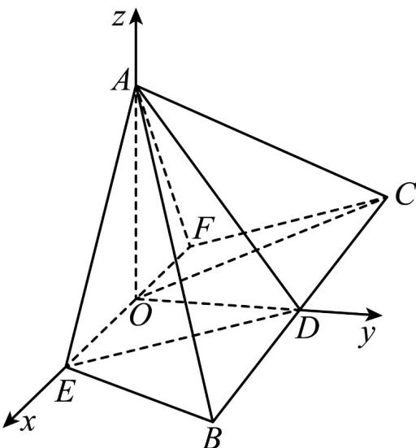

> [!faq]- 《专题21 立体几何大题综合》真题解析
>
> > [!success]- **【答案】** (2) 求二面角 F-AE-B 的余弦值. (3) 若 $BE \perp$ 平面 AOC，求 a 的值. 【答案】（1）见解析；（2）余弦为 $-\frac{\sqrt{5}}{5}$ ；（2） $a=\frac{4}{3}$ .
>
> > [!note]- **【分析】**
> > 本题未单列分析。
>
> > [!note]- **【解析】**
> > 试题分析：（1）要证 $AO \perp BE$ ，可以先证明 AO 垂直于 BE 所在的平面 EFCB；（2）可以用向量
> > 法解决，取 CB 的中点 D，连接 OD，以 O 为原点，分别以 OE、OD、OA 为 x、y、z 轴建立空间直角坐标系，
> > 分别求出两平面 $AEF$ 、平面 $AEB$ 的法向量，并求出法向量的夹角的余弦值，进而得到二面角 $F - AE - B$
> > 的余弦值；（3）因为 $BE \perp$ 平面 $AOC$ ，只需 $BE \perp OC$ ，利用 $\overline{BE} \cdot \overline{OC} = 0$ 即可求出 $a$ 的值·
> > 试题解析：（1）由于平面 $AEF \perp$ 平面 $EFCB$ ，
> > 为等边三角形，O 为 EF 的中点，则 $AO \perp EF$ ，
> > 根据面面垂直性质定理，所以 $AO \perp$ 平面 EFCB，
> > 又 $BE \subset$ 平面 $EFCB$ ，则 $AO \perp BE$
> > (2) 取 CB 的中点 D，连接 OD，
> > 以 O 为原点，分别以 OE、OD、OA 为 x、y、z 轴建立空间直角坐标系，
> > $A(0,0,\sqrt{3}a),E(a,0,0),B(2,2\sqrt{3} -\sqrt{3}a,0),\overline{AE} = (a,0, - \sqrt{3} a),\overline{EB} = (2 - a,2\sqrt{3} -\sqrt{3} a,0)$ ，由于平面
> > $AEF$ 与 $y$ 轴垂直，则设平面 $AEF$ 的法向量为 $\overline{n_1} = (0,1,0)$
> > 设平面 AEB 的法向量
> > $$
> > \overline {{{n _ {2}}}} = (x, y, 1), \overline {{{n _ {2}}}} \perp \overline {{{A E}}}, a x - \sqrt {3} a = 0, x = \sqrt {3}, \overline {{{n _ {2}}}} \perp \overline {{{E B}}}, (2 - a) x + (2 \sqrt {3} - \sqrt {3} a) y = 0, y = - 1
> > $$
> > $$
> > \overline {{n _ {2}}} = (\sqrt {3}, - 1, 1)
> > $$
> > 二面角 $_{F-AE-B}$ 的余弦值 $\cos\left\langle\overline{n_{1}},\overline{n_{2}}\right\rangle=\frac{n_{1}\cdot n_{2}}{\left|\overline{n_{1}}\right|\cdot\left|\overline{n_{2}}\right|}=\frac{-1}{\sqrt{5}}=-\frac{\sqrt{5}}{5}$
> > 由二面角 F-AE-B 为钝二面角，
> > 所以二面角 $F - AE - B$ 的余弦值为 $-\frac{\sqrt{5}}{5}$ .
> > (3) 有 (1) 知 $AO \perp$ 平面 $EFCB$ ，则 $AO \perp BE$ ，
> > 若 $BE \perp$ 平面 AOC ，只需 $BE \perp OC$
> > $$
> > \overline {{{{E B}}}} = (2 - a, 2 \sqrt {3} - \sqrt {3} a, 0)
> > $$
> > $$
> > \text {又} \overline {{O C}} = (- 2, 2 \sqrt {3} - \sqrt {3} a, 0) \overline {{B E}} \cdot \overline {{O C}} = - 2 (2 - a) + (2 \sqrt {3} - \sqrt {3} a) ^ {2} = 0
> > $$
> > 解得
> > $a = 2$ 或 $a = \frac{4}{3}$ ，由于 $a <   2$ ，则 $a = \frac{4}{3}$
> > 
> > 考点： $^{1}$ 、线线垂直； $^{2}$ 、线面垂直； $^{3}$ 、二面角·
> > 【思路点睛】本题是一个有关线线垂直、线面垂直、二面角方面的综合性问题，解决本题的基本思路是：对于（1）要证 $AO \perp BE$ ，可以先证明 $AO$ 垂直于 $BE$ 所在的平面；对于（3）在建立直角坐标系之后，解决问题的关键是要正确求出平面 $AEF$ 的法向量和平面 $AEB$ 的法向量，之后再根据向量夹角的公式就可求出二面角 $F - AE - B$ 的余弦值；对于（3）在前两问的基础上，只需由 $BE \perp OC$ 即可求出 $a$ 的值。
> > 考点08 已知异面直线所成角、线面角、二面角求值或范围（方程思想）
