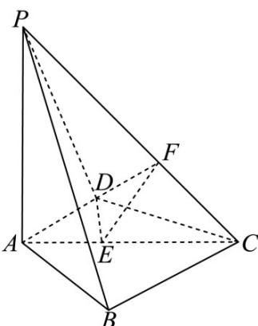

> [!faq]- 《专题21 立体几何大题综合》真题解析
>
> > [!success]- **【答案】** 详见解析
>
> > [!note]- **【分析】**
> > 【分析】（1）先证出 $AD \perp$ 平面 $PAB$ ，即可得 $AD \perp AB$ ，由勾股定理逆定理可得 $BC \perp AB$ ，从而 $AD // BC$ ，再根据线面平行的判定定理即可证出；
> >
> > (2) 过点 $D$ 作 $DE \perp AC$ 于 $E$ ，再过点 $E$ 作 $EF \perp CP$ 于 $F$ ，连接 $DF$ ，根据三垂线法可知， $\angle DFE$ 即为二面角 $A - CP - D$ 的平面角，即可求得 $\tan \angle DFE = \sqrt{6}$ ，再分别用 $AD$ 的长度表示出 $DE, EF$ ，即可解方程求出 $AD$ 。
>
> > [!note]- **【解析】**
> > 【详解】（1）（1）因为 $PA \perp$ 平面ABCD，而 $AD \subset$ 平面ABCD，所以 $PA \perp AD$
> > 又 $AD \perp PB$ ， $PB \cap PA = P$ ， $PB, PA \subset$ 平面 $PAB$ ，所以 $AD \perp$ 平面 $PAB$
> > 而 $AB \subset$ 平面 PAB ，所以 $AD \perp AB \cdot$
> > 因为 $BC^2 + AB^2 = AC^2$ ，所以 $BC \perp AB$ ，根据平面知识可知 $AD // BC$
> > 又 $AD \notin$ 平面 $PBC$ , $BC \subset$ 平面 $PBC$ , 所以 $AD //$ 平面 $PBC$
> > (2) 如图所示，过点 D 作 $DE \perp AC$ 于 E ，再过点 E 作 $EF \perp CP$ 于 F ，连接 DF ，
> > 因为 $PA \perp$ 平面 $ABCD$ ，所以平面 $PAC \perp$ 平面 $ABCD$ ，而平面 $PAC \cap$ 平面 $ABCD = AC$
> > 所以 $DE \perp$ 平面 PAC ，又 $EF \perp CP$ ，所以 $CP \perp$ 平面 DEF ，
> > 根据二面角的定义可知， $\angle DFE$ 即为二面角 A-CP-D 的平面角，
> > 即 $\sin \angle DFE = \frac{\sqrt{42}}{7}$ ，即 $\tan \angle DFE = \sqrt{6}$
> > 因为 $AD \perp DC$ ，设 $AD = x$ ，则 $CD = \sqrt{4 - x^2}$ ，由等面积法可得， $DE = \frac{x\sqrt{4 - x^2}}{2}$
> > 又 $CE = \sqrt{\left(4 - x^2\right) - \frac{x^2\left(4 - x^2\right)}{4}} = \frac{4 - x^2}{2}$ ，而 $\triangle EFC$ 为等腰直角三角形，所以 $EF = \frac{4 - x^2}{2\sqrt{2}}$
> > 故 $\tan \angle DFE = \frac{\frac{x\sqrt{4 - x^2}}{2}}{\frac{4 - x^2}{2\sqrt{2}}} = \sqrt{6}$ ，解得 $x = \sqrt{3}$ ，即 $AD = \sqrt{3}$
> > 
