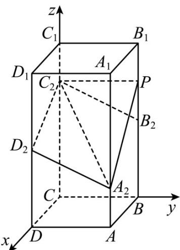

> [!faq]- 《专题21 立体几何大题综合》真题解析
>
> > [!success]- **【答案】** 详见解析
>
> > [!note]- **【分析】**
> > （1）建立空间直角坐标系，利用向量坐标相等证明；
> >
> > (2) 设 $P(0,2,\lambda)(0 \leq \lambda \leq 4)$ ，利用向量法求二面角，建立方程求出 $\lambda$ 即可得解.
>
> > [!note]- **【解析】**
> > （1）以 C 为坐标原点， $CD, CB, CC_{1}$ 所在直线为 x, y, z 轴建立空间直角坐标系，如图，
> > 
> > 则 $C(0,0,0), C_2(0,0,3), B_2(0,2,2), D_2(2,0,2), A_2(2,2,1)$
> > $$
> > \therefore B _ {2} C _ {2} = (0, - 2, 1), A _ {2} D _ {2} = (0, - 2, 1)
> > $$
> > $$
> > \therefore B _ {2} C _ {2} \| A _ {2} D _ {2}
> > $$
> > 又 $B_{2}C_{2}, A_{2}D_{2}$ 不在同一条直线上，
> > $\therefore B_{2}C_{2}\parallel A_{2}D_{2}$
> > (2) 设 $P(0,2,\lambda)(0 \leq \lambda \leq 4)$
> > 则 $A_{2}C_{2} = (-2, - 2, 2),PC_{2} = (0, - 2,3 - \lambda),D_{2}C_{2} = (-2,0,1)$
> > 设平面 $PA_{2}C_{2}$ 的法向量 $n=(x,y,z)$
> > 则 $\left\{ \begin{array}{l} n \cdot A_2 C_2 = -2x - 2y + 2z = 0 \\ n \cdot P C_2 = -2y + (3 - \lambda)z = 0 \end{array} \right.$
> > 令 z=2 ，得 $y=3-\lambda, x=\lambda-1$
> > $$
> > \therefore n = (\lambda - 1, 3 - \lambda , 2)
> > $$
> > 设平面 $A_{2}C_{2}D_{2}$ 的法向量 $\vec{m} = (a,b,c)$
> > 则 $\left\{ \begin{array}{l}m\cdot A_2C_2 = -2a - 2b + 2c = 0\\ \rightarrow \\ m\cdot D_2C_2 = -2a + c = 0 \end{array} \right.$
> > 令 a=1 ，得 b=1,c=2 ，
> > $$
> > \therefore \stackrel {\sqcup} {m} = (1, 1, 2)
> > $$
> > $$
> > \therefore \left| \cos \left\langle \stackrel {\rightarrow} {n}, m \right\rangle\right| = \frac {\left| n \cdot \stackrel {\cup} {m} \right|}{\left| n \right|\left| m \right|} = \frac {6}{\sqrt {6} \sqrt {4 + (\lambda - 1) ^ {2} + (3 - \lambda) ^ {2}}} = | \cos 1 5 0 ^ {\circ} | = \frac {\sqrt {3}}{2},
> > $$
> > 化简可得， $\lambda^{2}-4\lambda+3=0$
> > 解得 $\lambda = 1$ 或 $\lambda = 3$
> > $\therefore P(0,2,1)$ 或 $P(0,2,3)$
> > $\therefore B_{2}P=1.$
