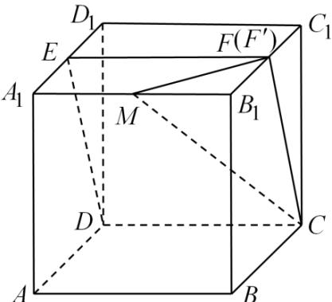
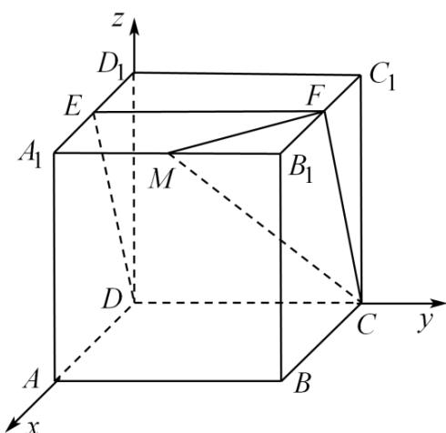

> [!faq]- 《专题21 立体几何大题综合》真题解析
>
> > [!success]- **【答案】** 详见解析
>
> > [!note]- **【分析】**
> > 【分析】(1)首先将平面 CDE 进行扩展，然后结合所得的平面与直线 $B_{1}C_{1}$ 的交点即可证得题中的结论；
> >
> > (2)建立空间直角坐标系，利用空间直角坐标系求得相应平面的法向量，然后解方程即可求得实数 $\lambda$ 的值.
>
> > [!note]- **【解析】**
> > 【详解】(1)如图所示，取 $B_{1}C_{1}$ 的中点 $F'$ ，连结DE,EF',F'C
> > 由于 $ABCD-A_{1}B_{1}C_{1}D_{1}$ 为正方体， $E,F'$ 为中点，故 $EF'PCD$
> > 从而 $E, F', C, D$ 四点共面，即平面 $CDE$ 即平面 $CDEF'$
> > 据此可得：直线 $B_{1}C_{1}$ 交平面 CDE 于点 $F'$
> > 当直线与平面相交时只有唯一的交点，故点 F 与点 $F'$ 重合，
> > 即点 $F$ 为 $B_{1}C_{1}$ 中点·
> > 
> > (2)以点 $D$ 为坐标原点， $DA, DC, DD_{1}$ 方向分别为 $x$ 轴， $y$ 轴， $z$ 轴正方向，建立空间直角坐标系 $D - xyz$
> > 
> > 不妨设正方体的棱长为 $^{2}$ ，设 $\frac{A_{1}M}{A_{1}B_{1}}=\lambda(0\leq\lambda\leq1)$
> > 则： $M(2,2\lambda ,2),C(0,2,0),F(1,2,2),E(1,0,2)$
> > 从而： $MC = (-2,2 - 2\lambda , - 2),CF = (1,0,2),FE = (0, - 2,0)$
> > 设平面 MCF 的法向量为： $m = (x_{1}, y_{1}, z_{1})$ ，则：
> > $$
> > \left\{ \begin{array}{c} m \cdot M C = - 2 x _ {1} + (2 - 2 \lambda) y _ {1} - 2 z _ {1} = 0 \\ m \cdot C F = x _ {1} + 2 z _ {1} = 0 \end{array} \right.
> > $$
> > 令 $z_{1} = -1$ 可得： $\vec{m} = \left(2,\frac{1}{1 - \lambda}, - 1\right)$
> > 设平面 CFE 的法向量为： $n=(x_{2},y_{2},z_{2})$ ，则：
> > $$
> > \left\{ \begin{array}{l} - \square \square \square \\ n \cdot E E = - 2 y _ {2} = 0 \\ - \square \square \square \\ n \cdot C F = x _ {2} + 2 z _ {2} = 0 \end{array} \right.
> > $$
> > 令 $z_{1} = -1$ 可得： $n = (2, 0, -1)$ ，
> > 从而： $m \cdot n = 5, \left| m \right| = \sqrt{5 + \left( \frac{1}{1 - \lambda} \right)^2}, \left| n \right| = \sqrt{5}$
> > 则： $\cos \left\langle \vec{m},n\right\rangle = \frac{\vec{m}\cdot n}{|m|\times|n|} = \frac{5}{\sqrt{5 + \left(\frac{1}{1 - \lambda}\right)^2}\times\sqrt{5}} = \frac{\sqrt{5}}{3}$
> > 整理可得： $(\lambda -1)^2 = \frac{1}{4}$ ，故 $\lambda = \frac{1}{2}$ （ $\lambda = \frac{3}{2}$ 舍去）.
> > 【点睛】本题考查了立体几何中的线面关系和二面角的求解问题，意在考查学生的空间想象能力和逻辑推理能力，对于立体几何中角的计算问题，往往可以利用空间向量法，通过求解平面的法向量，利用向量的夹角公式求解·
