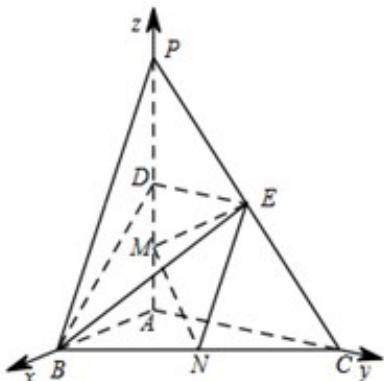

> [!faq]- 《专题21 立体几何大题综合》真题解析
>
> > [!success]- **【答案】** (1) 求证： $MN \parallel$ 平面 BDE； (2) 求二面角 C - EM - N 的正弦值； (3) 已知点 $H$ 在棱 $PA$ 上，且直线 $NH$ 与直线 $BE$ 所成角的余弦值为 $\frac{\sqrt{7}}{21}$ ，求线段 $AH$ 的长. 【答案】（1）证明见解析；（2） $\frac{\sqrt{105}}{21}$ ；（3） $\frac{8}{5}$ 或 $\frac{1}{2}$ .
>
> > [!note]- **【分析】**
> > 本题未单列分析。
>
> > [!note]- **【解析】**
> > 试题分析：本小题主要考查直线与平面平行、二面角、异面直线所成的角等基础知识·考查用空间向量解决立体几何问题的方法·考查空间想象能力、运算求解能力和推理论证能力·首先要建立空间直角坐标系，写出相关点的坐标，证明线面平行只需求出平面的法向量，计算直线对应的向量与法向量的数量积为 $^{0}$ ，求二面角只需求出两个半平面对应的法向量，借助法向量的夹角求二面角，利用向量的夹角公式，求出异面直线所成角的余弦值，利用已知条件，求出AH的值·
> > 试题解析：如图，以 $A$ 为原点，分别以 $\overline{AB}$ ， $\overline{AC}$ ， $\overline{AP}$ 方向为 $x$ 轴、 $y$ 轴、 $z$ 轴正方向建立空间直角坐标系。依题意可得 $A(0,0,0)$ ， $B(2,0,0)$ ， $C(0,4,0)$ ， $P(0,0,4)$ ， $D(0,0,2)$ ， $E(0,2,2)$ ， $M(0,0,1)$ ， $N(1,2,0)$ 。
> > 
> > (1) 证明： $\overline{DE} = (0, 2, 0)$ ， $\overline{DB} = (2, 0, -2)$ ·设 $n = (x, y, z)$ ，为平面 BDE 的法向量，
> > 则 $\left\{\begin{aligned}\underline{n}\cdot\overline{DE}&=0\\n\cdot DB&=0\end{aligned}\right.$ ，即 $\left\{\begin{aligned}2y&=0\\2x-2z&=0\end{aligned}\right.$ ·不妨设 $_{z=1}$ ，可得 $n=(1,0,1)\cdot\overline{MN}=\left(1,2,-1\right)$ ，可得 $MN\cdot n=0$ 。
> > 因为 MN ∉ 平面 BDE，所以 MN// 平面 BDE.
> > （2）解：易知 $n_{1}^{u}=(1,0,0)$ 为平面 $CEM$ 的一个法向量·设 $n_{2}^{u}= \left(x,y,z\right)$ 为平面 $EMN$ 的法向量，则 $\begin{cases}\overline{n_{2}}\cdot\overline{EM}=0\\n_{2}\cdot MN=0\end{cases}$ ，
> > 因为 $EM = (0, -2, -1)$ ， $MN = (1, 2, -1)$ ，所以 $\begin{cases} -2y - z = 0 \\ x + 2y - z = 0 \end{cases}$ 不妨设 $y = 1$ ，可得 $n_{2}^{u} = (-4, 1, -2)$ ·
> > 因此有 $cos n_{1}, n_{2} = \frac{n_{1} \cdot n_{2}}{|n_{1}| |n_{2}|} = -\frac{4}{\sqrt{21}}$ ，于是 $\sin n_{1}, n_{2} = \frac{\sqrt{105}}{21}$ ·
> > 所以，二面角 $C - EM - N$ 的正弦值为 $\frac{\sqrt{105}}{21}$
> > (3) 解：依题意，设 $AH = h$ (0 ≤ h ≤ 4)，则 $H(0, 0, h)$ ，进而可得 $\overline{NH} = (-1, -2, h)$ ， $\overline{BE} = (-2, 2, 2)$ 。由已知，得 $\left|\cos \left\langle \overrightarrow{NH}, \overrightarrow{BE}\right\rangle\right| = \frac{\left|\overrightarrow{NH} \cdot \overrightarrow{BE}\right|}{\left|\overrightarrow{NH}\right|\left|\overrightarrow{BE}\right|} = \frac{|2h - 2|}{\sqrt{h^2 + 5} \times 2\sqrt{3}} = \frac{\sqrt{7}}{21}$ ，整理得 $10h^2 - 21h + 8 = 0$ ，解得 $h = \frac{8}{5}$ ，或 $h = \frac{1}{2}$ 。所以，线段 $AH$ 的长为 $\frac{8}{5}$ 或 $\frac{1}{2}$ 。
> > 【考点】直线与平面平行、二面角、异面直线所成的角
> > 【名师点睛】空间向量是解决空间几何问题的锐利武器，不论是求空间角、空间距离还是证明线面关系利用空间向量都很方便，利用向量夹角公式求异面直线所成的角又快又准，特别是借助平面的法向量求线面角，二面角或点到平面的距离都很容易·
