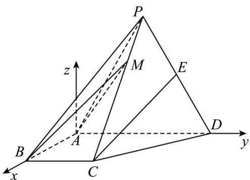

> [!faq]- 《专题21 立体几何大题综合》真题解析
>
> > [!success]- **【答案】** （1）见解析；（2） $\frac{\sqrt{10}}{5}$ 【详解】试题分析：（1）取 $PA$ 的中点 $F$ ，连结 $EF$ ， $BF$ ，由题意证得 $CE \parallel BF$ ，利用线面平行的判断定理即可证得结论；（2）建立空间直角坐标系，求得半平面的法向量： $m = (0, -\sqrt{6}, 2)$ ， $n = (0, 0, 1)$ ，然后利用空间向量的相关结论可求得二面角 $M - AB - D$ 的余弦值为 $\frac{\sqrt{10}}{5}$ 。 试题
>
> > [!note]- **【分析】**
> > 本题未单列分析。
>
> > [!note]- **【解析】**
> > $(1)$ 取 PA 中点 F ，连结 EF ， BF .
> > 因为 $E$ 为 $PD$ 的中点，所以 $EF // AD, EF = \frac{1}{2} AD$ ，由 $\angle BAD = \angle ABC = 90^\circ$ 得 $BC // AD$ ，又 $BC = \frac{1}{2} AD$ 所以 $EF // BC$ 。四边形 $BCEF$ 为平行四边形， $CE // BF$ 。又 $BF \subset$ 平面 $PAB$ ， $CE \notin$ 平面 $PAB$ ，故 $CE //$ 平面 $PAB$
> > (2)
> > 
> > 由已知得 $BA \perp AD$ ，以 $A$ 为坐标原点， $AB$ 的方向为 $x$ 轴正方向， $\left|AB\right|$ 为单位长，建立如图所示的空间直角坐标系 $A-xyz$ ，则
> > 则 $A(0,0,0)$ ， $B(1,0,0)$ ， $C(1,1,0)$ ， $P(0,1,\sqrt{3})$
> > $$
> > P C = \left(1 0, - \sqrt {3}\right), A B = \left(1 0 0\right) \text {则}
> > $$
> > $$
> > \stackrel {\sqcup \sqcup \sqcup} {B M} = (x - 1, y, z), \stackrel {\sqcup \sqcup \sqcup} {P M} = (x, y - 1, z - \sqrt {3})
> > $$
> > 因为 BM 与底面 ABCD 所成的角为 $45^{\circ}$ ，而 $n = (0, 0, 1)$ 是底面 ABCD 的法向量，所以
> > $$
> > \left| \cos \left\langle B M, n \right\rangle \right| = \sin 4 5 ^ {0}, \frac {| z |}{\sqrt {(x - 1) ^ {2} + y ^ {2} + z ^ {2}}} = \frac {\sqrt {2}}{2}
> > $$
> > 即 $(x - 1)^2 + y^2 - z^2 = 0$
> > 又 $M$ 在棱 $PC$ 上，设 $\overline{PM} = \lambda \overline{PC}$ ，则
> > $$
> > \mathrm{x} = \lambda , y = 1, z = \sqrt {3} - \sqrt {3} \lambda
> > $$
> > 由①，②得 $\left\{\begin{array}{l}\mathrm{x}=1+\frac{\sqrt{2}}{2}\\ \mathrm{y}=1\quad(\text{舍去})\\ \mathrm{z}=-\frac{\sqrt{6}}{2}\end{array}\right.\left\{\begin{array}{l}\mathrm{x}=1-\frac{\sqrt{2}}{2}\\ \mathrm{y}=1\\ \mathrm{z}=\frac{\sqrt{6}}{2}\end{array}\right.$
> > 所以 $M\left(1-\frac{\sqrt{2}}{2},1,\frac{\sqrt{6}}{2}\right)$ ，从而 $\overrightarrow{AM}=\left(1-\frac{\sqrt{2}}{2},1,\frac{\sqrt{6}}{2}\right)$
> > 设 $m=\left(x_{0},y_{0},z_{0}\right)$ 是平面 ABM 的法向量，则
> > $\left\{ \begin{array}{l}m\cdot \mathrm{AM} = 0\\ m\cdot \mathrm{AB} = 0 \end{array} \right.$ 即 $\left\{ \begin{array}{c}\left(2 - \sqrt{2}\right)\mathrm{x}_0 + 2\mathrm{y}_0 + \sqrt{6}\mathrm{z}_0 = 0\\ \mathrm{x}_0 = 0 \end{array} \right.$
> > 所以可取 $\square m = (0, -\sqrt{6}, 2)$ 于是 $cos\left\langle \vec{m}, n \right\rangle = \frac{\vec{m} \cdot n}{|m||n|} = \frac{\sqrt{10}}{5}$
> > 因此二面角 M-AB-D 的余弦值为 $\frac{\sqrt{10}}{5}$
> > 点睛: (1) 求解本题要注意两点: ①两平面的法向量的夹角不一定是所求的二面角, ②利用方程思想进行向量运算, 要认真细心、准确计算.
> > (2) 设 m，n 分别为平面 $\alpha, \beta$ 的法向量，则二面角 $\theta$ 与 <m，n> 互补或相等，故有 $|\cos \theta| = | \cos < m, n| = \frac{\sqrt[m]{m} \cdot n}{|m||n|}$ ．求解时一定要注意结合实际图形判断所求角是锐角还是钝角．
