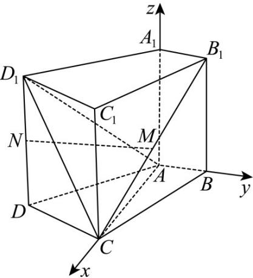

> [!faq]- 《专题21 立体几何大题综合》真题解析
>
> > [!success]- **【答案】** 详见解析
>
> > [!note]- **【分析】**
> > 本题未单列分析。
>
> > [!note]- **【解析】**
> > 【答案】（1）证明见解析；（2） $\frac{3\sqrt{10}}{10}$ ；（3） $\sqrt{7}-2$
> > 【详解】如图，以A为原点建立空间直角坐标系，依题意可得 $A(0,0,0),B(0,1,0),C(2,0,0),D(1, - 2,0)$
> > 
> > 又因为 $M, N$ 分别为 $B_{1}C$ 和 $D_{1}D$ 的中点，得 $M\left(1, \frac{1}{2}, 1\right), N(1, -2, 1)$ .
> > （Ⅰ）证明：依题意，可得 $n = (0,0,1)$ 为平面ABCD的一个法向量， $MN = \left(0, -\frac{5}{2}, 0\right)$
> > 由此可得， $MN \cdot n = 0$ ，又因为直线 MN ∉ 平面 ABCD，所以 MN // 平面 ABCD
> > (Ⅱ) $\overrightarrow{AD_{1}}=(1,-2,2),\overrightarrow{AC}=(2,0,0)$ ，设 $n_{1}=(x,y,z)$ 为平面 $ACD_{1}$ 的法向量，则 $\left\{\begin{matrix}\overline{n_{1}}\cdot\overline{AD_{1}}=0\\n_{1}\cdot AC=0\end{matrix}\right.$ ，即 $\left\{\begin{aligned}x-2y+2z=0\\2x=0\end{aligned}\right.$ ，不妨设 $_{z=1}$ ，可得 $n_{1}=(0,1,1)$ ，
> > 设 $n_2 = (x, y, z)$ 为平面 $ACB_1$ 的一个法向量，则 $\begin{cases} n_2 \cdot AB_1 = 0 \\ n_2 \cdot AC = 0 \end{cases}$ ，又 $AB_1 = (0, 1, 2)$ ，得
> > $\left\{ \begin{array}{l}y + 2z = 0\\ 2x = 0 \end{array} \right.$ ，不妨设 $_{z = 1}$ ，可得 $n_2 = (0, - 2,1)$
> > 因此有 $\cos \langle n_1, n_2 \rangle = \frac{n_1 \cdot n_2}{|n_1| \cdot |n_2|} = -\frac{\sqrt{10}}{10}$ ，于是 $sin \langle n_1, n_2 \rangle = \frac{3\sqrt{10}}{10}$ ，
> > 所以二面角 $D_{1}-AC-B_{1}$ 的正弦值为 $\frac{3\sqrt{10}}{10}$ .
> > （Ⅲ）依题意，可设 $A_{1}E = \lambda A_{1}B_{1}$ ，其中 $\lambda \in [0,1]$ ，则 $E(0,\lambda ,2)$ ，从而 $NE = (-1,\lambda +2,1)$ ，又 $n = (0,0,1)$ 为平面ABCD的一个法向量，由已知得
> > $\cos \langle NE, n \rangle = \frac{NE \cdot n}{|NE| \cdot |n|} = \frac{1}{\sqrt{(-1)^2 + (\lambda + 2)^2 + 1^2}} = \frac{1}{3}$ ，整理得 $\lambda^2 + 4\lambda - 3 = 0$
> > 又因为 $\lambda \in [0,1]$ ，解得 $\lambda = \sqrt{7} - 2$
> > 所以线段 $A_{1}E$ 的长为 $\sqrt{7}-2$ .
> > 考点：直线和平面平行和垂直的判定与性质，二面角、直线与平面所成的角，空间向量的应用·
