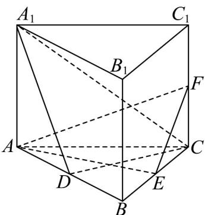

> [!faq]- 《专题21 立体几何大题综合》真题解析
>
> > [!success]- **【答案】** （Ⅰ）见解析；（Ⅱ） $\frac{\sqrt{6}}{12}$ 【详解】试题分析：（1）由面面垂直的判定定理很容易得结论；（2）所求三棱锥底面积容易求得，是本题转化为求三棱锥的高FC，利用直线 $A_{1}C$ 与平面 $A_{1}ABB_{1}$ 所成的角为 $45^{\circ}$ ，作出线面角，进而可求得 $AA_{1}$ 的值，则可得的FC长. 试题
>
> > [!note]- **【分析】**
> > 本题未单列分析。
>
> > [!note]- **【解析】**
> > （1）如图，因为三棱柱 $ABC - A_{1}B_{1}C_{1}$ 是直三棱柱，所以 $\mathrm{AE} \perp \mathrm{BB}_{1}$ ，
> > 又E是正三角形ABC的边BC的中点，所以AE⊥BC
> > 又 $\mathrm{BC} \cap \mathrm{BB}_1 = \mathrm{B}$ ，因此 $\mathrm{AE} \perp$ 平面 $\mathrm{B}_1\mathrm{BCC}_1$
> > 而 AE ⊂ 平面 AEF，所以平面 AEF ⊥ 平面 $B_{1}BCC_{1}$
> > (2) 设 AB 的中点为 D，连结 $A_{1}D$ ，CD
> > 
> > 因为 $\Delta ABC$ 是正三角形，所以 $CD \perp AB$
> > 又三棱柱 $ABC - A_{1}B_{1}C_{1}$ 是直三棱柱，所以 $\mathrm{CD} \perp \mathrm{AA}_{1}$
> > 因此 $\mathrm{CD} \perp$ 平面 $\mathrm{A}_{1} \mathrm{ABB}_{1}$ ，于是 $\angle \mathrm{CA}_{1} \mathrm{D}$ 为直线 $\mathrm{A}_{1} \mathrm{C}$ 与平面 $\mathrm{A}_{1} \mathrm{ABB}_{1}$ 所成的角，
> > 由题设， $\angle \mathrm{CA}_{1} \mathrm{D} = 45^{\circ}$ ，所以 $\mathrm{A}_{1} \mathrm{D} = \mathrm{CD} = \frac{\sqrt{3}}{2} \mathrm{AB} = \sqrt{3}$
> > 在 RtΔAA₁D 中，AA₁ = √A₁D² - AD² = √3 - 1 = √2 ，所以 FC = $\frac{1}{2}$ AA₁ = $\frac{\sqrt{2}}{2}$
> > 故三棱锥 F-AEC 的体积 $V=\frac{1}{3}S_{\Delta AEC}\cdot FC=\frac{1}{3}\times\frac{\sqrt{3}}{2}\times\frac{\sqrt{2}}{2}=\frac{\sqrt{6}}{12}$
> > 考点：直线与平面垂直的判定定理；直线与平面所成的角；几何体的体积。
