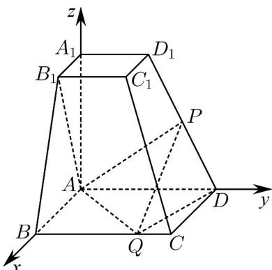

> [!faq]- 《专题21 立体几何大题综合》真题解析
>
> > [!success]- **【答案】** 详见解析
>
> > [!note]- **【分析】**
> > 本题未单列分析。
>
> > [!note]- **【解析】**
> > 【答案】（1）见解析（2）V=24
> > 【详解】根据已知条件知 AB，AD， $AA_{1}$ 三直线两两垂直，所以分别以这三直线为 x，y，z 轴，建立如
> > 图所示空间直角坐标系，则：
> > $$
> > A (0, 0, 0), B (6, 0, 0), D (0, 6, 0), A _ {1} (0, 0, 6), B _ {1} (3, 0, 6), D _ {1} (0, 3, 6)
> > $$
> > $Q$ 在棱 $BC$ 上，设 $Q(6, y_1, 0)$ ， $0, y_1, 6$
> > ∴（1）证明：若 $P$ 是 $DD_{1}$ 的中点，则 $P(0, \frac{9}{2}, 3)$ ；
> > $$
> > \therefore P Q = (6, y _ {1} - \frac {9}{2}, - 3), A B _ {1} = (3, 0, 6)
> > $$
> > $$
> > \therefore A B _ {1} \cdot P Q = 0
> > $$
> > $$
> > \therefore \stackrel {\mathrm{uuu}} {A B _ {1}} \perp \stackrel {\mathrm{uuu}} {P Q}
> > $$
> > $$
> > \therefore A B _ {1} \perp P Q
> > $$
> > (2) 设 $P(0, y_{2}, z_{2})$ , $y_{2}$ , $z_{2} \in [0, 6]$ , P 在棱 $DD_{1}$ 上；
> > ∴ $\overline{DP} = \lambda \overline{DD}_{1}$ , 0, λ, 1;
> > ∴ $(0, y_{2}-6, z_{2}) = \lambda (0, -3, 6)$ ;
> > ∴ $\left\{\begin{aligned}y_{2}-6&=-3\lambda\\ z_{2}&=6\lambda\end{aligned}\right.$ ∴ $z_{2}=12-2y_{2}$ ∴ $P(0, y_{2}, 12-2y_{2})$ ∴ $PQ=(6,y_{1}-y_{2},2y_{2}-12)$ 平面 $ABB_{1}A_{1}$ 的一个法向量为 $\overline{AD}=(0,6,0)$ ∵ $PQ // 平面 ABB_{1}A_{1}$ ∴ $PQ \cdot AD = 6(y_{1} - y_{2}) = 0$ ∴ $y_{1} = y_{2}$ ∴ $Q(6, y_{2}, 0)$ ;
> > 设平面 $PQD$ 的法向量为 $n = (x, y, z)$ ，则：
> > $$
> > \left\{ \begin{array}{l} n \cdot P Q = 6 x + (2 y _ {2} - 1 2) z = 0 \\ n \cdot D Q = 6 x + (y _ {2} - 6) y = 0 \end{array} \right.
> > $$
> > $\therefore \left\{ \begin{array}{l} x = \frac{6 - y_2}{3} z \\ y = 2z \end{array} \right.$ 取 $z = 1$ ，则 $\vec{n} = (\frac{6 - y_2}{3}, 2, 1)$
> > 又平面 AQD 的一个法向量为 $AA_{1} = (0, 0, 6)$ ;
> > 又二面角 P-QD-A 的余弦值为 $\frac{3}{7}$ ;
> > $\cos \left\langle n, AA_{1} \right\rangle = \frac{6}{6\sqrt{\left(\frac{y_{2} - 6}{3}\right)^{2} + 5}} = \frac{3}{7}$
> > 解得 $y_{2}=4$ ，或 $y_{2}=8$ （舍去）；
> > $$
> > \therefore P (0, 4, 4)
> > $$
> > ∴三棱锥P-ADQ的高为 $^{4}$ ，且 $S_{ADQ}=\frac{1}{2}\times6\times6=18$ ；
> > $$
> > \therefore V _ {\mathrm{四面体} A D P Q} = V _ {\mathrm{三棱锥} P - A D Q} = \frac {1}{3} \cdot 1 8 \cdot 4 = 2 4
> > $$
> > 
> > 考点：1. 空间向量的运用；2. 线面垂直的性质；3. 空间几何体体积计算。
> > 【名师点睛】本题主要考查了线面垂直的性质以及空间几何体体积计算，属于中档题，由于空间向量工具的引入，使得立体几何问题除了常规的几何法之外，还可以考虑利用向量工具来解决，因此有关立体几何的问题，可以建立空间直角坐标系，借助于向量知识来解决，在立体几何的线面关系中，中点是经常使用的一个特殊点，无论是试题本身的已知条件，还是在具体的解题中，通过找“中点”，连“中点”，即可出现平行线而线线平行是平行关系的根本，在垂直关系的证明中线线垂直是核心，也可以根据已知的平面图形通过计算的方式证明线线垂直，也可以根据已知的垂直关系证明线线垂直。
