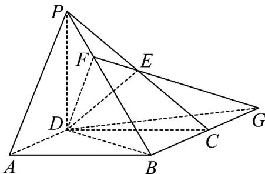
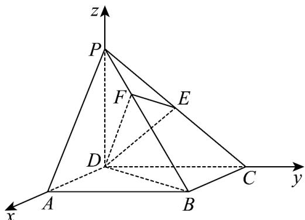

> [!faq]- 《专题21 立体几何大题综合》真题解析
>
> > [!success]- **【答案】** （I）详见解析；（II） $\frac{\sqrt{2}}{2}$
>
> > [!note]- **【分析】**
> > 本题未单列分析。
>
> > [!note]- **【解析】**
> > （解法 $^{1}$ ）（Ⅰ）因为 $PD \perp$ 底面 ABCD，所以 $PD \perp BC$
> > 由底面 ABCD 为长方形，有 $BC \perp CD$ ，而 $PD \cap CD = D$ ，
> > 所以 $BC \perp$ 平面 PCD．而 $DE \subset$ 平面 PCD，所以 $BC \perp DE$
> > 又因为 $PD = CD$ ，点 $E$ 是 $PC$ 的中点，所以 $DE \perp PC$
> > 而 $PC \cap BC = C$ ，所以 $DE \perp$ 平面 $PBC$ 。而 $PB \subset$ 平面 $PBC$ ，所以 $PB \perp DE$ 。
> > 又 $PB \perp EF$ ， $DE \cap EF = E$ ，所以 $PB \perp$ 平面 $DEF$ ：
> > 由 $DE \perp$ 平面 $PBC$ ， $PB \perp$ 平面 $DEF$ ，可知四面体 $BDEF$ 的四个面都是直角三角形，
> > 即四面体 BDEF 是一个鳖臑，其四个面的直角分别为 $\angle DEB, \angle DEF, \angle EFB, \angle DFB$
> > (Ⅱ) 如图 $^{1}$ ，在面 PBC 内，延长 BC 与 FE 交于点 G，则 DG 是平面 DEF 与平面 ABCD
> > 的交线．由（Ⅰ）知， $PB \perp$ 平面DEF，所以 $PB \perp DG$
> > 又因为 $PD \perp$ 底面 $ABCD$ ，所以 $PD \perp DG$ 。而 $PD \cap PB = P$ ，所以 $DG \perp$ 平面 $PBD$ 。
> > 故 $\angle BDF$ 是面 DEF 与面 ABCD 所成二面角的平面角，
> > 设 $PD = DC = 1$ ， $BC = \lambda$ ，有 $BD = \sqrt{1 + \lambda^2}$
> > 在 Rt△PDB 中，由 $DF \perp PB$ ，得 $\angle DPF = \angle FDB = \frac{\pi}{3}$ ，
> > 则 $\tan \frac{\pi}{3} = \tan \angle DPF = \frac{BD}{PD} = \sqrt{1 + \lambda^2} = \sqrt{3}$ ，解得 $\lambda = \sqrt{2}$
> > 所以 $\frac{DC}{BC} = \frac{1}{\lambda} = \frac{\sqrt{2}}{2}.$
> > 故当面 $DEF$ 与面 $ABCD$ 所成二面角的大小为 $\frac{\pi}{3}$ 时， $\frac{DC}{BC} = \frac{\sqrt{2}}{2}$ 。
> > (解法 $^{2}$ )
> > (Ⅰ) 如图 $^{2}$ ，以 D 为原点，射线 DA, DC, DP 分别为 x, y, z 轴的正半轴，建立空间直角坐标系.
> > 设 $PD = DC = 1$ ， $BC = \lambda$ ，则 $D(0,0,0),P(0,0,1),B(\lambda ,1,0),C(0,1,0)$ ， $PB = (\lambda ,1, - 1)$ ，点 $E$ 是 $PC$ 的中点，所以 $E(0,\frac{1}{2},\frac{1}{2})$ ， $\overrightarrow{DE} = (0,\frac{1}{2},\frac{1}{2})$
> > 于是 $PB \cdot DE = 0$ ，即 $PB \perp DE$
> > 又已知 $EF \perp PB$ ，而 $DE \cap EF = E$ ，所以 $PB \perp$ 平面 $DEF$
> > 因 $\overrightarrow{PC}=(0,1,-1)$ ， $\overrightarrow{DE}\cdot\overrightarrow{PC}=0$ ，则 $DE\perp PC$ ，所以 $DE\perp$ 平面 PBC。
> > 由 $DE \perp$ 平面 $PBC$ ， $PB \perp$ 平面 $DEF$ ，可知四面体 $BDEF$ 的四个面都是直角三角形，即四面体 $BDEF$ 是一个鳖臑，其四个面的直角分别为 $\angle DEB$ ， $\angle DEF$ ， $\angle EFB$ ， $\angle DFB$ 。
> > 
> > 图1
> > 
> > 图2
> > （Ⅱ）由 $PD \perp$ 平面ABCD，所以 $\overrightarrow{DP} = (\mathbf{0},\mathbf{0},\mathbf{1})$ 是平面ABCD的一个法向量；
> > 由（1）知， $PB \perp$ 平面DEF，所以 $\overrightarrow{BP} = (-\lambda, -1, 1)$ 是平面DEF的一个法向量.
> > 若面 DEF 与面 ABCD 所成二面角的大小为 $\frac{\pi}{3}$ ,
> > 则 $\cos\frac{\pi}{3}=\left|\begin{matrix}\square\square\square & \square\square\square \\BP \cdot DP \\ \square\square\square & \square\square\square \\ |BP|\cdot|DP|\end{matrix}\right|=\left|\frac{1}{\sqrt{\lambda^{2}+2}}\right|=\frac{1}{2}$
> > 解得 $\lambda = \sqrt{2}$ 。所以 $\frac{DC}{BC} = \frac{1}{\lambda} = \frac{\sqrt{2}}{2}$
> > 故当面 $DEF$ 与面 $ABCD$ 所成二面角的大小为 $\frac{\pi}{3}$ 时， $\frac{DC}{BC} = \frac{\sqrt{2}}{2}$
> > 考点：四棱锥的性质，线、面垂直的性质与判定，二面角.
