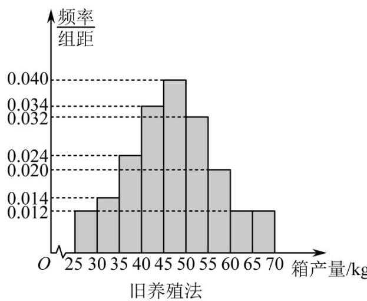
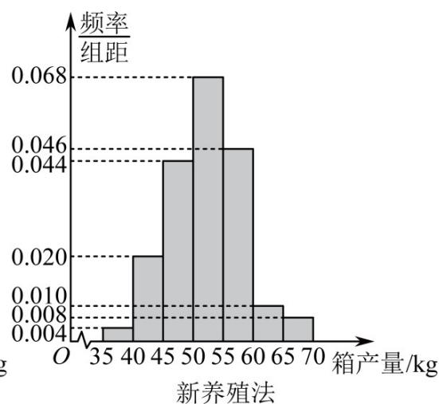

<!-- question-source:start -->
9. (2017·全国·高考真题) (2017 新课标全国Ⅱ理科) 海水养殖场进行某水产品的新、旧网箱养殖方法的产量对比, 收获时各随机抽取了 100 个网箱, 测量各箱水产品的产量 (单位: kg). 其频率分布直方图如下:

<!-- question-source:end -->

![[高中/真题/按题型分类/专题22 概率统计及数字特征大题综合/考点01_独立性检验为载体及其应用/真题/answers/Q00036166A1.md]]
