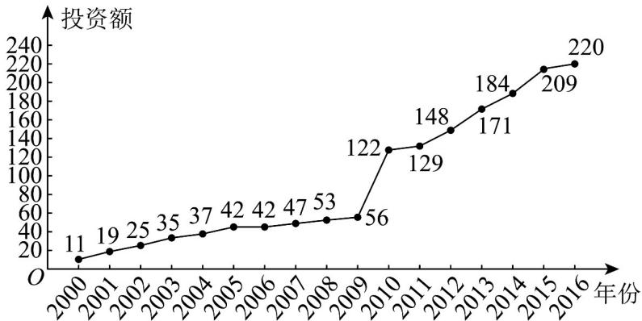

<!-- question-source:start -->
3. (2018·全国·高考真题) 下图是某地区 2000 年至 2016 年环境基础设施投资额 $^{y}$ （单位：亿元）的折线图.

投资额，建立了 $y$ 与时间变量 $t$ 的两个线性回归模型。根据 $^{2000}$ 年至 $^{2016}$ 年的数据（时间变量 $t$ 的值依次为 $1,2,\cdots,17$ ）建立模型①： $\hat{y} = -30.4 + 13.5t$ ；根据 $^{2010}$ 年至 $^{2016}$ 年的数据（时间变量 $t$ 的值依次为 $1,2,\cdots,7$ ）建立模型②： $\hat{y} = 99 + 17.5t$ 。
<!-- question-source:end -->

![[高中/真题/按题型分类/专题22 概率统计及数字特征大题综合/考点02_线性回归直线方程为载体及其应用/真题/answers/Q00036169A1.md]]
