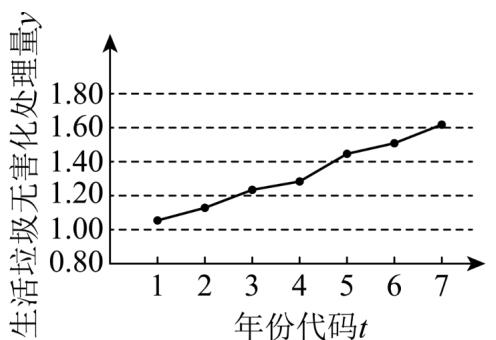

<!-- question-source:start -->
6. (2016·全国·高考真题) 下图是我国 2008 年至 2014 年生活垃圾无害化处理量（单位：亿吨）的折线图

注：年份代码1-7分别对应年份2008\~2014
<!-- question-source:end -->

![[高中/真题/按题型分类/专题22 概率统计及数字特征大题综合/考点02_线性回归直线方程为载体及其应用/真题/answers/Q00036172A1.md]]
