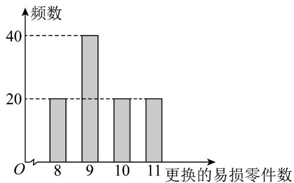

<!-- question-source:start -->
10．（2016·全国·高考真题）某公司计划购买 $^{2}$ 台机器，该种机器使用三年后即被淘汰，机器有一易损零件，在购进机器时，可以额外购买这种零件作为备件，每个200元．在机器使用期间，如果备件不足再购买，则每个500元．现需决策在购买机器时应同时购买几个易损零件，为此搜集并整理了100台这种机器在三年使用期内更换的易损零件数，得下面柱状图：

以这 $^{100}$ 台机器更换的易损零件数的频率代替 $^{1}$ 台机器更换的易损零件数发生的概率，记 $X$ 表示 $^{2}$ 台机器

三年内共需更换的易损零件数， $n$ 表示购买 $^2$ 台机器的同时购买的易损零件数。
<!-- question-source:end -->

![[高中/真题/按题型分类/专题22 概率统计及数字特征大题综合/考点04_其他类型的分布列及期望方差/真题/answers/Q00036199A1.md]]
