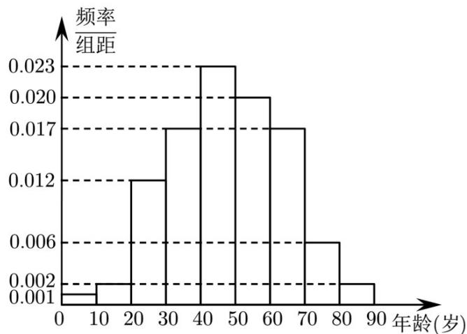

<!-- question-source:start -->
3. （2022·全国新II卷·高考真题）在某地区进行流行病学调查，随机调查了 $100$ 位某种疾病患者的年龄，得到如下的样本数据的频率分布直方图：

<!-- question-source:end -->

![[高中/真题/按题型分类/专题22 概率统计及数字特征大题综合/考点05_条件概率_全概率公式_贝叶斯公式/对点训练/answers/Q00055610A1.md]]
