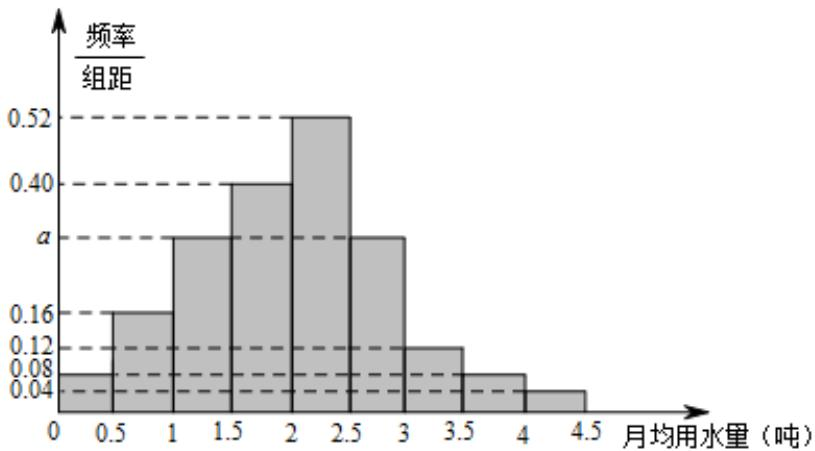

<!-- question-source:start -->
10.（2016·四川·高考真题）我国是世界上严重缺水的国家，某市政府为了鼓励居民节约用水，计划调整居民生活用水收费方案，拟确定一个合理的月用水量标准 $x$ （吨）、一位居民的月用水量不超过 $x$ 的部分按平价收费，超出 $x$ 的部分按议价收费·为了了解居民用水情况，通过抽样，获得了某年 $^{100}$ 位居民每人的月均用水量（单位：吨），将数据按照 $[0,0.5), [0.5,1), ..., [4,4.5)$ 分成9组，制成了如图所示的频率分布直方图·

<!-- question-source:end -->

![[高中/真题/按题型分类/专题22 概率统计及数字特征大题综合/考点07_概率统计的实际应用与决策问题/真题/answers/Q00036216A1.md]]
