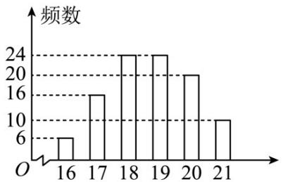

<!-- question-source:start -->
14.（2016·全国·高考真题）某公司计划购买 $^{1}$ 台机器，该种机器使用三年后即被淘汰·机器有一易损零件，在购进机器时，可以额外购买这种零件作为备件，每个200元·在机器使用期间，如果备件不足再购买，则每个500元·现需决策在购买机器时应同时购买几个易损零件，为此搜集并整理了100台这种机器在三年使用期内更换的易损零件数，得下面柱状图：

更换的易损零件数

记 $x$ 表示 ${}^{1}$ 台机器在三年使用期内需更换的易损零件数 $y$ 表示 ${}^{1}$ 台机器在购买易损零件上所需的费用（单位：元）， ${}^{n}$ 表示购机的同时购买的易损零件数。

(Ⅰ) 若 $n=19$ ，求 y 与 x 的函数解析式；

（Ⅱ）若要求“需更换的易损零件数不大于 $n$ ”的频率不小于0.5，求n的最小值；

（III）假设这 $^{100}$ 台机器在购机的同时每台都购买 $^{19}$ 个易损零件，或每台都购买 $^{20}$ 个易损零件，分别计算这 $^{100}$ 台机器在购买易损零件上所需费用的平均数，以此作为决策依据，购买 $^{1}$ 台机器的同时应购买 $^{19}$ 个还是 $^{20}$ 个易损零件？
<!-- question-source:end -->

![[高中/真题/按题型分类/专题22 概率统计及数字特征大题综合/考点07_概率统计的实际应用与决策问题/真题/answers/Q00036220A1.md]]
