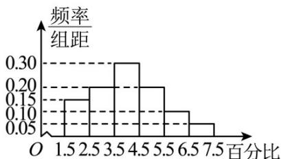
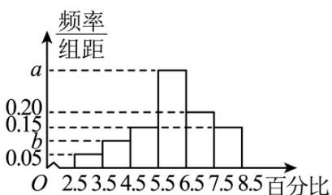

<!-- question-source:start -->
7. (2019·全国·高考真题)为了解甲、乙两种离子在小鼠体内的残留程度, 进行如下试验: 将 $^{200}$ 只小鼠随机分成 $A, B$ 两组, 每组 $^{100}$ 只, 其中 A 组小鼠给服甲离子溶液, $B$ 组小鼠给服乙离子溶液·每只小鼠给服的溶液体积相同、摩尔浓度相同·经过一段时间后用某种科学方法测算出残留在小鼠体内离子的百分比·根据试验数据分别得到如下直方图:

甲离子残留百分比直方图

乙离子残留百分比直方图

记 C 为事件：“乙离子残留在体内的百分比不低于 5.5”，根据直方图得到 $P(C)$ 的估计值为 0.70。
<!-- question-source:end -->

![[高中/真题/按题型分类/专题22 概率统计及数字特征大题综合/考点_07_概率统计的实际应用与决策问题/真题/answers/Q00036213A1.md]]
