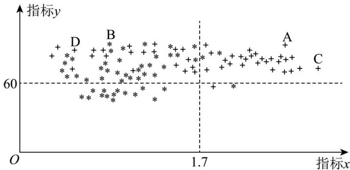

<!-- question-source:start -->
9.（2017·北京·高考真题）为了研究一种新药的疗效，选 $^{100}$ 名患者随机分成两组，每组各 $^{50}$ 名，一组服药，另一组不服药·一段时间后，记录了两组患者的生理指标 $^{X}$ 和 $^{Y}$ 的数据，并制成下图，其中“\*”表示服药者，“+”表示未服药者·

<!-- question-source:end -->

![[高中/真题/按题型分类/专题22 概率统计及数字特征大题综合/考点_07_概率统计的实际应用与决策问题/真题/answers/Q00036215A1.md]]
