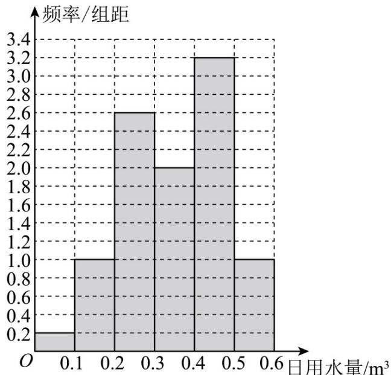

> [!faq]- 《专题22 概率统计及数字特征大题综合》真题解析
>
> > [!success]- **【答案】** 详见解析
>
> > [!note]- **【分析】**
> > 【分析】（ $^{1}$ ）根据题中所给的使用了节水龙头50天的日用水量频数分布表，算出落在相应区间上的频率，借助于直方图中长方形的面积表示的就是落在相应区间上的频率，从而确定出对应矩形的高，从而得到直方图；
> >
> > (2) 结合直方图，算出日用水量小于 0.35 的矩形的面积总和，即为所求的频率；
> >
> > (3) 根据组中值乘以相应的频率作和求得 50 天日用水量的平均值，作差乘以 365 天得到一年能节约用水多少 $m^{3}$ ，从而求得结果·
>
> > [!note]- **【解析】**
> > 【详解】（1）频率分布直方图如下图所示：
> > 
> > (2) 根据以上数据，该家庭使用节水龙头后 $50$ 天日用水量小于 $0.35m^{3}$ 的频率为 $0.2 \times 0.1 + 1 \times 0.1 + 2.6 \times 0.1 + 2 \times 0.05 = 0.48$ ；
> > 因此该家庭使用节水龙头后日用水量小于 $0.35m^{3}$ 的概率的估计值为 0.48；
> > (3) 该家庭未使用节水龙头50天日用水量的平均数为
> > $$
> > \overline {{{x _ {1}}}} = \frac {1}{5 0} (0. 0 5 \times 1 + 0. 1 5 \times 3 + 0. 2 5 \times 2 + 0. 3 5 \times 4 + 0. 4 5 \times 9 + 0. 5 5 \times 2 6 + 0. 6 5 \times 5) = 0. 4 8
> > $$
> > 该家庭使用了节水龙头后 $^{50}$ 天日用水量的平均数为
> > $$
> > \overline {{{x _ {2}}}} = \frac {1}{5 0} (0. 0 5 \times 1 + 0. 1 5 \times 5 + 0. 2 5 \times 1 3 + 0. 3 5 \times 1 0 + 0. 4 5 \times 1 6 + 0. 5 5 \times 5) = 0. 3 5
> > $$
> > 估计使用节水龙头后，一年可节省水 $(0.48 - 0.35)\times 365 = 47.45\left(\mathrm{m}^3\right)$
> > 【点睛】该题考查的是有关统计的问题，涉及到的知识点有频率分布直方图的绘制、利用频率分布直方图计算变量落在相应区间上的概率、利用频率分布直方图求平均数，在解题的过程中，需要认真审题，细心运算，仔细求解，就可以得出正确结果：
