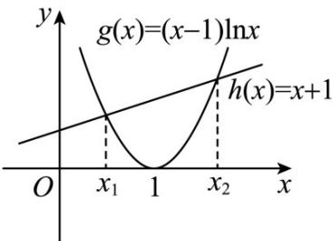

> [!faq]- 《专题23 导数及其应用大题综合》真题解析
>
> > [!success]- **【答案】** 详见解析
>
> > [!note]- **【分析】**
> > （1）先对函数 $f(x)$ 求导，根据导函数的单调性，得到存在唯一 $x_0$ ，使得 $f'(x_0) = 0$ ，进而可得判断函数 $f(x)$ 的单调性，即可确定其极值点个数，证明出结论成立；
> >
> > (2) 先由 (1) 的结果，得到 $f(x_0) < f(1) = -2 < 0$ ， $f(e^2) = e^2 - 3 > 0$ ，得到 $f(x) = 0$ 在 $(x_0, +\infty)$ 内存在唯一实根，记作 $x = \alpha$ ，再求出 $f(\frac{1}{\alpha}) = 0$ ，即可结合题意，说明结论成立。
>
> > [!note]- **【解析】**
> > （1）由题意可得， $f(x)$ 的定义域为 $(0, +\infty)$ ，
> > 由 $f(x) = (x - 1)\ln x - x - 1$
> > 得 $f'(x)=\ln x+\frac{x-1}{x}-1=\ln x-\frac{1}{x}$
> > 显然 $f^{\prime}(x) = \ln x - \frac{1}{x}$ 单调递增；
> > 又 $f^{\prime}(1) = -1 < 0$ ， $f^{\prime}(2) = \ln 2 - \frac{1}{2} = \frac{\ln 4 - 1}{2} >0$
> > 故存在唯一 $x_{0}$ ，使得 $f'(x_{0}) = 0$ ；
> > 又当 $x > x_0$ 时， $f'(x_0) > 0$ ，函数 $f(x)$ 单调递增；当 $0 < x < x_0$ 时， $f'(x_0) < 0$ ，函数 $f(x)$ 单调递减；因此， $f(x)$ 存在唯一的极值点；
> > (2)
> > ## [方法一]【利用对称性转化为研究两个函数根的问题】
> > $f(x)=(x-1)\ln x-x-1=0$ 的根的情况问题可转化为函数 $g(x)=(x-1)\ln x$ 与 $h(x)=x+1$ 的图像在区间 $(0,+\infty)$ 内的交点情况． $g'(x)=\ln x+1-\frac{1}{x},g''(x)=\frac{1}{x}+\frac{1}{x^{2}}$ 当 $x\in(0,+\infty)$ 时， $g''(x)>0, g'(x)$ 在区间 $(0,+\infty)$ 内单调递增；又因为 $g'(1)=0$ ，所以当 $x\in(0,1)$ 时， $g'(x)<g'(1)=0$ ，则 $x\in(0,1)$ 时， $g(x)=(x-1)\ln x$ 单调递减；当 $x\in(1,+\infty)$ 时， $g'(x)>g'(1)=0$ ，则当 $x\in(1,+\infty)$ 时， $g(x)=(x-1)\ln x$ 单调递增．又 $g(1)=0$ ，所以函数 $g(x)=(x-1)\ln x$ 与 $h(x)=x+1$ 的图像，如
> > 图所示，只有两个交点，横坐标分别为 $x_{1}$ 和 $x_{2}$ ，且 $0<x_{1}<1,x_{2}>1$ ，即 $x_{1}$ 和 $x_{2}$ 为 $f(x)=(x-1)\ln x-x-1=0$ 的两个实根．
> > 
> > 又因为 $f(x_{1}) = f(x_{2}) = 0$ ，当 $x = \frac{1}{x_1}$ 时， $f\left(\frac{1}{x_1}\right) = \left(\frac{1}{x_1} - 1\right)\ln \left(\frac{1}{x_1}\right) - \frac{1}{x_1} - 1 = \frac{1}{x_1}\left[(x_1 - 1)\ln x_1 - 1 - x_1\right]$ ，由于 $f(x_{1}) = (x_{1} - 1)\ln x_{1} - 1 - x_{1} = 0$ ，所以 $f\left(\frac{1}{x_1}\right) = 0$ ，即 $x_{2} = \frac{1}{x_1}$ ，所以两个实根互为倒数。
> > [方法二]【分类讨论】
> > 由（1）知， $f(x_{0}) < f(1) = -2 = f(\mathrm{e}) < 0$ 。又 $f\left(\mathrm{e}^{2}\right) = \mathrm{e}^{2} - 3 > 0, f\left(\mathrm{e}^{-2}\right) = 1 - \frac{3}{\mathrm{e}^{2}} > 0$ ，所以 $f(x) = 0$ 有且仅有两个实根 $x_{1}, x_{2}$ ，可令 $0 < x_{1} < 1 < x_{0} < \mathrm{e} < x_{2}$ 。
> > 下面证明 $x_{1}x_{2}=1$ ，
> > 由 $f(x) = 0$ ，得 $\ln x = \frac{x + 1}{x - 1}$ ，显然有 $(x_{1} - 1)(x_{2} - 1) < 0$ ， $\ln (x_1x_2) = \ln x_1 + \ln x_2 = \frac{x_1 + 1}{x_1 - 1} +\frac{x_2 + 1}{x_2 - 1} = \frac{2(x_1x_2 - 1)}{(x_1 - 1)(x_2 - 1)}.$ （\*）
> > (1) 当 $0 < x_{1}x_{2} < 1$ 时， $\ln(x_{1}x_{2})\left\langle0, \frac{2(x_{1}x_{2}-1)}{(x_{1}-1)(x_{2}-1)}\right\rangle0$ ， $(*)$ 式不成立；
> > (2) 当 $x_{1}x_{2}>1$ 时， $\ln(x_{1}x_{2})>0,\frac{2(x_{1}x_{2}-1)}{(x_{1}-1)(x_{2}-1)}<0$ ， $(*)$ 式不成立；
> > (3) 当 $x_{1}x_{2}=1$ 时， $\ln(x_{1}x_{2})=0,\frac{2(x_{1}x_{2}-1)}{(x_{1}-1)(x_{2}-1)}=0$ ， $(*)$ 式成立.
> > 综上， $f(x) = 0$ 有且仅有两个实根，且两个实根互为倒数。
> > ## [方法三]【利用函数的单调性结合零点存在定理】
> > $f(x)$ 的定义域为 $(0, +\infty)$ ，显然 $x = 1$ 不是方程 $f(x) = 0$ 的根，
> > 所以 $f(x) = 0$ 有两个实根等价于 $g(x) = \ln x - \frac{x + 1}{x - 1}$ 有两个零点，且 $g(x)$ 定义域为 $(0,1)\cup (1, + \infty)$
> > 而 $g^{\prime}(x) = \frac{x^{2} + 1}{x(x - 1)^{2}}$ ，所以 $g(x)$ 在区间 $(0,1)$ 内单调递增，在区间 $(1, + \infty)$ 内单调递增.
> > 当 $x \in (1, +\infty)$ 时， $g(e) = -\frac{2}{e-1} < 0$ ， $g(e^{2}) = \frac{e^{2} - 3}{e^{2} - 1} > 0$ ，
> > 所以 $g(x)$ 在区间 $(1,+\infty)$ 内有唯一零点 $x_{1}$ ，即 $g(x_{1})=0,0<\frac{1}{x_{1}}<1$
> > 所以 $g\left(\frac{1}{x_1}\right) = \ln \frac{1}{x_1} -\frac{\frac{1}{x_1} + 1}{\frac{1}{x_1} - 1} =$ $-g(x_{1}) = 0$
> > 结合单调性知 $g(x)$ 在区间 $(0,1)$ 内有唯一零点 $\frac{1}{x_1}$ ，所以 $g(x)$ 有且仅有两个零点，且两个零点互为倒数，即 $f(x) = 0$ 有且仅有两个实根，且两个实根互为倒数。
> > 【整体点评】(2)方法一：对称性是函数的重要性质，利用函数的对称性研究函数体现了整体思想；
> > 方法二：分类讨论是最常规的思想，是处理导数问题最常规的手段；
> > 方法三：函数的单调性和零点存在定理的综合运用使得问题简单化·
