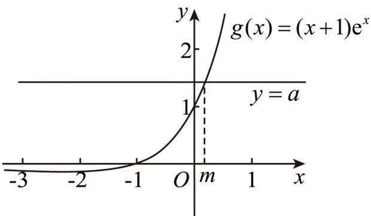

> [!faq]- 《专题23 导数及其应用大题综合》真题解析
>
> > [!success]- **【答案】** 详见解析
>
> > [!note]- **【分析】**
> > 【分析】（1）求出 $f(x)$ 在 $x = 0$ 处的导数，即切线斜率，求出 $f(0)$ ，即可求出切线方程；
> >
> > (Ⅱ) 令 $f'(x) = 0$ ，可得 $a = (x + 1)e^x$ ，则可化为证明 $y = a$ 与 $y = g(x)$ 仅有一个交点，利用导数求出 $g(x)$ 的变化情况，数形结合即可求解；
> >
> > (Ⅲ) 令 $h(x) = (x^2 - x - 1)e^x, (x > -1)$ ，题目等价于存在 $x \in (-1, +\infty)$ ，使得 $h(x) \leq b$ ，即 $b \quad h(x)_{\min}$ ，利用导数即可求出 $h(x)$ 的最小值·
>
> > [!note]- **【解析】**
> > 【详解】（1） $f'(x)=a-(x+1)e^{x}$ ，则 $f'(0)=a-1$ ，
> > 又 $f(0) = 0$ ，则切线方程为 $y = (a - 1)x, (a > 0)$
> > (Ⅱ) 令 $f'(x)=a-(x+1)e^{x}=0$ ，则 $a=(x+1)e^{x}$ ，
> > 令 $g(x) = (x + 1)e^{x}$ ，则 $g'(x) = (x + 2)e^x$
> > 当 $x \in (-\infty, -2)$ 时， $g'(x) < 0$ ， $g(x)$ 单调递减；当 $x \in (-2, +\infty)$ 时， $g'(x) > 0$ ， $g(x)$ 单调递增，
> > 当 $x \to -\infty$ 时， $g(x) < 0$ ， $g(-1) = 0$ ，当 $x \to +\infty$ 时， $g(x) > 0$ ，画出 $g(x)$ 大致图像如下：
> > 
> > 所以当 $a > 0$ 时， $y = a$ 与 $y = g(x)$ 仅有一个交点，令 $g(m) = a$ ，则 $m > -1$ ，且 $f'(m) = a - g(m) = 0$
> > 当 $x \in (-\infty, m)$ 时， $a > g(x)$ ，则 $f'(x) > 0$ ， $f(x)$ 单调递增，
> > 当 $x \in (m, +\infty)$ 时， $a < g(x)$ ，则 $f'(x) < 0$ ， $f(x)$ 单调递减，
> > $x = m$ 为 $f(x)$ 的极大值点，故 $f(x)$ 存在唯一的极值点；
> > (Ⅲ) 由 (Ⅱ) 知 $f(x)_{\max} = f(m)$ ，此时 $a = (1 + m)e^{m}, m > -1$ ，
> > 所以 $\left\{f(x)-a\right\}_{\max}=f(m)-a=\left(m^{2}-m-1\right)e^{m},(m>-1)$
> > $$
> > \text {令} h (x) = \left(x ^ {2} - x - 1\right) e ^ {x}, (x > - 1)
> > $$
> > 若存在 $a$ ，使得 $f(x)\leq a + b$ 对任意 $x\in \mathbf{R}$ 成立，等价于存在 $x\in (-1, + \infty)$ ，使得 $h(x)\leq b$ ，即 $b\quad h(x)_{\min}$
> > $$
> > h ^ {\prime} (x) = \left(x ^ {2} + x - 2\right) e ^ {x} = (x - 1) (x + 2) e ^ {x}, x > - 1
> > $$
> > 当 $x\in (-1,1)$ 时， $h'(x) < 0$ ， $h(x)$ 单调递减，当 $x\in (1, + \infty)$ 时， $h'(x) > 0$ ， $h(x)$ 单调递增，
> > 所以 $h(x)_{\min}=h(1)=-e$ ，故 b -e，
> > 所以实数 b 的取值范围 $\left[-e, +\infty\right)$ .
> > 【点睛】关键点睛：第二问解题的关键是转化为证明 $y = a$ 与 $y = g(x)$ 仅有一个交点；第三问解题的关键是转化为存在 $x \in (-1, +\infty)$ ，使得 $h(x) \leq b$ ，即 $b \quad h(x)_{\min}$ .
