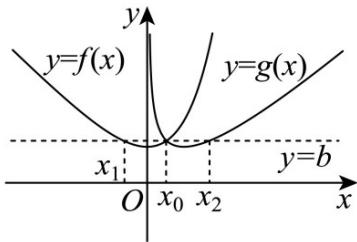

> [!faq]- 《专题23 导数及其应用大题综合》真题解析
>
> > [!success]- **【答案】** 详见解析
>
> > [!note]- **【分析】**
> > 【分析】（1）根据导数可得函数的单调性，从而可得相应的最小值，根据最小值相等可求 $a$ 。注意分类讨论：
> >
> > (2) 根据 (1) 可得当 $b > 1$ 时， $\mathrm{e}^x - x = b$ 的解的个数、 $x - \ln x = b$ 的解的个数均为 2，构建新函数 $h(x) = \mathrm{e}^x + \ln x - 2x$ ，利用导数可得该函数只有一个零点且可得 $f(x), g(x)$ 的大小关系，根据存在直线 $y = b$ 与曲线 $y = f(x)$ ， $y = g(x)$ 有三个不同的交点可得 $b$ 的取值，再根据两类方程的根的关系可证明三根成等差数列.
>
> > [!note]- **【解析】**
> > 【详解】（1） $f(x)=\mathrm{e}^{x}-ax$ 的定义域为R，而 $f'(x)=\mathrm{e}^{x}-a$ ，
> > 若 $a \leq 0$ ，则 $f'(x) > 0$ ，此时 $f(x)$ 无最小值，故 a > 0。
> > $g(x)=ax-\ln x$ 的定义域为 $(0,+\infty)$ ，而 $g'(x)=a-\frac{1}{x}=\frac{ax-1}{x}$ .
> > 当 $x < \ln a$ 时， $f'(x) < 0$ ，故 $f(x)$ 在 $\left(-\infty, \ln a\right)$ 上为减函数，
> > 当 $x > \ln a$ 时， $f'(x) > 0$ ，故 $f(x)$ 在 $\left(\ln a, +\infty\right)$ 上为增函数，
> > 故 $f(x)_{\min}=f(\ln a)=a-a\ln a$ .
> > 当 $0 < x < \frac{1}{a}$ 时， $g'(x) < 0$ ，故 $g(x)$ 在 $\left(0, \frac{1}{a}\right)$ 上为减函数，
> > 当 $x > \frac{1}{a}$ 时， $g'(x) > 0$ ，故 $g(x)$ 在 $\left(\frac{1}{a}, +\infty\right)$ 上为增函数，
> > 故 $g(x)_{\min} = g\left(\frac{1}{a}\right) = 1 - \ln \frac{1}{a}$ .
> > 因为 $f(x)=\mathrm{e}^{x}-ax$ 和 $g(x)=ax-\ln x$ 有相同的最小值，
> > 故 $1 - \ln \frac{1}{a} = a - a\ln a$ ，整理得到 $\frac{a - 1}{1 + a} = \ln a$ ，其中 $a > 0$ ，
> > 设 $g(a) = \frac{a - 1}{1 + a} -\ln a,a > 0$ ，则 $g^{\prime}(a) = \frac{2}{(1 + a)^{2}} -\frac{1}{a} = \frac{-a^{2} - 1}{a(1 + a)^{2}}\leq 0$
> > 故 $g(a)$ 为 $(0, +\infty)$ 上的减函数，而 $g(1) = 0$
> > 故 $g(a) = 0$ 的唯一解为 $a = 1$ ，故 $\frac{1 - a}{1 + a} = \ln a$ 的解为 $a = 1$
> > 综上， $a = 1$
> > $^{2}$ [方法一]:
> > 由（1）可得 $f(x)=\mathrm{e}^{x}-x$ 和 $g(x)=x-\ln x$ 的最小值为 $1-\ln1=1-\ln\frac{1}{1}=1$ .
> > 当 b > 1 时，考虑 $e^{x} - x = b$ 的解的个数、 $x - \ln x = b$ 的解的个数。
> > 设 $S(x) = \mathrm{e}^{x} - x - b$ ， $S'(x) = \mathrm{e}^{x} - 1$
> > 当 $x < 0$ 时， $S'(x) < 0$ ，当 $x > 0$ 时， $S'(x) > 0$
> > 故 $S(x)$ 在 $(-\infty, 0)$ 上为减函数，在 $(0, +\infty)$ 上为增函数，
> > 所以 $S(x)_{\min} = S(0) = 1 - b < 0$
> > 而 $S(-b)=\mathrm{e}^{-b}>0$ ， $S(b)=\mathrm{e}^{b}-2b$ ，
> > 设 $u(b)=\mathrm{e}^{b}-2b$ ，其中 b>1，则 $u'(b)=\mathrm{e}^{b}-2>0$ ，
> > 故 $u(b)$ 在 $(1,+\infty)$ 上为增函数，故 $u(b)>u(1)=\mathrm{e}-2>0$
> > 故 $S(b) > 0$ ，故 $S(x) = \mathrm{e}^{x} - x - b$ 有两个不同的零点，即 $\mathrm{e}^x - x = b$ 的解的个数为2.
> > 设 $T(x)=x-\ln x-b$ ， $T'(x)=\frac{x-1}{x}$ ，
> > 当0<x<1时， $T'(x)<0$ ，当x>1时， $T'(x)>0$ ，
> > 故 $T(x)$ 在 $(0,1)$ 上为减函数，在 $(1,+\infty)$ 上为增函数，
> > 所以 $T(x)_{\min}=T(1)=1-b<0$
> > 而 $T\left(\mathrm{e}^{-b}\right) = \mathrm{e}^{-b} > 0$ ， $T\left(\mathrm{e}^{b}\right) = \mathrm{e}^{b} - 2b > 0$
> > $T(x)=x-\ln x-b$ 有两个不同的零点即 $x-\ln x=b$ 的解的个数为2.
> > 当 $b = 1$ ，由（1）讨论可得 $x - \ln x = b$ 、 $\mathrm{e}^x -x = b$ 仅有一个解，
> > 当 $b < 1$ 时，由（1）讨论可得 $x - \ln x = b$ 、 $\mathrm{e}^x - x = b$ 均无根，
> > 故若存在直线 y=b 与曲线 $y=f(x)$ 、 $y=g(x)$ 有三个不同的交点，则 b>1.
> > 设 $h(x)=\mathrm{e}^{x}+\ln x-2x$ ，其中 x>0，故 $h'(x)=\mathrm{e}^{x}+\frac{1}{x}-2$ ，
> > 设 $s(x) = \mathrm{e}^x - x - 1$ ， $x > 0$ ，则 $s'(x) = \mathrm{e}^x - 1 > 0$
> > 故 $s(x)$ 在 $(0, +\infty)$ 上为增函数，故 $s(x) > s(0) = 0$ 即 $\mathrm{e}^x > x + 1$
> > 所以 $h'(x) > x + \frac{1}{x} - 1 \quad 2 - 1 > 0$ ，所以 $h(x)$ 在 $(0, +\infty)$ 上为增函数，
> > 而 $h(1)=\mathrm{e}-2>0$ ， $h(\frac{1}{\mathrm{e}^{3}})=\mathrm{e}^{\frac{1}{\mathrm{e}^{3}}}-3-\frac{2}{\mathrm{e}^{3}}<\mathrm{e}-3-\frac{2}{\mathrm{e}^{3}}<0$ ，
> > 故 $h(x)$ 在 $(0, +\infty)$ 上有且只有一个零点 $x_0$ ， $\frac{1}{\mathrm{e}^3} < x_0 < 1$ 且：
> > 当 $0 < x < x_0$ 时， $h(x) < 0$ 即 $\mathrm{e}^x - x < x - \ln x$ 即 $f(x) < g(x)$ ，
> > 当 $x > x_{0}$ 时， $h(x) > 0$ 即 $e^{x} - x > x - \ln x$ 即 $f(x) > g(x)$
> > 因此若存在直线 $y = b$ 与曲线 $y = f(x)$ 、 $y = g(x)$ 有三个不同的交点，
> > 故 $b=f(x_{0})=g(x_{0})>1$
> > 此时 $e^{x}-x=b$ 有两个不同的根 $x_{1}, x_{0}(x_{1}<0<x_{0})$
> > 此时 $x - \ln x = b$ 有两个不同的根 $x_0, x_4 (0 < x_0 < 1 < x_4)$
> > 故 $\mathrm{e}^{x_1} - x_1 = b$ ， $\mathrm{e}^{x_0} - x_0 = b$ ， $x_{4} - \ln x_{4} - b = 0$ ， $x_0 - \ln x_0 - b = 0$
> > 所以 $x_{4} - b = \ln x_{4}$ 即 $\mathrm{e}^{x_4 - b} = x_4$ 即 $\mathrm{e}^{x_4 - b} - (x_4 - b) - b = 0$
> > 故 $x_{4}-b$ 为方程 $e^{x}-x=b$ 的解，同理 $x_{0}-b$ 也为方程 $e^{x}-x=b$ 的解
> > 又 $\mathrm{e}^{x_1} - x_1 = b$ 可化为 $\mathrm{e}^{x_1} = x_1 + b$ 即 $x_{1} - \ln (x_{1} + b) = 0$ 即 $(x_{1} + b) - \ln (x_{1} + b) - b = 0$
> > 故 $x_{1} + b$ 为方程 $x - \ln x = b$ 的解，同理 $x_0 + b$ 也为方程 $x - \ln x = b$ 的解，
> > 所以 $\{x_1, x_0\} = \{x_0 - b, x_4 - b\}$ ，而 $b > 1$ ，
> > 故 $\left\{ \begin{array}{l} x_{0} = x_{4} - b \\ x_{1} = x_{0} - b \end{array} \right.$ 即 $x_{1} + x_{4} = 2x_{0}$ .
> > [方法二]：
> > 由(1)知， $f(x)=e^{x}-x$ ， $g(x)=x-\ln x$ ，
> > 且 $f(x)$ 在 $(- \infty, 0)$ 上单调递减，在 $(0, +\infty)$ 上单调递增；
> > $g(x)$ 在 $(0,1)$ 上单调递减，在 $(1,+\infty)$ 上单调递增，且 $f(x)_{\min}=g(x)_{\min}=1$ .
> > - **①**：b < 1 时，此时 $f(x)_{\min} = g(x)_{\min} = 1 > b$ ，显然 y = b 与两条曲线 $y = f(x)$ 和 $y = g(x)$
> > 共有 $^{0}$ 个交点，不符合题意；
> > - **②**：b=1 时，此时 $f(x)_{\min}=g(x)_{\min}=1=b$
> > 故 y = b 与两条曲线 $y = f(x)$ 和 $y = g(x)$ 共有 2 个交点，交点的横坐标分别为 0 和 1；
> > - **③**：b > 1 时，首先，证明 y = b 与曲线 $y = f(x)$ 有 2 个交点，
> > 即证明 $F(x) = f(x) - b$ 有2个零点， $F'(x) = f'(x) = e^x - 1$
> > 所以 $F(x)$ 在 $(-∞,0)$ 上单调递减，在 $(0,+∞)$ 上单调递增，
> > 又因为 $F(-b) = e^{-b} > 0$ ， $F(0) = 1 - b < 0$ ， $F(b) = e^b - 2b > 0$
> > (令 $t(b)=e^{b}-2b$ ，则 $t'(b)=e^{b}-2>0$ ， $t(b)>t(1)=e-2>0$ )
> > 所以 $F(x) = f(x) - b$ 在 $(- \infty, 0)$ 上存在且只存在1个零点，设为 $x_{1}$ ，在 $(0, +\infty)$ 上存在且只存在1个零点，设为 $x_{2}$ .
> > 其次，证明 $y = b$ 与曲线和 $y = g(x)$ 有2个交点，
> > 即证明 $G(x)=g(x)-b$ 有 2 个零点， $G'(x)=g'(x)=1-\frac{1}{x}$ ，
> > 所以 $G(x)(0,1)$ 上单调递减，在 $(1,+\infty)$ 上单调递增，
> > 又因为 $G(e^{-b}) = e^{-b} > 0$ ， $G(1) = 1 - b < 0$ ， $G(2b) = b - \ln 2b > 0$ ，
> > (令 $\mu(b)=b-\ln2b$ ，则 $\mu'(b)=1-\frac{1}{b}>0$ ， $\mu(b)>\mu(1)=1-\ln2>0$ )
> > 所以 $G(x)=g(x)-b$ 在 $(0,1)$ 上存在且只存在 1 个零点，设为 $x_{3}$ ，在 $(1,+\infty)$ 上存在且只存在 1 个零点，设为 $x_{4}$ .
> > 再次，证明存在 b，使得 $x_{2}=x_{3}$ ：
> > 因为 $F(x_{2}) = G(x_{3}) = 0$ ，所以 $b = e^{x_2} - x_2 = x_3 - \ln x_3$
> > 若 $x_{2} = x_{3}$ ，则 $e^{x_2} - x_2 = x_2 - \ln x_2$ ，即 $e^{x_2} - 2x_2 + \ln x_2 = 0$
> > 所以只需证明 $e^x - 2x + \ln x = 0$ 在 $(0,1)$ 上有解即可，
> > 即 $\varphi(x)=e^{x}-2x+\ln x$ 在 $(0,1)$ 上有零点，
> > 因为 $\varphi\left(\frac{1}{e^{3}}\right)=e^{\frac{1}{e^{3}}}-\frac{2}{e^{3}}-3<0$ ， $\varphi(1)=e-2>0$ ，
> > 所以 $\varphi (x) = e^{x} - 2x + \ln x$ 在(0,1)上存在零点，取一零点为 $x_0$ ，令 $x_{2} = x_{3} = x_{0}$ 即可，
> > 此时取 $b = e^{x_0} - x_0$
> > 则此时存在直线 $y = b$ ，其与两条曲线 $y = f(x)$ 和 $y = g(x)$ 共有三个不同的交点，
> > 最后证明 $x_{1} + x_{4} = 2x_{0}$ ，即从左到右的三个交点的横坐标成等差数列，
> > 因为 $F(x_{1}) = F(x_{2}) = F(x_{0}) = 0 = G(x_{3}) = G(x_{0}) = G(x_{4})$
> > 所以 $F(x_{1})=G(x_{0})=F(\ln x_{0})$
> > 又因为 $F(x)$ 在 $(-∞,0)$ 上单调递减， $x_{1}<0$ ， $0<x_{0}<1$ 即 $\ln x_{0}<0$ ，所以 $x_{1}=\ln x_{0}$ ，
> > 同理，因为 $F(x_{0}) = G(e^{x_{0}}) = G(x_{4})$
> > 又因为 $G(x)$ 在 $(1,+\infty)$ 上单调递增， $x_{0}>0$ 即 $e^{x_{0}}>1$ ， $x_{1}>1$ ，所以 $x_{4}=e^{x_{0}}$ ，
> > 又因为 $e^{x_0} - 2x_0 + \ln x_0 = 0$ ，所以 $x_{1} + x_{4} = e^{x_{0}} + \ln x_{0} = 2x_{0}$
> > 即直线 y = b 与两条曲线 $y = f(x)$ 和 $y = g(x)$ 从左到右的三个交点的横坐标成等差数列.
> > 
> > 【点睛】思路点睛：函数的最值问题，往往需要利用导数讨论函数的单调性，此时注意对参数的分类讨论，而不同方程的根的性质，注意利用方程的特征找到两类根之间的关系·
