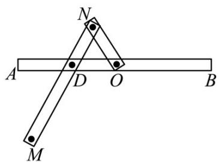
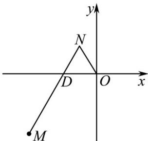

<!-- question-source:start -->
5．（2015·湖北·高考真题）一种作图工具如图1所示．O是滑槽AB的中点，短杆ON可绕O转动，长杆MN通过N处铰链与ON连接，MN上的栓子D可沿滑槽AB滑动，且DN=ON=1，MN=3．当栓子D在滑槽AB内做往复运动时，带动N绕O转动一周（D不动时，N也不动），M处的笔尖画出的曲线记为C．以O为原点，AB所在的直线为x轴建立如图2所示的平面直角坐标系．

图1

图2

(Ⅰ) 求曲线 $^{C}$ 的方程；

（Ⅱ）设动直线 l 与两定直线 $l_{1}: x - 2y = 0$ 和 $l_{2}: x + 2y = 0$ 分别交于 P, Q 两点．若直线 l 总与曲线 C 有且只有一个公共点，试探究： $\Delta OQP$ 的面积是否存在最小值？若存在，求出该最小值；若不存在，说明理由．
<!-- question-source:end -->

![[高中/真题/按题型分类/专题24 圆锥曲线/考点02_求轨迹方程/真题/answers/Q00036433A1.md]]
