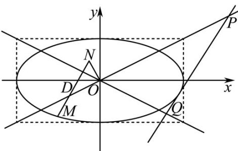

> [!faq]- 《专题24 圆锥曲线》真题解析
>
> > [!success]- **【答案】** 详见解析
>
> > [!note]- **【分析】**
> > 本题未单列分析。
>
> > [!note]- **【解析】**
> > 【答案】（Ⅰ） $\frac{x^{2}}{16} + \frac{y^{2}}{4} = 1$ ；（Ⅱ）存在最小值 $^{8}$ .
> > 【详解】（1）设点 $D(t,0)(|t|\leq 2)$ ， $N(x_0,y_0),M(x,y)$ ，依题意，
> > 
> > ，且
> > $\overset{\cup\cup\cup}{MD}=2DN$ $\left|\overset{\cup\cup\cup}{DN}\right|=\left|\overset{\cup\cup\cup}{ON}\right|=1$
> > 所以 $(t - x, - y) = 2(x_0 - t, y_0)$ ，且 $\left\{ \begin{array}{l} (x_0 - t)^2 + y_0^2 = 1, \\ x_0^2 + y_0^2 = 1. \end{array} \right.$
> > 即 $\left\{\begin{aligned}t-x&=2x_{0}-2t,\\ y&=-2y_{0}.\end{aligned}\right.$ 且 $t(t-2x_{0})=0.$
> > 由于当点 D 不动时，点 D 也不动，所以 t 不恒等于 0，
> > 于是 $t = 2x_0$ ，故 $x_0 = \frac{x}{4}, y_0 = -\frac{y}{2}$ ，代入 $x_0^2 + y_0^2 = 1$ ，可得 $\frac{x^2}{16} + \frac{y^2}{4} = 1$
> > 即所求的曲线 C 的方程为 $\frac{x^{2}}{16} + \frac{y^{2}}{4} = 1$ .
> > （Ⅱ）（1）当直线 $l$ 的斜率不存在时，直线 $l$ 为 $x = 4$ 或 $x = -4$ ，都有 $S_{\Delta OPQ} = \frac{1}{2}\times 4\times 4 = 8$
> > (2) 当直线 l 的斜率存在时，设直线 $l: y = kx + m (k \neq \pm \frac{1}{2})$ ,
> > 由 $\left\{ \begin{array}{l} y = kx + m, \\ x^2 + 4y^2 = 16, \end{array} \right.$ 消去 $y$ ，可得 $(1 + 4k^2)x^2 + 8kmx + 4m^2 - 16 = 0$ 。
> > 因为直线 l 总与椭圆 C 有且只有一个公共点，
> > 所以 $\Delta = 64k^{2}m^{2} - 4(1 + 4k^{2})(4m^{2} - 16) = 0$ ，即 $m^{2} = 16k^{2} + 4$ ．①
> > 又由 $\left\{ \begin{array}{l}y = kx + m,\\ x - 2y = 0, \end{array} \right.$ 可得 $P\left(\frac{2m}{1 - 2k},\frac{m}{1 - 2k}\right)$ ；同理可得 $Q\left(\frac{-2m}{1 + 2k},\frac{m}{1 + 2k}\right)$
> > 由原点 $O$ 到直线 $PQ$ 的距离为 $d = \frac{|m|}{\sqrt{1 + k^2}}$ 和 $|PQ| = \sqrt{1 + k^2}\left|x_P - x_Q\right|$ ，可得
> > $$
> > S _ {\Delta O P Q} = \frac {1}{2} | P Q | \cdot d = \frac {1}{2} | m | \left| x _ {P} - x _ {Q} \right| = \frac {1}{2} \cdot | m | \left| \frac {2 m}{1 - 2 k} + \frac {2 m}{1 + 2 k} \right| = \left| \frac {2 m ^ {2}}{1 - 4 k ^ {2}} \right|
> > $$
> > 将①代入②得， $S_{\Delta OPQ}=\left|\frac{2m^{2}}{1-4k^{2}}\right|=8\frac{\left|4k^{2}+1\right|}{\left|4k^{2}-1\right|}$
> > 当 $k^2 > \frac{1}{4}$ 时， $S_{\Delta OPQ} = 8(\frac{4k^2 + 1}{4k^2 - 1}) = 8(1 + \frac{2}{4k^2 - 1}) > 8$ ；
> > 当 $0 \leq k^2 < \frac{1}{4}$ 时， $S_{\Delta OPQ} = 8(\frac{4k^2 + 1}{1 - 4k^2}) = 8(-1 + \frac{2}{1 - 4k^2})$
> > 因 $0 \leq k^2 < \frac{1}{4}$ ，则 $0 < 1 - 4k^2 \leq 1$ ， $\frac{2}{1 - 4k^2} = 2$ ，所以 $S_{\Delta OPQ} = 8(-1 + \frac{2}{1 - 4k^2}) = 8$ ，
> > 当且仅当 k = 0 时取等号。
> > 所以当 k=0 时， $S_{\Delta OPQ}$ 的最小值为 8
> > 综合（1）（2）可知，当直线 $l$ 与椭圆 $C$ 在四个顶点处相切时， $\Delta OPQ$ 的面积取得最小值8
> > 考点：椭圆的标准方程、几何性质，直线与圆、椭圆的位置关系，最值。
