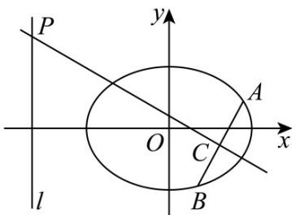

<!-- question-source:start -->
9. (2015·江苏·高考真题) 如图，在平面直角坐标系 xOy 中，已知椭圆 $\frac{x^2}{a^2} + \frac{y^2}{b^2} = 1 (a > b > 0)$ 的离心率为 $\frac{\sqrt{2}}{2}$ ，且右焦点 $F$ 到左准线 $I$ 的距离为 3.

(1) 求椭圆的标准方程；

(2) 过 $F$ 的直线与椭圆交于 $A, B$ 两点，线段 $AB$ 的垂直平分线分别交直线 $I$ 和 $AB$ 于点 $P, C$ ，若 $PC = 2AB$ ，求直线 $AB$ 的方程：
<!-- question-source:end -->

![[高中/真题/按题型分类/专题24 圆锥曲线/考点03_求直线方程/真题/answers/Q00036442A1.md]]
