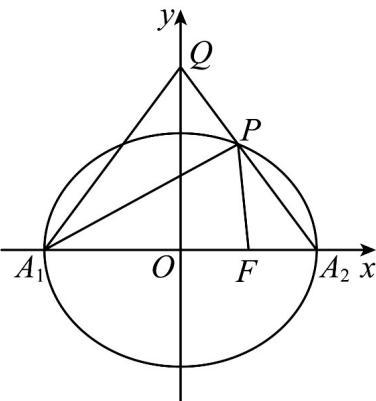

> [!faq]- 《专题24 圆锥曲线》真题解析
>
> > [!success]- **【答案】** 详见解析
>
> > [!note]- **【分析】**
> > 【分析】（1）由 $\left\{ \begin{array}{l}a + c = 3\\ a - c = 1 \end{array} \right.$ 解得 $a = 2,c = 1$ ，从而求出 $b = \sqrt{3}$ ，代入椭圆方程即可求方程，再代入离心率公式即求离心率·
> >
> > (2) 先设直线 $A_{2}P$ 的方程，与椭圆方程联立，消去 $y$ ，再由韦达定理可得 $x_{A_2} \cdot x_P$ ，从而得到 $P$ 点和 $Q$ 点坐标·由 $S_{\triangle A_2QA_1} = S_{\triangle A_1PQ} + S_{\triangle A_1A_2P} = 2S_{\triangle A_2PF} + S_{\triangle A_1A_2P}$ 得 $2|y_Q| = 3|y_P|$ ，即可得到关于 $k$ 的方程，解出 $k$ ，代入直线 $A_{2}P$ 的方程即可得到答案·
>
> > [!note]- **【解析】**
> > 【详解】（1）如图，
> > 
> > 由题意得 $\left\{ \begin{array}{l}a + c = 3\\ a - c = 1 \end{array} \right.$ ，解得 $a = 2,c = 1$ ，所以 $b = \sqrt{2^2 - 1^2} = \sqrt{3}$
> > 所以椭圆的方程为 $\frac{x^{2}}{4}+\frac{y^{2}}{3}=1$ ，离心率为 $e=\frac{c}{a}=\frac{1}{2}$ .
> > (2) 由题意得，直线 $A_{2}P$ 斜率存在，由椭圆的方程为 $\frac{x^2}{4} + \frac{y^2}{3} = 1$ 可得 $A_{2}(2,0)$ ，设直线 $A_{2}P$ 的方程为 $y = k(x - 2)$ ，
> > 联立方程组 $\left\{ \begin{array}{l} \frac{x^2}{4} + \frac{y^2}{3} = 1 \\ y = k(x - 2) \end{array} \right.$ ，消去 整理得： $\left(3 + 4k^2\right)x^2 - 16k^2x + 16k^2 - 12 = 0$ 由韦达定理得 $x_{A_2} \cdot x_P = \frac{16k^2 - 12}{3 + 4k^2}$ ，所以 $x_P = \frac{8k^2 - 6}{3 + 4k^2}$ ，
> > 所以 $P\left(\frac{8k^{2}-6}{3+4k^{2}},\frac{-12k}{3+4k^{2}}\right)$ ， $Q(0,-2k)$ .
> > 所以 $S_{\triangle A_{2}QA_{1}}=\frac{1}{2}\times4\times\left|y_{Q}\right|$ , $S_{\triangle A_{2}PF}=\frac{1}{2}\times1\times\left|y_{P}\right|$ , $S_{\triangle A_{1}A_{2}P}=\frac{1}{2}\times4\times\left|y_{P}\right|$ ,
> > 所以 $S_{\triangle A_{2}QA_{1}} = S_{\triangle A_{1}PQ} + S_{\triangle A_{1}A_{2}P} = 2S_{\triangle A_{2}PF} + S_{\triangle A_{1}A_{2}P}$
> > 所以 $2\left|y_{Q}\right| = 3\left|y_{P}\right|$ ，即 $2\left|-2k\right| = 3\left[-\frac{12k}{3 + 4k^2}\right]$
> > 解得 $k = \pm \frac{\sqrt{6}}{2}$ ，所以直线 $A_{2}P$ 的方程为 $y = \pm \frac{\sqrt{6}}{2}(x - 2)$ .
