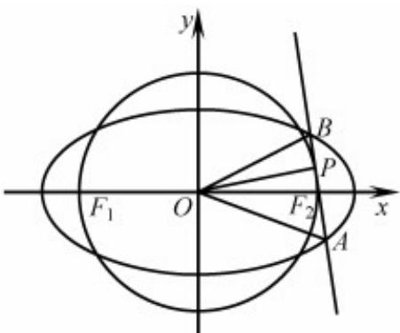

> [!faq]- 《专题24 圆锥曲线》真题解析
>
> > [!success]- **【答案】** 详见解析
>
> > [!note]- **【分析】**
> > （1）根据条件易得圆的半径，即得圆的标准方程，再根据点在椭圆上，解方程组可得 $a, b$ ，即得椭圆方程；
> >
> > (2) 方法一：①先根据直线与圆相切得一方程，再根据直线与椭圆相切得另一方程，解方程组可得切点坐标；②先根据三角形面积得三角形底边边长，再结合①中方程组，利用求根公式以及两点间距离公式，列方程，解得切点坐标，即得直线方程.
>
> > [!note]- **【解析】**
> > （1）因为椭圆 $C$ 的焦点为 $F_{1}(-\sqrt{3},0), F_{2}(\sqrt{3},0)$
> > 可设椭圆 $C$ 的方程为 $\frac{x^2}{a^2} +\frac{y^2}{b^2} = 1(a > b > 0)$ 又点 $\left(\sqrt{3},\frac{1}{2}\right)$ 在椭圆 $C$ 上，
> > 所以 $\left\{\begin{aligned}\frac{3}{a^{2}}+\frac{1}{4b^{2}}=1,\\ a^{2}-b^{2}=3,\end{aligned}\right.$ ，解得 $\left\{\begin{aligned}a^{2}&=4,\\ b^{2}&=1,\end{aligned}\right.$
> > 因此，椭圆 $C$ 的方程为 $\frac{x^2}{4} + y^2 = 1$
> > 因为圆 O 的直径为 $F_{1}F_{2}$ ，所以其方程为 $x^{2} + y^{2} = 3$ 。
> > ## (2) [方法一]：【通性通法】代数法硬算
> > - **①**：设直线 l 与圆 O 相切于 $P(x_{0}, y_{0})(x_{0} > 0, y_{0} > 0)$ ，则 $x_{0}^{2} + y_{0}^{2} = 3$ ，
> > 所以直线 l 的方程为 $y = -\frac{x_{0}}{y_{0}}(x - x_{0}) + y_{0}$ ，即 $y = -\frac{x_{0}}{y_{0}}x + \frac{3}{y_{0}}$ .
> > 由 $\left\{ \begin{array}{l} \frac{x^2}{4} + y^2 = 1 \\ y = -\frac{x_0}{y_0} x + \frac{3}{y_0} \end{array} \right.$ ，消去 $y$ ，得 （\*）， $\left(4x_0^2 + y_0^2\right)x^2 - 24x_0x + 36 - 4y_0^2 = 0$
> > 因为直线 $l$ 与椭圆 $C$ 有且只有一个公共点，
> > 所以 $\Delta = (-24x_0)^2 - 4(4x_0^2 + y_0^2)(36 - 4y_0^2) = 48y_0^2(x_0^2 - 2) = 0$
> > 因为 $x_0, y_0 > 0$ ，所以 $x_0 = \sqrt{2}, y_0 = 1$ ，因此，点 $P$ 的坐标为 $(\sqrt{2}, 1)$
> > - **②**：因为三角形 $OAB$ 的面积为 $\frac{2\sqrt{6}}{7}$ ，所以 $\frac{1}{2} |AB| \cdot |OP| = \frac{2\sqrt{6}}{7}$ ，从而 $|AB| = \frac{4\sqrt{2}}{7}$
> > 设 $A(x_{1},y_{1}),B(x_{2},y_{2})$ ，由（ $^*$ ）得 $x_{1,2} = \frac{24x_0\pm\sqrt{48y_0^2(x_0^2 - 2)}}{2(4x_0^2 + y_0^2)}$
> > 所以 $AB^{2}=\left(x_{1}-x_{2}\right)^{2}+\left(y_{1}-y_{2}\right)^{2}=\left(1+\frac{x_{0}^{2}}{y_{0}^{2}}\right)\cdot\frac{48y_{0}^{2}\left(x_{0}^{2}-2\right)}{\left(4x_{0}^{2}+y_{0}^{2}\right)^{2}}$
> > 因为 $x_0^2 + y_0^2 = 3$ ，所以 $\left|AB\right|^2 = \frac{16(x_0^2 - 2)}{(x_0^2 + 1)^2} = \frac{32}{49}$ ，即 $2x_0^4 - 45x_0^2 + 100 = 0$ ，
> > 解得 $x_0^2 = \frac{5}{2} (x_0^2 = 20$ 舍去），则 $y_0^2 = \frac{1}{2}$ ，因此 $P$ 的坐标为 $\left(\frac{\sqrt{10}}{2},\frac{\sqrt{2}}{2}\right)$
> > 综上，直线 $l$ 的方程为 $y = -\sqrt{5} x + 3\sqrt{2}$
> > 
> > [方法二]：圆的参数方程的应用
> > 设 $P$ 点坐标为 $(\sqrt{3}\cos \alpha ,\sqrt{3}\sin \alpha),\alpha \in \left(0,\frac{\pi}{2}\right)$
> > 因为原点到直线 $x \cos \alpha + y \sin \alpha = \sqrt{3}$ 的距离 $d = \frac{\sqrt{3}}{\sqrt{\cos^{2} \alpha + \sin^{2} \alpha}} = \sqrt{3} = r$ ，所以与圆 O 切于点 P 的直线 l 的方程为 $x \cos \alpha + y \sin \alpha = \sqrt{3}$ 。
> > 由 $\left\{ \begin{array}{l} x\cos \alpha + y\sin \alpha = \sqrt{3}, \\ \frac{x^2}{4} + y^2 = 1, \end{array} \right.$ 消去 $y$ ，得 $\left(1 + 3\cos^2\alpha\right)x^2 - (8\sqrt{3}\cos \alpha)x + \left(12 - 4\sin^2\alpha\right) = 0$
> > - **①**：因为直线 $l$ 与椭圆相切，所以 $\Delta = -16\cdot (\cos^2\alpha -2)(3\cos^2\alpha -2) = 0$
> > 因为 $\alpha \in \left(0, \frac{\pi}{2}\right)$ ，所以 $\cos \alpha \in (0,1)$ ，故 $\cos \alpha = \frac{\sqrt{6}}{3}$ ， $\sin \alpha = \frac{\sqrt{3}}{3}$
> > 所以， $P$ 点坐标为 $(\sqrt{2},1)$
> > - **②**：因为直线 $l: x \cos \alpha + y \sin \alpha = \sqrt{3}$ 与圆 $O$ 相切，所以 $\triangle OAB$ 中边 $AB$ 上的高 $\sqrt{3} = r$ ，因为 $\triangle OAB$ 的面积为 $\frac{2\sqrt{6}}{7}$ ，所以 $|AB| = \frac{4}{7}\sqrt{2}$ ：
> > 设 $A(x_{1},y_{1}),B(x_{2},y_{2})$ ，由①知
> > $$
> > x _ {1} + x _ {2} = \frac {8 \sqrt {3} \cos \alpha}{1 + 3 \cos^ {2} \alpha}, x _ {1} x _ {2} = \frac {1 2 - 4 \sin^ {2} \alpha}{1 + 3 \cos^ {2} \alpha} = \frac {8 + 4 \cos^ {2} \alpha}{1 + 3 \cos^ {2} \alpha}
> > $$
> > $$
> > \mid A B \mid = \frac {4}{7} \sqrt {2} = \sqrt {1 + \frac {\cos^ {2} \alpha}{\sin^ {2} \alpha}} \cdot \sqrt {\left(x _ {1} + x _ {2}\right) ^ {2} - 4 x _ {1} x _ {2}} = \sqrt {1 + \frac {\cos^ {2} \alpha}{\sin^ {2} \alpha}} \cdot \sqrt {\left(\frac {8 \sqrt {3} \cos \alpha}{1 + 3 \cos^ {2} \alpha}\right) ^ {2}} - 4 \left(\frac {8 + 4 \cos^ {2} \alpha}{1 + 3 \cos^ {2} \alpha}\right)
> > $$
> > 即 $18\cos^6\alpha - 153\cos^4\alpha + 235\cos^2\alpha - 100 = 0$
> > 即 $\left(6\cos^2\alpha -5\right)\left(\cos^2\alpha -1\right)\left(3\cos^2\alpha -20\right) = 0$
> > 因为 $\alpha \in \left(0, \frac{\pi}{2}\right)$ ，所以 $\cos \alpha \in (0,1)$ ，故 $\cos^2 \alpha = \frac{5}{6}$ ，所以 $\cos \alpha = \sqrt{\frac{5}{6}}$ ， $\sin \alpha = \sqrt{\frac{1}{6}}$
> > 所以直线 $l$ 的方程为 $y = -\sqrt{5} x + 3\sqrt{2}$
> > ## [方法三]：直线参数方程与圆的参数方程的应用
> > 设 $P$ 点坐标为 $(\sqrt{3}\cos \alpha ,\sqrt{3}\sin \alpha),\alpha \in \left(0,\frac{\pi}{2}\right)$ ，则与圆 $O$ 切于点 $P$ 的直线 $l$ 的参数方程为：
> > $\left\{ \begin{array}{l} x = \sqrt{3} \cos \alpha + t \cos \left( \alpha + \frac{\pi}{2} \right) \\ y = \sqrt{3} \sin \alpha + t \sin \left( \alpha + \frac{\pi}{2} \right) \end{array} \right.$ （ $t$ 为参数），
> > 即 $\left\{\begin{aligned}x&=\sqrt{3}\cos\alpha-t\sin\alpha\\ y&=\sqrt{3}\sin\alpha+t\cos\alpha\end{aligned}\right.$ （t为参数）.
> > 代入 $\frac{x^2}{4} + y^2 = 1$ ，得关于 $t$ 的一元二次方程 $(1 + 3\cos^2\alpha)t^2 + (6\sqrt{3}\sin \alpha \cos \alpha)t + (8 - 9\cos^2\alpha) = 0$
> > - **①**：因为直线 $l$ 与椭圆相切，所以， $\Delta = (6\sqrt{3}\sin \alpha \cos \alpha)^2 -4(1 + 3\cos^2\alpha)(8 - 9\cos^2\alpha) = 0$
> > 因为 $\alpha \in \left(0, \frac{\pi}{2}\right)$ ，所以 $\cos \alpha \in (0,1)$ ，故 $\cos \alpha = \frac{\sqrt{6}}{3}$ ， $\sin \alpha = \frac{\sqrt{3}}{3}$ 。
> > 所以， $P$ 点坐标为 $(\sqrt{2},1)$
> > - **②**：同方法二，略。
> > 【整体点评】（2）方法一：①直接利用直线与圆的位置关系，直线与椭圆的位置关系代数法硬算，即可解出点 $P$ 的坐标；
> > - **②**：根据三角形面积公式，利用弦长公式可求出点 $P$ 的坐标，是该题的通性通法；
> > 方法二：①利用圆的参数方程设出点 $(\sqrt{3}\cos\alpha,\sqrt{3}\sin\alpha)$ ，进而表示出直线方程，根据直线与椭圆的位置关
> > 系解出点 P 的坐标；
> > - **②**：根据三角形面积公式，利用弦长公式可求出点 P 的坐标；
> > 方法三：①利用圆的参数方程设出点 $(\sqrt{3} \cos \alpha, \sqrt{3} \sin \alpha)$ ，将直线的参数方程表示出来，根据直线与椭圆的位置关系解出点 $P$ 的坐标；
> > - **②**：根据三角形面积公式，利用弦长公式可求出点 $P$ 的坐标。
