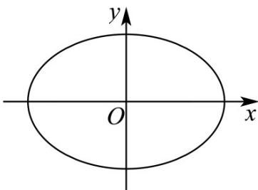

<!-- question-source:start -->
8. (2016·浙江·高考真题) 如图，设椭圆 $\frac{x^2}{a^2} + y^2 = 1$ ( $a > 1$ ).

(Ⅰ) 求直线 $y=kx^{+1}$ 被椭圆截得的线段长（用 a、k 表示）；

(Ⅱ) 若任意以点 $A(0,1)$ 为圆心的圆与椭圆至多有 $^{3}$ 个公共点，求椭圆离心率的取值范围·
<!-- question-source:end -->

![[高中/真题/按题型分类/专题24 圆锥曲线/考点04_求斜率值或范围/对点训练/answers/Q00055854A1.md]]
