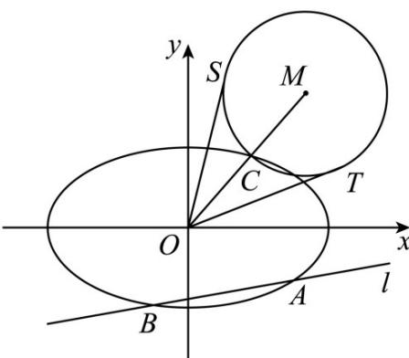

<!-- question-source:start -->
8.（2017·山东·高考真题）在平面直角坐标系 $xOy$ 中，椭圆 $E: \frac{x^2}{a^2} + \frac{y^2}{b^2} = 1 (a > b > 0)$ 的离心率为 $\frac{\sqrt{2}}{2}$ ，焦距为 $2$ .

(Ⅰ) 求椭圆 E 的方程；

（Ⅱ）如图，动直线 $l: y = k_1x - \frac{\sqrt{3}}{2}$ 交椭圆 $E$ 于 $A, B$ 两点， $C$ 是椭圆 $E$ 上一点，直线 $OC$ 的斜率为 $k_2$ ，且 $k_1k_2 = \frac{\sqrt{2}}{4}$ ， $M$ 是线段 $OC$ 延长线上一点，且 $|MC|: |AB| = 2:3$ ， $\odot M$ 的半径为 $|MC|$ ， $OS, OT$ 是 $\odot M$ 的两条切线，切点分别为 $S, T$ 。求 $\angle SOT$ 的最大值，并求取得最大值时直线 $l$ 的斜率。

<!-- question-source:end -->

![[高中/真题/按题型分类/专题24 圆锥曲线/考点04_求斜率值或范围/真题/answers/Q00036450A1.md]]
