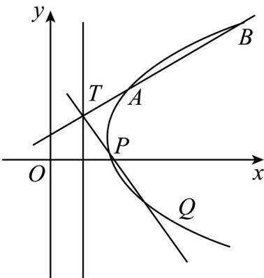

> [!faq]- 《专题24 圆锥曲线》真题解析
>
> > [!success]- **【答案】** 详见解析
>
> > [!note]- **【分析】**
> > (1) 利用双曲线的定义可知轨迹 C 是以点 $F_{1}$ 、 $F_{2}$ 为左、右焦点双曲线的右支，求出 a、b 的值，即可得出轨迹 C 的方程；
> >
> > (2)方法一：设出点的坐标和直线方程，联立直线方程与曲线 $C$ 的方程，结合韦达定理求得直线的斜率，
> >
> > 最后化简计算可得 $k_{1} + k_{2}$ 的值·
>
> > [!note]- **【解析】**
> > (1) 因为 $\left|MF_{1}\right|-\left|MF_{2}\right|=2<\left|F_{1}F_{2}\right|=2\sqrt{17}$
> > 所以，轨迹 C 是以点 $F_{1}$ 、 $F_{2}$ 为左、右焦点的双曲线的右支，设轨迹 C 的方程为 $\frac{x^{2}}{a^{2}} - \frac{y^{2}}{b^{2}} = 1 (a > 0, b > 0)$ ，则 2a = 2，可得 a = 1， $b = \sqrt{17 - a^{2}} = 4$ ，
> > 所以，轨迹 C 的方程为 $x^{2}-\frac{y^{2}}{16}=1(x-1)$ .
> > ## (2) [方法一] 【最优解】：直线方程与双曲线方程联立
> > 如图所示，设 $T(\frac{1}{2},n)$ ,
> > 设直线 $AB$ 的方程为 $y - n = k_{1}(x - \frac{1}{2}), A(x_{1}, y_{1}), B(x_{2}, y_{2})$
> > 
> > 联立 $\left\{\begin{aligned}y-n&=k_{1}(x-\frac{1}{2})\\ x^{2}-\frac{y^{2}}{16}&=1\end{aligned}\right.$
> > 化简得 $(16 - k_{1}^{2})x^{2} + (k_{1}^{2} - 2k_{1}n)x - \frac{1}{4} k_{1}^{2} - n^{2} + k_{1}n - 16 = 0$ ， $\Delta = 16\left(4n^2 -4kn - 3k^2 +64\right)$
> > $$
> > x _ {1} + x _ {2} = \frac {k _ {1} ^ {2} - 2 k _ {1} n}{k _ {1} ^ {2} - 1 6}, x _ {1} x _ {2} = \frac {\frac {1}{4} k _ {1} ^ {2} + n ^ {2} - k _ {1} n + 1 6}{k _ {1} ^ {2} - 1 6}
> > $$
> > 故 $|TA| = \sqrt{1 + k_1^2} (x_1 - \frac{1}{2}), |TB| = \sqrt{1 + k_1^2} (x_2 - \frac{1}{2})$ .
> > $$
> > T A \left| \cdot \right| T B \left| = \left(1 + k _ {1} ^ {2}\right) \left(x _ {1} - \frac {1}{2}\right) \left(x _ {2} - \frac {1}{2}\right) = \frac {\left(n ^ {2} + 1 2\right) \left(1 + k _ {1} ^ {2}\right)}{k _ {1} ^ {2} - 1 6} \right.
> > $$
> > 设 $PQ$ 的方程为 $y - n = k_{2}(x - \frac{1}{2})$ ，同理 $\left|TP\right|\cdot \left|TQ\right| = \frac{(n^2 + 12)(1 + k_2^2)}{k_2^2 - 16}$
> > 因为 $|TA|\cdot |TB| = |TP|\cdot |TQ|$ ，所以 $\frac{1 + k_1^2}{k_1^2 - 16} = \frac{1 + k_2^2}{k_2^2 - 16}$
> > 化简得 $1 + \frac{17}{k_1^2 - 16} = 1 + \frac{17}{k_2^2 - 16}$
> > 所以 $k_{1}^{2} - 16 = k_{2}^{2} - 16$ ，即 $k_{1}^{2} = k_{2}^{2}$
> > 因为 $k_{1} \neq k_{2}$ ，所以 $k_{1} + k_{2} = 0$
> > [方法二]：参数方程法
> > 设 $T(\frac{1}{2},m)$ ．设直线AB的倾斜角为 $\theta_{1}$ ，
> > 则其参数方程为 $\left\{ \begin{array}{l}x = \frac{1}{2} +t\cos \theta_{1}\\ y = m + t\sin \theta_{1} \end{array} \right.$
> > 联立直线方程与曲线 C 的方程 $16x^{2}-y^{2}-16=0(x-1)$
> > 可得 $16\left(\frac{1}{4} + t^2 \cos^2 \theta_1 + t \cos \theta_1\right) - (m^2 + t^2 \sin^2 \theta_1 + 2mt \sin \theta_1) - 16 = 0$
> > 整理得 $(16\cos^2\theta_1 - \sin^2\theta_1)t^2 +(16\cos \theta_1 - 2m\sin \theta_1)t - (m^2 +12) = 0$
> > 设 $TA = t_{1}, TB = t_{2}$
> > 由根与系数的关系得 $|TA|\cdot|TB|=t_{1}\cdot t_{2}=\frac{-(m^{2}+12)}{16\cos^{2}\theta_{1}-\sin^{2}\theta_{1}}=\frac{m^{2}+12}{1-17\cos^{2}\theta_{1}}$
> > 设直线 PQ 的倾斜角为 $\theta_{2}$ ， $TP = t_{3}, TQ = t_{4}$
> > 同理可得 $|TP|\cdot|TQ|=t_{3}\cdot t_{4}=\frac{m^{2}+12}{1-17\cos^{2}\theta_{2}}$
> > 由 $|TA|\cdot|TB|=|TP|\cdot|TQ|$ ，得 $\cos^{2}\theta_{1}=\cos^{2}\theta_{2}$
> > 因为 $\theta_{1} \neq \theta_{2}$ ，所以 $\cos \theta_{1} = -\cos \theta_{2}$
> > 由题意分析知 $\theta_{1} + \theta_{2} = \pi$ . 所以 $\tan \theta_{1} + \tan \theta_{2} = 0$
> > 故直线 AB 的斜率与直线 $PQ$ 的斜率之和为 0.
> > [方法三]：利用圆幂定理
> > 因为 $|TA|\cdot|TB| = |TP|\cdot|TQ|$ ，由圆幂定理知 $A, B, P, Q$ 四点共圆。
> > 设 $T(\frac{1}{2},t)$ ，直线AB的方程为 $y-t=k_{1}(x-\frac{1}{2})$ ，
> > 直线 PQ 的方程为 $y - t = k_{2}(x - \frac{1}{2})$ ,
> > 则二次曲线 $(k_{1}x - y - \frac{k_{1}}{2} + t)(k_{2}x - y - \frac{k_{2}}{2} + t) = 0$
> > 又由 $x^{2} - \frac{y^{2}}{16} = 1$ ，得过 $A, B, P, Q$ 四点的二次曲线系方程为：
> > $$
> > \lambda \left(k _ {1} x - y - \frac {k _ {1}}{2} + t\right) \left(k _ {2} x - y - \frac {k _ {2}}{2} + t\right) + \mu \left(x ^ {2} - \frac {y ^ {2}}{1 6} - 1\right) = 0 (\lambda \neq 0)
> > $$
> > 整理可得：
> > $$
> > (\lambda k _ {1} k _ {2} + \mu) x ^ {2} + (\lambda - \frac {\mu}{1 6}) y ^ {2} - \lambda (k _ {1} + k _ {2}) x y + [ t (k _ {1} + k _ {2}) - k _ {1} k _ {2} ] \lambda x + (\frac {k _ {1} + k _ {2}}{2} - 2 t) \lambda y + m = 0
> > $$
> > 其中 $m = \lambda \left[t^2 +\frac{k_1k_2}{4} -\frac{t}{2} (k_1 + k_2)\right] - \mu$
> > 由于 A, B, P, Q 四点共圆，则 xy 项的系数为 0，即 $k_{1} + k_{2} = 0$ .
> > 【整体点评】(2)方法一：直线方程与二次曲线的方程联立，结合韦达定理处理圆锥曲线问题是最经典的方法，它体现了解析几何的特征，是该题的通性通法，也是最优解；
> > 方法二：参数方程的使用充分利用了参数的几何意义，要求解题过程中对参数有深刻的理解，并能够灵活的应用到题目中·
> > 方法三：圆幂定理的应用更多的提现了几何的思想，二次曲线系的应用使得计算更为简单·
