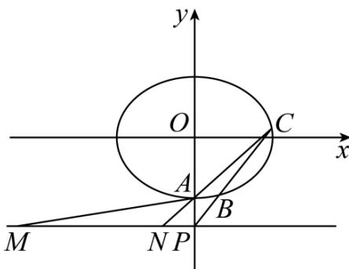

> [!faq]- 《专题24 圆锥曲线》真题解析
>
> > [!success]- **【答案】** 详见解析
>
> > [!note]- **【分析】**
> > （1）根据椭圆所过的点及四个顶点围成的四边形的面积可求 $a, b$ ，从而可求椭圆的标准方程（2）设 $B(x_1, y_1), C(x_2, y_2)$ ，求出直线 $AB, AC$ 的方程后可得 $M, N$ 的横坐标，从而可得 $\left|PM\right| + \left|PN\right|$ ，联立直线 BC 的方程和椭圆的方程，结合韦达定理化简 $\left|PM\right| + \left|PN\right|$ ，从而可求 k 的范围，注意判别式的要求。
>
> > [!note]- **【解析】**
> > （1）因为椭圆过 $A(0,-2)$ ，故b=2，
> > 因为四个顶点围成的四边形的面积为 $4\sqrt{5}$ ，故 $\frac{1}{2} \times 2a \times 2b = 4\sqrt{5}$ ，即 $a = \sqrt{5}$ ，
> > 故椭圆的标准方程为： $\frac{x^{2}}{5}+\frac{y^{2}}{4}=1$
> > (2)
> > 
> > 设 $B(x_{1},y_{1}),C(x_{2},y_{2})$
> > 因为直线 $BC$ 的斜率存在，故 $x_{1}x_{2} \neq 0$
> > 故直线 $AB:y = \frac{y_1 + 2}{x_1} x - 2$ ，令 $y = -3$ ，则 $x_{M} = -\frac{x_{1}}{y_{1} + 2}$ ，同理 $x_{N} = -\frac{x_{2}}{y_{2} + 2}$
> > 直线 $BC:y = kx - 3$ ，由 $\left\{ \begin{array}{l}y = kx - 3\\ 4x^{2} + 5y^{2} = 20 \end{array} \right.$ 可得 $\left(4 + 5k^2\right)x^2 -30kx + 25 = 0$
> > 故 $\Delta = 900k^{2} - 100(4 + 5k^{2}) > 0$ ，解得 k < -1 或 k > 1。
> > 又 $x_{1} + x_{2} = \frac{30k}{4 + 5k^{2}}, x_{1}x_{2} = \frac{25}{4 + 5k^{2}}$ ，故 $x_{1}x_{2} > 0$ ，所以 $x_{M}x_{N} > 0$
> > $$
> > \left| P M \right| + \left| P N \right| = \left| x _ {M} + x _ {N} \right| = \left| \frac {x _ {1}}{y _ {1} + 2} + \frac {x _ {2}}{y _ {2} + 2} \right|
> > $$
> > $$
> > = \left| \frac {x _ {1}}{k x _ {1} - 1} + \frac {x _ {2}}{k x _ {2} - 1} \right| = \left| \frac {2 k x _ {1} x _ {2} - \left(x _ {1} + x _ {2}\right)}{k ^ {2} x _ {1} x _ {2} - k \left(x _ {1} + x _ {2}\right) + 1} \right| = \left| \frac {\frac {5 0 k}{4 + 5 k ^ {2}} - \frac {3 0 k}{4 + 5 k ^ {2}}}{\frac {2 5 k ^ {2}}{4 + 5 k ^ {2}} - \frac {3 0 k ^ {2}}{4 + 5 k ^ {2}} + 1} \right| = 5 | k |
> > $$
> > 故 $5|k|\leq 15$ 即 $|k|\leq 3$
> > 综上， $-3 \leq k < -1$ 或 $1 < k \leq 3$ .
