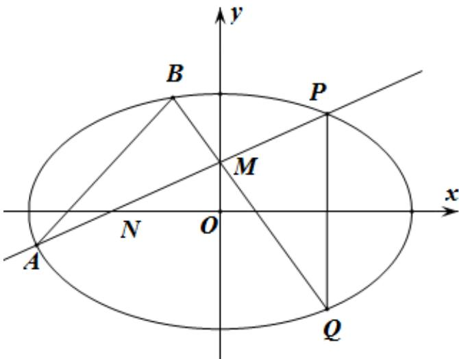

> [!faq]- 《专题24 圆锥曲线》真题解析
>
> > [!success]- **【答案】** (1) 求椭圆 C 的方程； (Ⅱ) 过动点 $M(0,m)(m>0)$ 的直线交 x 轴与点 N，交 C 于点 A, P （P 在第一象限），且 M 是线段 PN 的中点·过点 P 作 x 轴的垂线交 C 于另一点 Q，延长 QM 交 C 于点 B. (i) 设直线 $PM, QM$ 的斜率分别为 $k_{1}, k_{2}$ ，证明 $\frac{k_{2}}{k_{1}}$ 为定值； (ii) 求直线 AB 的斜率的最小值. 【答案】（Ⅰ） $\frac{x^{2}}{4}+\frac{y^{2}}{2}=1$ ；（Ⅱ）（i）见解析，（ii）直线 $^{AB}$ 的斜率的最小值为 $\frac{\sqrt{6}}{2}$
>
> > [!note]- **【分析】**
> > 本题未单列分析。
>
> > [!note]- **【解析】**
> > 
> > 试题分析：（Ⅰ）分别计算 $a, b$ 即得·
> > (II) (i) 设 $P(x_0, y_0)(x_0 > 0, y_0 > 0)$ ，由 $\mathrm{M}(0, \mathrm{m})$ ，可得 $P, Q$ 的坐标，进而得到直线 ${}^{\mathrm{PM}}$ 的斜率 $k$ ，直线 ${}^{\mathrm{QM}}$ 的斜率 $k'$ ，可得 $\frac{k'}{k}$ 为定值。
> > $$
> > y = k x + m,
> > $$
> > (ii) 设 $A(x_{1},y_{1}), B(x_{2},y_{2})$ 直线 PA 的方程为 $y=kx+m$ ，直线 QB 的方程为 $y=-3kx+m$ 。联立 $\frac{x^{2}}{4}+\frac{y^{2}}{2}=1$ ，应用一元二次方程根与系数的关系得到 $x_{2}-x_{1}$ ， $y_{2}-y_{1}$ ，进而可得 $k_{AB}$ 。应用基本不等式即得。
> > 试题解析：（Ⅰ）设椭圆的半焦距为 $c$
> > 由题意知 $2a = 4, 2c = 2\sqrt{2}$
> > 所以 $a = 2, b = \sqrt{a^2 - c^2} = \sqrt{2}$ .
> > 所以椭圆 C 的方程为 $\frac{x^{2}}{4} + \frac{y^{2}}{2} = 1$ .
> > (Ⅱ) (i) 设 $P(x_{0}, y_{0})(x_{0} > 0, y_{0} > 0)$
> > 由 $M(0,m)$ ，可得 $P(x_{0},2m), Q(x_{0},-2m)$ .
> > 所以直线 $PM$ 的斜率 $k=\frac{2m-m}{x_{0}}=\frac{m}{x_{0}}$
> > 直线 QM 的斜率 $k' = \frac{-2m - m}{x_{0}} = -\frac{3m}{x_{0}}$ .
> > 此时 $\frac{k'}{k}=-3$ .
> > 所以 $\frac{k'}{k}$ 为定值-3.
> > (ii) 设 $A(x_{1}, y_{1}), B(x_{2}, y_{2})$ .
> > 直线 PA 的方程为 $y=kx+m$ ，
> > 直线 QB 的方程为 $y = -3kx + m$ .
> > $$
> > y = k x + m,
> > $$
> > 联立 $\frac{x^{2}}{4}+\frac{y^{2}}{2}=1,$
> > 整理得 $(2k^{2}+1)x^{2}+4mkx+2m^{2}-4=0$ .
> > 由 $x_{0}x_{1}=\frac{2m^{2}-4}{2k^{2}+1}$ ，可得 $x_{1}=\frac{2(m^{2}-2)}{(2k^{2}+1)x_{0}}$ ，
> > 所以 $y_{1}=kx_{1}+m=\frac{2k(m^{2}-2)}{(2k^{2}+1)x_{0}}+m.$
> > 同理 $x_{2}=\frac{2(m^{2}-2)}{(18k^{2}+1)x_{0}},y_{2}=\frac{-6k(m^{2}-2)}{(18k^{2}+1)x_{0}}+m.$
> > 所以 $x_{2} - x_{1} = \frac{2(m^{2} - 2)}{(18k^{2} + 1)x_{0}} -\frac{2(m^{2} - 2)}{(2k^{2} + 1)x_{0}} = \frac{-32k^{2}(m^{2} - 2)}{(18k^{2} + 1)(2k^{2} + 1)x_{0}}$
> > $$
> > y _ {2} - y _ {1} = \frac {- 6 k (m ^ {2} - 2)}{(1 8 k ^ {2} + 1) x _ {0}} + m - \frac {2 (m ^ {2} - 2)}{(2 k ^ {2} + 1) x _ {0}} - m = \frac {- 8 k (6 k ^ {2} + 1) (m ^ {2} - 2)}{(1 8 k ^ {2} + 1) (2 k ^ {2} + 1) x _ {0}},
> > $$
> > 所以 $k_{AB}=\frac{y_{2}-y_{1}}{x_{2}-x_{1}}=\frac{6k^{2}+1}{4k}=\frac{1}{4}(6k+\frac{1}{k})$ .
> > 由 $m > 0, x_{0} > 0$ ，可知 k > 0，
> > 所以 $6k + \frac{1}{k}$ $2\sqrt{6}$ ，等号当且仅当 $k = \frac{\sqrt{6}}{6}$ 时取得.
> > 此时 $\frac{m}{\sqrt{4 - 8m^2}} = \frac{\sqrt{6}}{6}$ ，即 $m = \frac{\sqrt{14}}{7}$ ，符号题意·
> > 所以直线 $^{AB}$ 的斜率的最小值为 $\frac{\sqrt{6}}{2}$ .
> > 【考点】椭圆的标准方程及其几何性质，直线与椭圆的位置关系，基本不等式
> > 【名师点睛】本题对考生的计算能力要求较高，是一道难题·解答此类题目，利用 $a, b, c, e$ 的关系，确定椭圆（圆锥曲线）的方程是基础，通过联立直线方程与椭圆（圆锥曲线）方程，应用一元二次方程根与系数的关系，得到关于参数的解析式或方程是关键，易错点是对复杂式子的变形能力不足，导致错误百出·本题能较好地考查考生的逻辑思维能力、基本计算能力及分析问题、解决问题的能力等·
