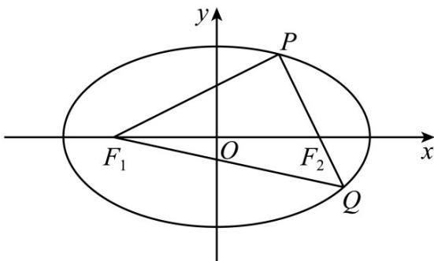

<!-- question-source:start -->
9.（2015·重庆·高考真题）如图，椭圆 $\frac{x^2}{a^2} +\frac{y^2}{b^2} = 1(a > b > 0)$ 的左右焦点分别为 $F_{1},F_{2}$ ，且过 $F_{2}$ 的直线交椭圆于 $P,Q$ 两点，且 $PQ\bot PF_1$

<!-- question-source:end -->

![[高中/真题/按题型分类/专题24 圆锥曲线/考点05_离心率求值或范围综合/真题/answers/Q00036467A1.md]]
