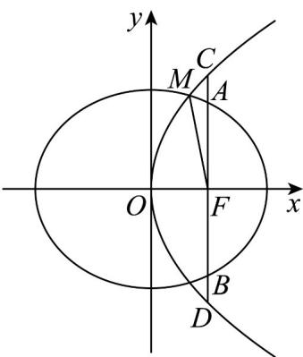

> [!faq]- 《专题24 圆锥曲线》真题解析
>
> > [!success]- **【答案】** 详见解析
>
> > [!note]- **【分析】**
> > （1）求出 $|AB|$ 、 $|CD|$ ，利用 $|CD|=\frac{4}{3}|AB|$ 可得出关于a、c的齐次等式，可解得椭圆 $C_{1}$ 的离心率的值；
> >
> > (2) [方法四]由 (1) 可得出 $C_1$ 的方程为 $\frac{x^2}{4c^2} + \frac{y^2}{3c^2} = 1$ ，联立曲线 $C_1$ 与 $C_2$ 的方程，求出点 $M$ 的坐标，利用抛物线的定义结合 $|MF| = 5$ 可求得 $c$ 的值，进而可得出 $C_1$ 与 $C_2$ 的标准方程.
>
> > [!note]- **【解析】**
> > （1）∵ $F(c,0)$ ， $AB \perp x$ 轴且与椭圆 $C_{1}$ 相交于 A、B 两点，
> > 则直线 AB 的方程为 x = c ，
> > 联立 $\left\{ \begin{array}{l}x = c\\ \frac{x^2}{a^2} +\frac{y^2}{b^2} = 1\\ a^2 = b^2 +c^2 \end{array} \right.$ ，解得 $\left\{ \begin{array}{ll}x = c\\ y = \pm \frac{b^2}{a} \end{array} \right.$ ，则 $|AB| = \frac{2b^2}{a}$ 抛物线 $C_2$ 的方程为 $y^{2} = 4cx$ ，联立 $\left\{ \begin{array}{l}x = c\\ y^2 = 4cx \end{array} \right.$
> > 
> > 解得 $\left\{\begin{aligned}x&=c\\ y&=\pm2c\end{aligned}\right.$ ，∴ $\left|CD\right|=4c$ ，
> > $\because \left|CD\right| = \frac{4}{3}\left|AB\right|$ ，即 $4c = \frac{8b^2}{3a}$ ， $2b^{2} = 3ac$
> > 即 $2c^{2} + 3ac - 2a^{2} = 0$ ，即 $2e^{2} + 3e - 2 = 0$
> > $Q0 < e < 1$ ，解得 $e = \frac{1}{2}$ ，因此，椭圆 $C_1$ 的离心率为 $\frac{1}{2}$ ；
> > ## (2) [方法一]: 椭圆的第二定义
> > 由椭圆的第二定义知 $\frac{|MF|}{\frac{a^2}{c} - x_0} = e$ ，则有 $|MF| = e\left(\frac{a^2}{c} - x_0\right) = a - ex_0$ ，
> > 所以 $a - \frac{1}{2}x_{0} = 5$ ，即 $x_{0} = 2a - 10$ 。
> > 又由 $|MF| = x_0 + c = 5$ ，得 $x_0 = 5 - \frac{a}{2}$
> > 从而 $2a - 10 = 5 - \frac{a}{2}$ ，解得 $a = 6$
> > 所以 $c = 3, a = 6, b = 3\sqrt{3}, p = 6$
> > 故椭圆 $C_1$ 与抛物线 $C_2$ 的标准方程分别是 $\frac{x^2}{36} +\frac{y^2}{27} = 1,y^2 = 12x$
> > [方法二]：圆锥曲线统一的极坐标公式
> > 以 $F(\mathbf{c},0)$ 为极点， $x$ 轴的正半轴为极轴，建立极坐标系。
> > 由（Ⅰ）知 $a = 2c$ ，又由圆锥曲线统一的极坐标公式 $\left|MF\right| = \frac{2c}{1 - \cos\theta}$ ，得 $2c = 5 - 5\cos \theta$ ，由 $\mid MF\mid = \frac{\frac{1}{2}\times 3c}{1 + \frac{1}{2}\cos\theta}$ ，得 $3c = 10 + 5\cos \theta$ ，两式联立解得.
> > 故 $C_1$ 的标准方程为 $\frac{x^2}{36} +\frac{y^2}{27} = 1$ ， $C_2$ 的标准方程为 $y^{2} = 12x$ ：
> > ## [方法三]：参数方程
> > 由（1）知 $a = 2c, b = \sqrt{3}c$ ，椭圆 $C_1$ 的方程为 $\frac{x^2}{4c^2} + \frac{y^2}{3c^2} = 1$ ，
> > 所以 $C_{1}$ 的参数方程为 $\left\{\begin{aligned}x=2c\cdot\cos\theta,\\ y=\sqrt[3]{3}c\cdot\sin\theta\end{aligned}\right.$ ( $\theta$ 为参数)，
> > 将它代入抛物线 $C_{2}: y^{2} = 4cx$ 的方程并化简得 $3\cos^{2}\theta + 8\cos\theta - 3 = 0$
> > 解得 $\cos\theta=\frac{1}{3}$ 或 $\cos\theta=-3$ （舍去），
> > 所以 $\sin \theta = \frac{2\sqrt{2}}{3}$ ，即点 $M$ 的坐标为 $\left(\frac{2c}{3},\frac{2\sqrt{6}c}{3}\right)$
> > 又 $|MF| = 5$ ，所以由抛物线焦半径公式有 $x_{M} + c = 5$ ，即 $\frac{2c}{3} + c = 5$ ，解得 $c = 3$ ：
> > 故 $C_1$ 的标准方程为 $\frac{x^2}{36} +\frac{y^2}{27} = 1$ ， $C_2$ 的标准方程为 $y^{2} = 12x$ ：
> > ## [方法四]【最优解】：利用韦达定理
> > 由（1）知 $a = 2c$ ， $b = \sqrt{3} c$ ，椭圆 $C_1$ 的方程为 $\frac{x^2}{4c^2} +\frac{y^2}{3c^2} = 1$
> > 联立 $\left\{ \begin{array}{l} y^{2} = 4cx \\ \frac{x^{2}}{4c^{2}} + \frac{y^{2}}{3c^{2}} = 1 \end{array} \right.$ ，消去 并整理得 $y$ $3x^{2} + 16cx - 12c^{2} = 0$
> > 解得 $x=\frac{2}{3}c$ 或 $x=-6c$ （舍去），
> > 由抛物线的定义可得 $\left|MF\right|=\frac{2}{3}c+c=\frac{5c}{3}=5$ ，解得c=3。
> > 因此，曲线 $C_{1}$ 的标准方程为 $\frac{x^{2}}{36} + \frac{y^{2}}{27} = 1$
> > 曲线 $C_{2}$ 的标准方程为 $y^{2}=12x$ .
> > 【整体点评】(2)方法一：椭圆的第二定义是联系准线与离心率的重要工具，涉及离心率的问题不妨考虑使用第二定义，很多时候会使得问题简单明了。
> > 方法二：圆锥曲线统一的极坐标公式充分体现了圆锥曲线的统一特征，同时它也是解决圆锥曲线问题的一个不错的思考方向·
> > 方法三：参数方程是一种重要的数学工具，它将圆锥曲线的问题转化为三角函数的问题，使得原来抽象的问题更加具体化·
> > 方法四：韦达定理是最常用的处理直线与圆锥曲线位置关系的方法，联立方程之后充分利用韦达定理可以达到设而不求的效果·
