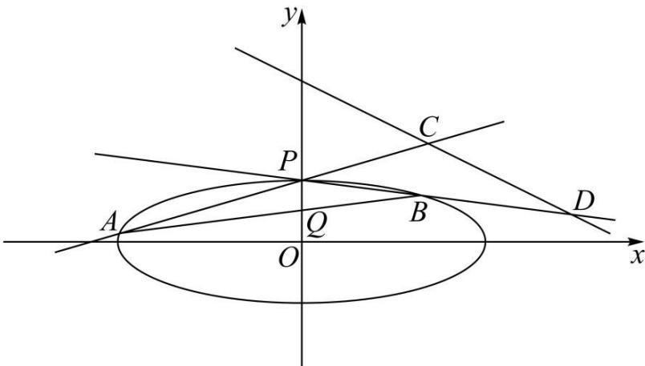

<!-- question-source:start -->
1. （2022·浙江·高考真题）如图，已知椭圆 $\frac{x^2}{12} + y^2 = 1$ 。设 $A, B$ 是椭圆上异于 $P(0,1)$ 的两点，且点 $Q\left(0, \frac{1}{2}\right)$ 在线段 $AB$ 上，直线 $PA, PB$ 分别交直线 $y = -\frac{1}{2} x + 3$ 于 $C, D$ 两点。

<!-- question-source:end -->

![[高中/真题/按题型分类/专题24 圆锥曲线/考点06_弦长类求值或范围综合/真题/answers/Q00036469A1.md]]
