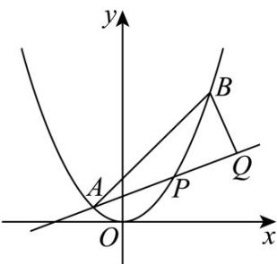

<!-- question-source:start -->
4．（2017·浙江·高考真题）如图，已知抛物线 $x^{2}=y$ ·点 $A\left(-\frac{1}{2},\frac{1}{4}\right),B\left(\frac{3}{2},\frac{9}{4}\right)$ ，抛物线上的点 $P(x,y)$ $\left(-\frac{1}{2}<x<\frac{3}{2}\right)$ ，过点 B 作直线 AP 的垂线，垂足为 Q.

(1) 求直线 AP 斜率的取值范围；

(Ⅱ) 求 $\left|PA\right|\cdot\left|PQ\right|$ 的最大值
<!-- question-source:end -->

![[高中/真题/按题型分类/专题24 圆锥曲线/考点06_弦长类求值或范围综合/真题/answers/Q00036472A1.md]]
