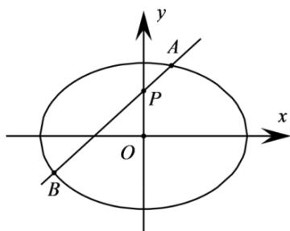

<!-- question-source:start -->
7．（2015·四川·高考真题）如图，椭圆 $E: \frac{x^{2}}{a^{2}} + \frac{y^{2}}{b^{2}} = 1 (a > b > 0)$ 的离心率是 $\frac{\sqrt{2}}{2}$ ，过点 $P(0,1)$ 的动直线 l 与椭圆相交于 A，B 两点，当直线 l 平行于 x 轴时，直线 l 被椭圆 E 截得的线段长为 $2\sqrt{2}$ .

<!-- question-source:end -->

![[高中/真题/按题型分类/专题24 圆锥曲线/考点06_弦长类求值或范围综合/真题/answers/Q00036474A1.md]]
