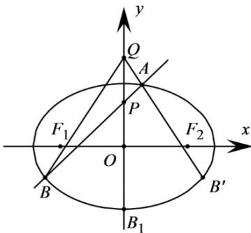

> [!faq]- 《专题24 圆锥曲线》真题解析
>
> > [!success]- **【答案】** (1) 求椭圆 E 的方程； (2) 在平面直角坐标系 $xOy$ 中，是否存在与点 $P$ 不同的定点 $Q$ ，使得 $\frac{|QA|}{|QB|} = \frac{|PA|}{|PB|}$ 恒成立？若存在，求出点 $Q$ 的坐标；若不存在，请说明理由。 【答案】（1） $\frac{x^{2}}{4}+\frac{y^{2}}{2}=1$ ；（2）存在，Q点的坐标为 $Q(0,2)$
>
> > [!note]- **【分析】**
> > 本题未单列分析。
>
> > [!note]- **【解析】**
> > （1）由已知，点 $(\sqrt{2}, 1)$ 在椭圆 $E$ 上.
> > 因此， $\left\{ \begin{array}{l} \frac{2}{a^2} +\frac{1}{b^2} = 1,\\ a^2 -b^2 = c^2,\\ \frac{c}{a} = \frac{\sqrt{2}}{2}, \end{array} \right.$ 解得 $a = 2,b = \sqrt{2}$
> > 所以椭圆的方程为 $\frac{x^{2}}{4}+\frac{y^{2}}{2}=1$ .
> > (2) 当直线 l 与 x 轴平行时，设直线 l 与椭圆相交于 C、D 两点
> > 如果存在定点 Q 满足条件，则 $\frac{|QC|}{|QD|} = \frac{|PC|}{|PD|} = 1$ ，即 $|QC| = |QD|$ 所以 Q 点在 y 轴上，可设 Q 点的坐标为 $(0, y_{0})$ .
> > $$
> > l
> > $$
> > $$
> > l
> > $$
> > $$
> > M (0, \sqrt {2}), N (0, - \sqrt {2})
> > $$
> > 由 $\frac{|QM|}{|QN|} = \frac{|PM|}{|PN|}$ ，有 $\frac{|y_0 - \sqrt{2}|}{|y_0 + \sqrt{2}|} = \frac{\sqrt{2} - 1}{\sqrt{2} + 1}$ ，解得 $y_0 = 1$ 或 $y_0 = 2$
> > $$
> > l
> > $$
> > 下面证明：对任意的直线 $l$ ，均有 $\frac{|QA|}{|QB|} = \frac{|PA|}{|PB|}$
> > $$
> > l
> > $$
> > $$
> > y = k x + 1
> > $$
> > $$
> > (x _ {1}, y _ {1}), (x _ {2}, y _ {2})
> > $$
> > 联立 $\left\{ \begin{array}{l} \frac{x^2}{4} + \frac{y^2}{2} = 1 \\ y = kx + 1 \end{array} \right.$ 得 $(2k^2 + 1)x^2 + 4kx - 2 = 0$
> > 其判别式 $\Delta = 16k^2 + 8(2k^2 + 1) > 0$
> > 所以， $x_{1} + x_{2} = -\frac{4k}{2k^{2} + 1}, x_{1}x_{2} = -\frac{2}{2k^{2} + 1}$
> > 因此 $\frac{1}{x_1} +\frac{1}{x_2} = \frac{x_1 + x_2}{x_1x_2} = 2k$
> > 易知，点 $B$ 关于 $y$ 轴对称的点的坐标为 $B'(-x_2, y_2)$ .
> > 
> > 又 $k_{QA} = \frac{y_1 - 2}{x_1} = k - \frac{1}{x_1}, k_{QB'} = \frac{y_2 - 2}{-x_2} = -k + \frac{1}{x_2} = k - \frac{1}{x_1}$
> > 所以 $k_{QA} = k_{QB'}$ ，即 $Q, A, B'$ 三点共线。
> > 所以 $\frac{|QA|}{|QB|} = \frac{|QA|}{|QB'|} = \frac{|x_1|}{|x_2|} = \frac{|PA|}{|PB|}$
> > 故存在与 $P$ 不同的定点 $Q(0,2)$ ，使得 $\frac{|QA|}{|QB|} = \frac{|PA|}{|PB|}$ 恒成立·
> > 【点睛】本题考查椭圆的标准方程与几何性质、直线方程、直线与椭圆的位置关系等基础知识，考查推理论证能力、运算求解能力，考查数形结合、化归与转化、特殊与一般、分类与整合等数学思想·
