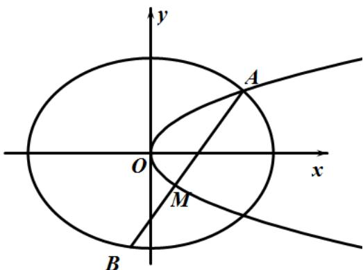

<!-- question-source:start -->
4．（2020·浙江·高考真题）如图，已知椭圆 $C_{1}:\frac{x^{2}}{2}+y^{2}=1$ ，抛物线 $C_{2}:y^{2}=2px(p>0)$ ，点A是椭圆 $C_{1}$ 与抛物线 $C_{2}$ 的交点，过点A的直线l交椭圆 $C_{1}$ 于点B，交抛物线 $C_{2}$ 于M(B,M不同于A).

(Ⅰ) 若 $p=\frac{1}{16}$ ，求抛物线 $C_{2}$ 的焦点坐标；

(Ⅱ) 若存在不过原点的直线 l 使 M 为线段 AB 的中点，求 p 的最大值.
<!-- question-source:end -->

![[高中/真题/按题型分类/专题24 圆锥曲线/考点07_其他综合类求值或范围综合/真题/answers/Q00036479A1.md]]
