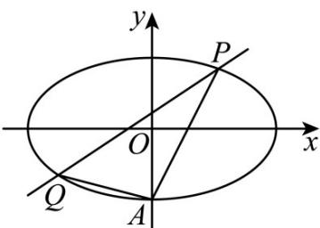

<!-- question-source:start -->
13. (2015·陕西·高考真题) 如图，椭圆 $E: \frac{x^2}{a^2} + \frac{y^2}{b^2} = 1 (a > b > 0)$ 经过点 $A(0, -1)$ ，且离心率为 $\frac{\sqrt{2}}{2}$ .

(I)求椭圆 E 的方程；

(Ⅲ)经过点 $(1,1)$ ，且斜率为k的直线与椭圆E交于不同两点P,Q（均异于点A），

问：直线 $AP$ 与 $AQ$ 的斜率之和是否为定值？若是，求出此定值；若否，说明理由。

<!-- question-source:end -->

![[高中/真题/按题型分类/专题24 圆锥曲线/考点08_定值定点定直线问题/真题/answers/Q00036495A1.md]]
