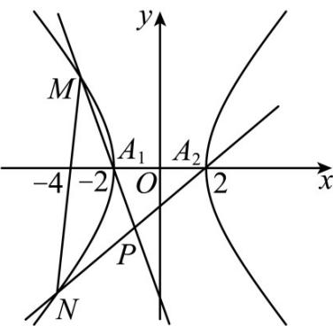

> [!faq]- 《专题24 圆锥曲线》真题解析
>
> > [!success]- **【答案】** 详见解析
>
> > [!note]- **【分析】**
> > （1）由题意求得 $a, b$ 的值即可确定双曲线方程；
> >
> > (2) 设出直线方程，与双曲线方程联立，然后由点的坐标分别写出直线 $MA_{1}$ 与 $NA_{2}$ 的方程，联立直线方程消去 $y$ ，结合韦达定理计算可得 $\frac{x + 2}{x - 2} = -\frac{1}{3}$ ，即交点的横坐标为定值，据此可证得点 $P$ 在定直线 $x = -1$ 上。
>
> > [!note]- **【解析】**
> > （1）设双曲线方程为 $\frac{x^2}{a^2} - \frac{y^2}{b^2} = 1 (a > 0, b > 0)$ ，由焦点坐标可知 $c = 2\sqrt{5}$ ，
> > 则由 $e = \frac{c}{a} = \sqrt{5}$ 可得 $a = 2$ ， $b = \sqrt{c^2 - a^2} = 4$
> > 双曲线方程为 $\frac{x^{2}}{4}-\frac{y^{2}}{16}=1$ .
> > (2) 由(1)可得 $A_{1}(-2,0), A_{2}(2,0)$ ，设 $M(x_{1},y_{1}), N(x_{2},y_{2})$ ，
> > 显然直线的斜率不为 $0$ ，所以设直线 $MN$ 的方程为 $x = my - 4$ ，且 $-\frac{1}{2} < m < \frac{1}{2}$ ，
> > 与 $\frac{x^2}{4} -\frac{y^2}{16} = 1$ 联立可得 $(4m^{2} - 1)y^{2} - 32my + 48 = 0$ ，且 $\Delta = 64(4m^2 +3) > 0$
> > 则 $y_{1} + y_{2} = \frac{32m}{4m^{2} - 1},y_{1}y_{2} = \frac{48}{4m^{2} - 1}$
> > 
> > 直线 $MA_{1}$ 的方程为 $y = \frac{y_1}{x_1 + 2}(x + 2)$ ，直线 $NA_{2}$ 的方程为 $y = \frac{y_2}{x_2 - 2}(x - 2)$
> > 联立直线 $MA_{1}$ 与直线 $NA_{2}$ 的方程可得：
> > $$
> > \frac {x + 2}{x - 2} = \frac {y _ {2} (x _ {1} + 2)}{y _ {1} (x _ {2} - 2)} = \frac {y _ {2} (m y _ {1} - 2)}{y _ {1} (m y _ {2} - 6)} = \frac {m y _ {1} y _ {2} - 2 (y _ {1} + y _ {2}) + 2 y _ {1}}{m y _ {1} y _ {2} - 6 y _ {1}}
> > $$
> > $$
> > = \frac {m \cdot \frac {4 8}{4 m ^ {2} - 1} - 2 \cdot \frac {3 2 m}{4 m ^ {2} - 1} + 2 y _ {1}}{m \times \frac {4 8}{4 m ^ {2} - 1} - 6 y _ {1}} = \frac {\frac {- 1 6 m}{4 m ^ {2} - 1} + 2 y _ {1}}{\frac {4 8 m}{4 m ^ {2} - 1} - 6 y _ {1}} = - \frac {1}{3},
> > $$
> > 由 $\frac{x + 2}{x - 2} = -\frac{1}{3}$ 可得 $x = -1$ ，即 $x_{P} = -1$
> > 据此可得点 P 在定直线 x = -1 上运动.
> > 【点睛】关键点点睛·求双曲线方程的定直线问题，意在考查学生的计算能力，转化能力和综合应用能力，其中根据设而不求的思想，利用韦达定理得到根与系数的关系可以简化运算，是解题的关键·
