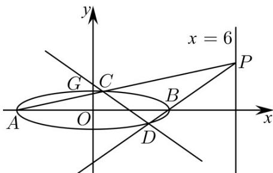

> [!faq]- 《专题24 圆锥曲线》真题解析
>
> > [!success]- **【答案】** 详见解析
>
> > [!note]- **【分析】**
> > （1）由已知可得： $A(-a,0)$ ， $B(a,0)$ ， $G(0,1)$ ，即可求得 $AG \cdot GB = a^{2} - 1$ ，结合已知即可求得： $a^{2}=9$ ，问题得解·
> >
> > (2) 方法一：设 $P(6, y_0)$ ，可得直线 $AP$ 的方程为： $y = \frac{y_0}{9}(x + 3)$ ，联立直线 $AP$ 的方程与椭圆方程即可求得点 $C$ 的坐标为 $\left(\frac{-3y_0^2 + 27}{y_0^2 + 9}, \frac{6y_0}{y_0^2 + 9}\right)$ ，同理可得点 $D$ 的坐标为 $\left(\frac{3y_0^2 - 3}{y_0^2 + 1}, \frac{-2y_0}{y_0^2 + 1}\right)$ ，当 $y_0^2 \neq 3$ 时，可表示出直线 $CD$ 的方程，整理直线 $CD$ 的方程可得： $y = \frac{4y_0}{3(3 - y_0^2)}\left(x - \frac{3}{2}\right)$ 即可知直线过定点 $\left(\frac{3}{2}, 0\right)$ ，当 $y_0^2 = 3$ 时，直线 $CD: x = \frac{3}{2}$ ，直线过点 $\left(\frac{3}{2}, 0\right)$ ，命题得证·
>
> > [!note]- **【解析】**
> > （1）依据题意作出如下图象：
> > 
> > 由椭圆方程 $E:\frac{x^{2}}{a^{2}}+y^{2}=1(a>1)$ 可得： $A(-a,0)$ ， $B(a,0)$ ， $G(0,1)$
> > $$
> > \therefore \stackrel {{\sqcup \sqcup \sqcup}} {A G} = (a, 1), \stackrel {{\sqcup \sqcup \sqcup}} {G B} = (a, - 1)
> > $$
> > $$
> > \therefore A G \cdot G B = a ^ {2} - 1 = 8, \therefore a ^ {2} = 9
> > $$
> > $\therefore$ 椭圆方程为： $\frac{x^{2}}{9}+y^{2}=1$
> > (2) [方法一]: 设而求点法
> > 证明：设 $P(6,y_{0})$
> > 则直线 $_{AP}$ 的方程为： $y = \frac{y_0 - 0}{6 - (-3)} (x + 3)$ ，即： $y = \frac{y_0}{9} (x + 3)$
> > 联立直线 的方程与椭圆方程可得： $\left\{\begin{aligned}\frac{x^{2}}{9}+y^{2}&=1\\ y&=\frac{y_{0}}{9}(x+3)\end{aligned}\right.$ ，整理得：AP
> > $\left(y_{0}^{2} + 9\right)x^{2} + 6y_{0}^{2}x + 9y_{0}^{2} - 81 = 0$ ，解得： $x = -3$ 或 $x = \frac{-3y_0^2 + 27}{y_0^2 + 9}$
> > 将 $x = \frac{-3y_0^2 + 27}{y_0^2 + 9}$ 代入直线 $y = \frac{y_0}{9} (x + 3)$ 可得： $y = \frac{6y_0}{y_0^2 + 9}$
> > 所以点 $C$ 的坐标为 $\left(\frac{-3y_0^2 + 27}{y_0^2 + 9},\frac{6y_0}{y_0^2 + 9}\right)$
> > 同理可得：点 $D$ 的坐标为 $\left(\frac{3y_0^2 - 3}{y_0^2 + 1},\frac{-2y_0}{y_0^2 + 1}\right)$
> > 当 $y_{0}^{2}\neq3$ 时，
> > 直线 的方程为： $y - \left(\frac{-2y_0}{y_0^2 + 1}\right) = \frac{\frac{6y_0}{y_0^2 + 9} - \left(\frac{-2y_0}{y_0^2 + 1}\right)}{\frac{-3y_0^2 + 27}{y_0^2 + 9} - \frac{3y_0^2 - 3}{y_0^2 + 1}}\left(x - \frac{3y_0^2 - 3}{y_0^2 + 1}\right)$ ，
> > ∴ CD
> > 整理可得： $y + \frac{2y_{0}}{y_{0}^{2} + 1} = \frac{8y_{0}(y_{0}^{2} + 3)}{6(9 - y_{0}^{4})}\left(x - \frac{3y_{0}^{2} - 3}{y_{0}^{2} + 1}\right) = \frac{8y_{0}}{6(3 - y_{0}^{2})}\left(x - \frac{3y_{0}^{2} - 3}{y_{0}^{2} + 1}\right)$
> > 整理得： $y=\frac{4y_{0}}{3\left(3-y_{0}^{2}\right)}x+\frac{2y_{0}}{y_{0}^{2}-3}=\frac{4y_{0}}{3\left(3-y_{0}^{2}\right)}\left(x-\frac{3}{2}\right)$
> > 所以直线 $CD$ 过定点 $\left(\frac{3}{2},0\right)$
> > 当 $y_0^2 = 3$ 时，直线 $CD:x = \frac{3}{2}$ ，直线过点 $\left(\frac{3}{2},0\right)$
> > 故直线 $CD$ 过定点 $\left(\frac{3}{2}, 0\right)$
> > ## [方法二]【最优解】：数形结合
> > 设 $P(6,t)$ ，则直线 $PA$ 的方程为 $y = \frac{t}{9} (x + 3)$ ，即 $tx - 9y + 3t = 0$ ：
> > 同理，可求直线 $PB$ 的方程为 $tx - 3y - 3t = 0$
> > 则经过直线 $PA$ 和直线 $PB$ 的方程可写为 $(tx - 9y + 3t)(tx - 3y - 3t) = 0$
> > 可化为 $t^{2}(x^{2}-9)+27y^{2}-12txy+18ty=0$ .④
> > 易知 A, B, C, D 四个点满足上述方程，同时 A, B, C, D 又在椭圆上，则有 $x^{2}-9=-9y^{2}$ ，代入④式可得 $\left(27-9t^{2}\right)y^{2}-12txy+18ty=0$ 。
> > 故 $y\left[\left(27 - 9t^2\right)y - 12tx + 18t\right] = 0$ ，可得 $y = 0$ 或 $\left(27 - 9t^2\right)y - 12tx + 18t = 0$
> > 其中 $y = 0$ 表示直线 $AB$ ，则 $\left(27 - 9t^2\right)y - 12tx + 18t = 0$ 表示直线 $CD$ ：
> > 令 $y = 0$ ，得 $x = \frac{3}{2}$ ，即直线 $CD$ 恒过点 $\left(\frac{3}{2},0\right)$
> > 【整体点评】本题主要考查了椭圆的简单性质及方程思想，还考查了计算能力及转化思想、推理论证能力，属于难题·
> > 第二问的方法一最直接，但对运算能力要求严格；方法二曲线系的应用更多的体现了几何与代数结合的思想，二次曲线系的应用使得计算更为简单·
