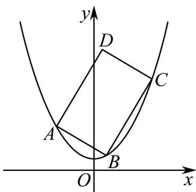
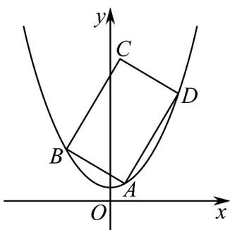
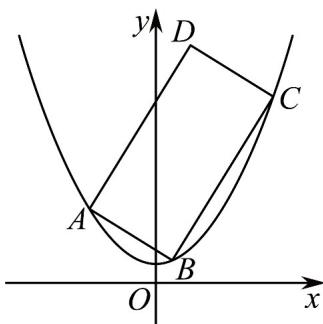
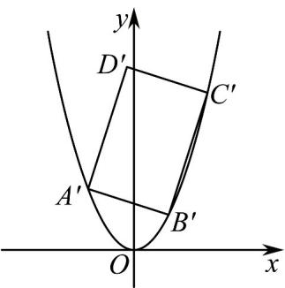

> [!faq]- 《专题24 圆锥曲线》真题解析
>
> > [!success]- **【答案】** 详见解析
>
> > [!note]- **【分析】**
> > （1）设 $P(x,y)$ ，根据题意列出方程 $x^{2} + \left(y - \frac{1}{2}\right)^{2} = y^{2}$ ，化简即可；
> >
> > (2) 法一：设矩形的三个顶点 $A\left(a, a^2 + \frac{1}{4}\right), B\left(b, b^2 + \frac{1}{4}\right), C\left(c, c^2 + \frac{1}{4}\right)$ ，且 $a < b < c$ ，分别令
> >
> > $k_{AB} = a + b = m < 0$ ， $k_{BC} = b + c = n > 0$ ，且 $mn = -1$ ，利用放缩法得 $\frac{1}{2} C$ （ $n + \frac{1}{n}$ ） $\sqrt{1 + n^2}$ ，设函数
> >
> > $f(x) = \left(x + \frac{1}{x}\right)^2\left(1 + x^2\right)$ ，利用导数求出其最小值，则得 $C$ 的最小值，再排除边界值即可
> >
> > 法二：设直线 $AB$ 的方程为 $y = k(x - a) + a^2 + \frac{1}{4}$ ，将其与抛物线方程联立，再利用弦长公式和放缩法得 $\left|AB\right| + \left|AD\right| \sqrt{\frac{\left(1 + k^2\right)^3}{k^2}}$ ，利用换元法和求导即可求出周长最值，再排除边界值即可·
> >
> > 法三：利用平移坐标系法，再设点，利用三角换元再对角度分类讨论，结合基本不等式即可证明·
>
> > [!note]- **【解析】**
> > （1）设 $P(x,y)$ 则 $\left|y\right| = \sqrt{x^2 + \left(y - \frac{1}{2}\right)^2}$ ，两边同平方化简得 $y = x^2 + \frac{1}{4}$ ，
> > 故 $W:y = x^{2} + \frac{1}{4}$
> > (2) 法一：设矩形的三个顶点 $A\left(a, a^2 + \frac{1}{4}\right), B\left(b, b^2 + \frac{1}{4}\right), C\left(c, c^2 + \frac{1}{4}\right)$ 在 $W$ 上，且 $a < b < c$ ，易知矩形四条边所在直线的斜率均存在，且不为 0，
> > 
> > 则 $k_{AB} \cdot k_{BC} = -1, a + b < 0 < b + c$ ，令 $k_{AB} = \frac{b^2 + \frac{1}{4} - \left(a^2 + \frac{1}{4}\right)}{b - a} = a + b = m < 0$ ，
> > 同理令 $k_{BC} = b + c = n > 0$ ，且 $mn = -1$ ，则 $m = -\frac{1}{n}$
> > 设矩形周长为 C，由对称性不妨设 $\left|m\right|\left|n\right|$ ， $k_{BC}-k_{AB}=c-a=n-m=n+\frac{1}{n}$ ，
> > 则 $\frac{1}{2} C = |AB| + |BC| = (b - a)\sqrt{1 + m^2} + (c - b)\sqrt{1 + n^2}$ （ $c - a)\sqrt{1 + n^2} = \left(n + \frac{1}{n}\right)\sqrt{1 + n^2}$ ，易知 $\left(n + \frac{1}{n}\right)\sqrt{1 + n^2} > 0$
> > 则令 $f(x) = \left(x + \frac{1}{x}\right)^2\left(1 + x^2\right), x > 0, f'(x) = 2\left(x + \frac{1}{x}\right)^2\left(2x - \frac{1}{x}\right)$ ,
> > 令 $f^{\prime}(x) = 0$ ，解得 $x = \frac{\sqrt{2}}{2}$
> > 当 $x \in \left(0, \frac{\sqrt{2}}{2}\right)$ 时， $f'(x) < 0$ ，此时 $f(x)$ 单调递减，
> > 当 $x \in \left(\frac{\sqrt{2}}{2}, 1\right]$ ， $f'(x) > 0$ ，此时 $f(x)$ 单调递增，
> > 则 $f(x)_{\min} = f\left(\frac{\sqrt{2}}{2}\right) = \frac{27}{4}$
> > 故 $\frac{1}{2}C\sqrt{\frac{27}{4}}=\frac{3\sqrt{3}}{2}$ ，即 $C=3\sqrt{3}$
> > 当 $C = 3\sqrt{3}$ 时， $n = \frac{\sqrt{2}}{2}, m = -\sqrt{2}$ ，且 $(b - a)\sqrt{1 + m^2} = (b - a)\sqrt{1 + n^2}$ ，即 $m = n$ 时等号成立，矛盾，故 $C > 3\sqrt{3}$ ，
> > 得证·
> > 法二：不妨设 A, B, D 在 W 上，且 $BA \perp DA$ ，
> > 
> > 依题意可设 $A\left(a, a^2 + \frac{1}{4}\right)$ ，易知直线 $BA$ ， $DA$ 的斜率均存在且不为 0，
> > 则设 $BA, DA$ 的斜率分别为 $k$ 和 $-\frac{1}{k}$ ，由对称性，不妨设 $|k| \leq 1$ ，
> > 直线 $AB$ 的方程为 $y = k(x - a) + a^2 +\frac{1}{4}$
> > 则联立 $\left\{ \begin{array}{l} y = x^2 + \frac{1}{4} \\ y = k(x - a) + a^2 + \frac{1}{4} \end{array} \right.$ 得 $x^2 - kx + ka - a^2 = 0$
> > $\Delta = k^2 - 4(ka - a^2) = (k - 2a)^2 > 0$ ，则 $k \neq 2a$
> > 则 $|AB| = \sqrt{1 + k^2} |k - 2a|$
> > 同理 $|AD| = \sqrt{1 + \frac{1}{k^2}}\left|\frac{1}{k} + 2a\right|$
> > $$
> > A B \left| + \right| A D \left| = \sqrt {1 + k ^ {2}} \mid k - 2 a \right| + \sqrt {1 + \frac {1}{k ^ {2}}} \left| \frac {1}{k} + 2 a \right|
> > $$
> > $$
> > \sqrt {1 + k ^ {2}} \left(\left| k - 2 a \right| + \left| \frac {1}{k} + 2 a \right|\right) \quad \sqrt {1 + k ^ {2}} \left| k + \frac {1}{k} \right| = \sqrt {\frac {\left(1 + k ^ {2}\right) ^ {3}}{k ^ {2}}}
> > $$
> > 令 $k^2 = m$ ，则 $m\in (0,1]$ ，设 $f(m) = \frac{(m + 1)^3}{m} = m^2 +3m + \frac{1}{m} +3$
> > 则 $f^{\prime}(m) = 2m + 3 - \frac{1}{m^{2}} = \frac{(2m - 1)(m + 1)^{2}}{m^{2}}$ ，令 $f^{\prime}(m) = 0$ ，解得 $m = \frac{1}{2}$
> > 当 $m \in \left(0, \frac{1}{2}\right)$ 时， $f'(m) < 0$ ，此时 $f(m)$ 单调递减，
> > 当 $m \in \left(\frac{1}{2}, +\infty\right)$ ， $f'(m) > 0$ ，此时 $f(m)$ 单调递增，
> > 则 $f(m)_{\mathrm{min}} = f\left(\frac{1}{2}\right) = \frac{27}{4}$
> > $\therefore |AB| + |AD| \frac{3\sqrt{3}}{2}$
> > 但 $\sqrt{1 + k^2}\mid k - 2a\mid +\sqrt{1 + \frac{1}{k^2}}\left|\frac{1}{k} +2a\right|\sqrt{1 + k^2}\left(|k - 2a| + \left|\frac{1}{k} +2a\right|\right)$ ，此处取等条件为 $k = 1$ ，与最终取等时 $k = \frac{\sqrt{2}}{2}$ 不一致，故 $\left|AB\right| + \left|AD\right| > \frac{3\sqrt{3}}{2}$
> > 法三：为了计算方便，我们将抛物线向下移动 $\frac{1}{4}$ 个单位得抛物线 $W^{\prime}:y = x^{2}$
> > 矩形 ABCD 变换为矩形 $A^{\prime}B^{\prime}C^{\prime}D^{\prime}$ ，则问题等价于矩形 $A^{\prime}B^{\prime}C^{\prime}D^{\prime}$ 的周长大于 $3\sqrt{3}$ .
> > 设 $B^{\prime}(t_{0},t_{0}^{2}),A^{\prime}(t_{1},t_{1}^{2}),C^{\prime}(t_{2},t_{2}^{2})$ ，根据对称性不妨设 $t_{0}$ 0.
> > 则 $k_{A^{\prime}B^{\prime}}=t_{1}+t_{0},k_{B^{\prime}C^{\prime}}=t_{2}+t_{0}$ ，由于 $A^{\prime}B^{\prime}\perp B^{\prime}C^{\prime}$ ，则 $(t_{1}+t_{0})(t_{2}+t_{0})=-1$ .
> > 由于 $\left|A^{\prime}B^{\prime}\right|=\sqrt{1+\left(t_{1}+t_{0}\right)^{2}}\left|t_{1}-t_{0}\right|,\left|B^{\prime}C^{\prime}\right|=\sqrt{1+\left(t_{2}+t_{0}\right)^{2}}\left|t_{2}-t_{0}\right|$ ，且 $t_{0}$ 介于 $t_{1},t_{2}$ 之间，
> > 则 $\left|A^{\prime}B^{\prime}\right|+\left|B^{\prime}C^{\prime}\right|=\sqrt{1+\left(t_{1}+t_{0}\right)^{2}}\left|t_{1}-t_{0}\right|+\sqrt{1+\left(t_{2}+t_{0}\right)^{2}}\left|t_{2}-t_{0}\right|\cdot$ 令 $t_{2}+t_{0}=\tan\theta$
> > $t_1 + t_0 = -\cot \theta, \theta \in \left(0, \frac{\pi}{2}\right)$ , 则 $t_2 = \tan \theta - t_0, t_1 = -\cot \theta - t_0$ ，从而
> > $$
> > \left| A ^ {\prime} B ^ {\prime} \right| + \left| B ^ {\prime} C ^ {\prime} \right| = \sqrt {1 + \cot^ {2} \theta} (2 t _ {0} + \cot \theta) + \sqrt {1 + \tan^ {2} \theta} (\tan \theta - 2 t _ {0})
> > $$
> > $$
> > \text {故} \left| A ^ {\prime} B ^ {\prime} \right| + \left| B ^ {\prime} C ^ {\prime} \right| = 2 t _ {0} \left(\frac {1}{\sin \theta} - \frac {1}{\cos \theta}\right) + \frac {\sin \theta}{\cos^ {2} \theta} + \frac {\cos \theta}{\sin^ {2} \theta} = \frac {2 t _ {0} (\cos \theta - \sin \theta)}{\sin \theta \cos \theta} + \frac {\sin^ {3} \theta + \cos^ {3} \theta}{\sin^ {2} \theta \cos^ {2} \theta}
> > $$
> > - **①**：当 $\theta\in\left(0,\frac{\pi}{4}\right]$ 时，
> > $$
> > \left| A ^ {\prime} B ^ {\prime} \right| + \left| B ^ {\prime} C ^ {\prime} \right| \quad \frac {\sin^ {3} \theta + \cos^ {3} \theta}{\sin^ {2} \theta \cos^ {2} \theta} = \frac {\sin \theta}{\cos^ {2} \theta} + \frac {\cos \theta}{\sin^ {2} \theta} \quad 2 \sqrt {\frac {1}{\sin \theta \cos \theta}} = 2 \sqrt {\frac {2}{\sin 2 \theta}} \quad 2 \sqrt {2}
> > $$
> > - **②**：当 $\theta\in\left(\frac{\pi}{4},\frac{\pi}{2}\right)$ 时，由于 $t_{1}<t_{0}<t_{2}$ ，从而 $-\cot\theta-t_{0}<t_{0}<\tan\theta-t_{0}$
> > 从而 $-\frac{\cot\theta}{2}<t_{0}<\frac{\tan\theta}{2}$ 又 $t_{0}\quad0$
> > $$
> > \begin{array}{r l} & {\text {故} 0 \leq t _ {0} <   \frac {\tan \theta}{2}, \text {由此} \left| A ^ {\prime} B ^ {\prime} \right| + \left| B ^ {\prime} C ^ {\prime} \right| = \frac {2 t _ {0} (\cos \theta - \sin \theta)}{\sin \theta \cos \theta} + \frac {\sin^ {3} \theta + \cos^ {3} \theta}{\sin^ {2} \theta \cos^ {2} \theta}} \\ & {> \frac {\sin \theta (\cos \theta - \sin \theta) (\sin \theta \cos \theta)}{\sin^ {2} \theta \cos^ {3} \theta} + \frac {\sin^ {3} \theta + \cos^ {3} \theta}{\sin^ {2} \theta \cos^ {2} \theta} = \frac {1}{\cos \theta} + \frac {\cos \theta}{\sin^ {2} \theta}} \\ & {= \sqrt {\frac {2}{\sin^ {2} \theta \sin^ {2} \theta \cdot 2 \cos^ {2} \theta}} = \sqrt {\frac {2}{(1 - \cos^ {2} \theta) (1 - \cos^ {2} \theta) \cdot 2 \cos^ {2} \theta}}} \\ & {\sqrt {\frac {2}{\left(\frac {(1 - \cos^ {2} \theta) + (1 - \cos^ {2} \theta) + 2 \cos^ {2} \theta}{3}\right) ^ {3}}} \quad \sqrt {\frac {2}{\left(\frac {2}{3}\right) ^ {3}}} = \frac {3 \sqrt {3}}{2},} \end{array}
> > $$
> > 当且仅当 $\cos \theta = \frac{\sqrt{3}}{3}$ 时等号成立，故 $\left|A'B'\right| + \left|B'C'\right| > \frac{3\sqrt{3}}{2}$ ，故矩形周长大于 $3\sqrt{3}$ 【点睛】关键点睛：本题的第二个的关键是通过放缩得 $\frac{1}{2} C = |AB| + |BC|\left(n + \frac{1}{n}\right)\sqrt{1 + n^2}$ ，同时为了简便运算，对右边的式子平方后再设新函数求导，最后再排除边界值即可·
> > 
> > 
