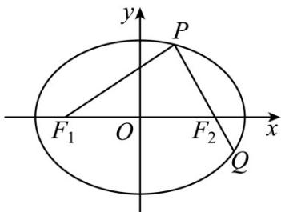

<!-- question-source:start -->
10.（2015·重庆·高考真题）如图，椭圆 $\frac{x^2}{a^2} +\frac{y^2}{b^2} = 1(a > b > 0)$ 的左、右焦点分别为 $F_{1},F_{2}$ ，过 $F_{2}$ 的直线交椭圆于 $P,Q$ 两点，且 $PQ\bot PF_1$

(1) 若 $\left|PF_{1}\right|=2+\sqrt{2},\left|PF_{2}\right|=2-\sqrt{2}$ ，求椭圆的标准方程

(2) 若 $\left|PF_{1}\right|=\left|PQ\right|$ ，求椭圆的离心率 e.
<!-- question-source:end -->

![[高中/真题/按题型分类/专题24 圆锥曲线/考点_05_离心率求值或范围综合/真题/answers/Q00036468A1.md]]
