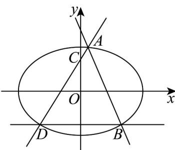

> [!faq]- 《专题24 圆锥曲线》真题解析
>
> > [!success]- **【答案】** 详见解析
>
> > [!note]- **【分析】**
> > 【分析】（1）由题意得 $b=c=\sqrt{2}$ ，进一步得a，由此即可得解；
> >
> > (2) 设 $AB: y = kx + t, (k \neq 0, t > \sqrt{2})$ ， $A(x_{1}, y_{1}), B(x_{2}, y_{2})$ ，联立椭圆方程，由韦达定理有
> >
> > $x_{1} + x_{2} = \frac{-4kt}{1 + 2k^{2}}, x_{1}x_{2} = \frac{2t^{2} - 4}{2k^{2} + 1}$ 而 $AD:y = \frac{y_1 - y_2}{x_1 + x_2}(x - x_1) + y_1$ ，令 $x = 0$ ，即可得解
>
> > [!note]- **【解析】**
> > 【详解】（1）由题意 $b=c=\frac{2}{\sqrt{2}}=\sqrt{2}$ ，从而 $a=\sqrt{b^{2}+c^{2}}=2$ ，
> > 所以椭圆方程为 $\frac{x^2}{4} +\frac{y^2}{2} = 1$ ，离心率为 $e = \frac{\sqrt{2}}{2}$
> > (2) 直线 AB 斜率不为 $^{0}$ ，否则直线 AB 与椭圆无交点，矛盾，
> > 
> > 从而设 $AB: y = kx + t, \left(k \neq 0, t > \sqrt{2}\right)$ ， $A(x_{1}, y_{1}), B(x_{2}, y_{2})$
> > 联立 $\left\{ \begin{array}{l} \frac{x^2}{4} + \frac{y^2}{2} = 1 \\ y = kx + t \end{array} \right.$ ，化简并整理得 $\left(1 + 2k^2\right)x^2 + 4ktx + 2t^2 - 4 = 0$
> > 由题意 $\Delta = 16k^2 t^2 - 8(2k^2 + 1)(t^2 - 2) = 8(4k^2 + 2 - t^2) > 0$ ，即 $k, t$ 应满足 $4k^2 + 2 - t^2 > 0$
> > 所以 $x_{1} + x_{2} = \frac{-4kt}{1 + 2k^{2}}, x_{1}x_{2} = \frac{2t^{2} - 4}{2k^{2} + 1}$
> > 若直线 BD 斜率为 $^{0}$ ，由椭圆的对称性可设 $D(-x_{2}, y_{2})$
> > 所以 $AD: y = \frac{y_{1} - y_{2}}{x_{1} + x_{2}} (x - x_{1}) + y_{1}$ ，在直线 AD 方程中令 x = 0，
> > $$
> > y _ {C} = \frac {x _ {1} y _ {2} + x _ {2} y _ {1}}{x _ {1} + x _ {2}} = \frac {x _ {1} (k x _ {2} + t) + x _ {2} (k x _ {1} + t)}{x _ {1} + x _ {2}} = \frac {2 k x _ {1} x _ {2} + t (x _ {1} + x _ {2})}{x _ {1} + x _ {2}} = \frac {4 k (t ^ {2} - 2)}{- 4 k t} + t = \frac {2}{t} = 1
> > $$
> > 所以 t = 2
> > 此时 $k$ 应满足 $\left\{ \begin{array}{l} 4k^2 + 2 - t^2 = 4k^2 - 2 > 0 \\ k \neq 0 \end{array} \right.$ ，即 $k$ 应满足 $k < -\frac{\sqrt{2}}{2}$ 或 $k > \frac{\sqrt{2}}{2}$ ，
> > 综上所述， $t = 2$ 满足题意，此时 $k < -\frac{\sqrt{2}}{2}$ 或 $k > \frac{\sqrt{2}}{2}$ .
