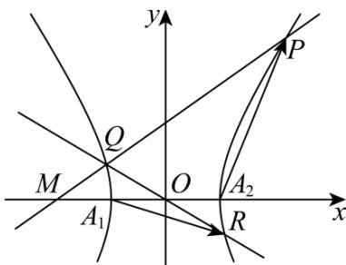

> [!faq]- 《专题24 圆锥曲线》真题解析
>
> > [!success]- **【答案】** 详见解析
>
> > [!note]- **【分析】**
> > 【分析】（ $^{1}$ ）根据离心率公式计算即可；
> >
> > (2) 分三角形三边分别为底讨论即可；
> >
> > (3) 设直线 $l: x = my - 2$ ，联立双曲线方程得到韦达定理式，再代入计算向量数量积的等式计算即可
>
> > [!note]- **【解析】**
> > 【详解】（1）由题意得 $e = \frac{c}{a} = \frac{c}{1} = 2$ ，则 $c = 2$ ， $b = \sqrt{2^2 - 1} = \sqrt{3}$ 。
> > (2) 当 $b = \frac{2\sqrt{6}}{3}$ 时，双曲线 $\Gamma: x^{2} - \frac{y^{2}}{\frac{8}{3}} = 1$ ，其中 $M(-2,0)$ ， $A_{2}(1,0)$ ，
> > 因为 $\triangle MA_{2}P$ 为等腰三角形，则
> > - **①**：当以 $MA_{2}$ 为底时，显然点 $P$ 在直线 $x = -\frac{1}{2}$ 上，这与点 $P$ 在第一象限矛盾，故舍去；
> > - **②**：当以 $A_{2}P$ 为底时， $\left|MP\right|=\left|MA_{2}\right|=3$
> > 设 , 则 $\left\{\begin{aligned}x^{2}-\frac{3y^{2}}{8}&=1\\ (x+2)^{2}+y^{2}&=9\end{aligned}\right.$ ，联立解得 $\left\{\begin{aligned}x&=-\frac{23}{11}\\ y&=-\frac{8\sqrt{17}}{11}\end{aligned}\right.$ 或 $\left\{\begin{aligned}x&=-\frac{23}{11}\\ y&=\frac{8\sqrt{17}}{11}\end{aligned}\right.$ 或 $\left\{\begin{aligned}x&=1\\ y&=0\end{aligned}\right.$
> > 因为点 $P$ 在第一象限，显然以上均不合题意，舍去；
> > （或者由双曲线性质知 $\left|MP\right|>\left|MA_{2}\right|$ ，矛盾，舍去）；
> > - **③**：当以 $MP$ 为底时， $\left|A_2P\right| = \left|MA_2\right| = 3$ ，设 $P(x_0,y_0)$ ，其中 $x_0 > 0,y_0 > 0$
> > 则有 $\left\{ \begin{array}{l} (x_0 - 1)^2 + y_0^2 = 9 \\ x_0^2 - \frac{y_0^2}{8} = 1 \\ \overline{3} \end{array} \right.$ ，解得 $\left\{ \begin{array}{ll} x_0 = 2 & \text{即} \\ y_0 = 2\sqrt{2} & P(2,2\sqrt{2}) \end{array} \right.$
> > 综上所述： $P(2,2\sqrt{2})$ .
> > (3) 由题知 $A_{1}(-1,0), A_{2}(1,0)$
> > 当直线 $l$ 的斜率为 $0$ 时，此时 $\overline{A_1R} \cdot \overline{A_2P} = 0$ ，不合题意，则 $k_l \neq 0$
> > 则设直线 l: x = my - 2 ，
> > 设点 $P(x_{1},y_{1}), Q(x_{2},y_{2})$ ，根据 OQ 延长线交双曲线 $\Gamma$ 于点 R，
> > 根据双曲线对称性知 $R\left(-x_{2}, - y_{2}\right)$
> > 联立有 $\left\{ \begin{array}{l} x = my - 2 \\ x^2 - \frac{y^2}{b^2} = 1 \end{array} \right. \Rightarrow (b^2 m^2 - 1)y^2 - 4b^2my + 3b^2 = 0$
> > 显然二次项系数 $b^{2}m^{2} - 1 \neq 0$
> > 其中 $\Delta = \left(-4mb^{2}\right)^{2} - 4\left(b^{2}m^{2} - 1\right)3b^{2} = 4b^{4}m^{2} + 12b^{2} > 0$
> > $y_{1} + y_{2} = \frac{4b^{2}m}{b^{2}m^{2} - 1}$ ①， $y_{1}y_{2} = \frac{3b^{2}}{b^{2}m^{2} - 1}$ ②，
> > 
> > $$
> > A _ {1} R = \left(- x _ {2} + 1, - y _ {2}\right), A _ {2} P = \left(x _ {1} - 1, y _ {1}\right)
> > $$
> > 则 $A_{1}R \cdot A_{2}P = (-x_{2} + 1)(x_{1} - 1) - y_{1}y_{2} = 1$ ，因为 $P(x_{1},y_{1}), Q(x_{2},y_{2})$ 在直线 $l$ 上，
> > 则 $x_{1} = my_{1} - 2$ ， $x_{2} = my_{2} - 2$
> > 即 $-\left(my_{2} - 3\right)\left(my_{1} - 3\right) - y_{1}y_{2} = 1$ ，即 $y_{1}y_{2}\left(m^{2} + 1\right) - \left(y_{1} + y_{2}\right)3m + 10 = 0$
> > 将①②代入有 $\left(m^{2}+1\right)\cdot\frac{3b^{2}}{b^{2}m^{2}-1}-3m\cdot\frac{4b^{2}m}{b^{2}m^{2}-1}+10=0$ ，
> > 即 $3b^{2}(m^{2} + 1) - 3m\cdot 4b^{2}m + 10(b^{2}m^{2} - 1) = 0$
> > 化简得 $b^{2}m^{2} + 3b^{2} - 10 = 0$
> > 所以 $m^{2}=\frac{10}{b^{2}}-3$ ，代入到 $b^{2}m^{2}-1\neq0$ ，得 $b^{2}=10-3b^{2}\neq1$ ，所以 $b^{2}\neq3$ ，
> > 且 $m^2 = \frac{10}{b^2} - 3 \quad 0$ ，解得 $b^2 \leq \frac{10}{3}$ ，又因为 $b > 0$ ，则 $0 < b^2 \leq \frac{10}{3}$ ，
> > 综上知， $b^{2}\in(0,3)\cup\left(3,\frac{10}{3}\right]$ ，∴ $b\in(0,\sqrt{3})\cup\left(\sqrt{3},\frac{\sqrt{30}}{3}\right]$
> > 【点睛】关键点点睛：本题第三问的关键是采用设线法，为了方便运算可设 $l: x = my - 2$ ，将其与双曲线方程联立得到韦达定理式，再写出相关向量，代入计算，要注意排除联立后的方程得二次项系数不为0.
