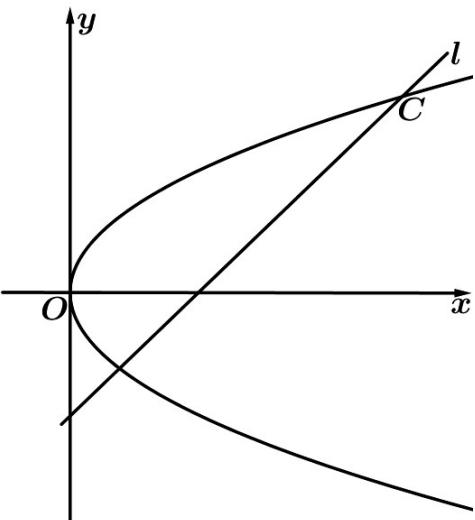

<!-- question-source:start -->
15. (2016·江苏·高考真题) 如图, 在平面直角坐标系 $xOy$ 中, 已知直线 $l: x - y - 2 = 0$ , 抛物线 $C: y^2 = 2px$ ( $p > 0$ ).

(1) 若直线 $^{1}$ 过抛物线 $^{C}$ 的焦点，求抛物线 $^{C}$ 的方程；

(2) 已知抛物线 $^{C}$ 上存在关于直线 $^{I}$ 对称的相异两点 $^{P}$ 和 $^{Q}$ .

①求证：线段 PQ 的中点坐标为 $(2-p,-p)$ ;

②求 $p$ 的取值范围·
<!-- question-source:end -->

![[高中/真题/按题型分类/专题24 圆锥曲线/考点_09_其他证明综合/真题/answers/Q00036510A1.md]]
