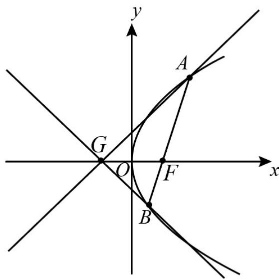

<!-- question-source:start -->
20．（2015·福建·高考真题）已知点 F 为抛物线 $E: y^{2} = 2px (p > 0)$ 的焦点，点 $A(2, m)$ 在抛物线 E 上，且 $\left|AF\right| = 3$

(Ⅰ) 求抛物线 E 的方程；

（Ⅱ）已知点 $G(-1,0)$ ，延长 $AF$ 交抛物线 $E$ 于点 $B$ ，证明：以点 $F$ 为圆心且与直线 $GA$ 相切的圆，必与直线 $GB$ 相切。
<!-- question-source:end -->

![[高中/真题/按题型分类/专题24 圆锥曲线/考点_09_其他证明综合/真题/answers/Q00036515A1.md]]
