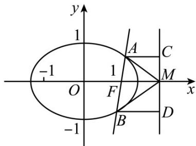

> [!faq]- 《专题24 圆锥曲线》真题解析
>
> > [!success]- **【答案】** 详见解析
>
> > [!note]- **【分析】**
> > 本题未单列分析。
>
> > [!note]- **【解析】**
> > 【答案】（1） $AM$ 的方程为 $y = -\frac{\sqrt{2}}{2} x + \sqrt{2}$ 或 $y = \frac{\sqrt{2}}{2} x - \sqrt{2}$ ；（2）证明见解析【分析】（1）根据 $l$ 与 $x$ 轴垂直，且过点 $F(1,0)$ ，求得直线 $l$ 的方程为 $x = 1$ ，代入椭圆方程求得点 $A$ 的坐标为 $\left(1, \frac{\sqrt{2}}{2}\right)$ 或 $\left(1, -\frac{\sqrt{2}}{2}\right)$ ，利用两点式求得直线 $AM$ 的方程；
> > (2) 方法一：分直线 $l$ 与 $x$ 轴重合、 $l$ 与 $x$ 轴垂直、 $l$ 与 $x$ 轴不重合也不垂直三种情况证明，特殊情况比较简单，也比较直观，对于一般情况将角相等通过直线的斜率的关系来体现，从而证得结果。
> > 【详解】（1）由已知得 $F(1,0)$ ，l的方程为x=1。
> > 由已知可得，点 $A$ 的坐标为 $\left(1, \frac{\sqrt{2}}{2}\right)$ 或 $\left(1, -\frac{\sqrt{2}}{2}\right)$ .
> > 所以 $AM$ 的方程为 $y = -\frac{\sqrt{2}}{2} x + \sqrt{2}$ 或 $y = \frac{\sqrt{2}}{2} x - \sqrt{2}$ .
> > (2) [方法一]：【通性通法】分类 + 常规联立
> > 当 l 与 x 轴重合时， $\angle OMA = \angle OMB = 0^{\circ}$ .
> > 当 l 与 x 轴垂直时，OM 为 AB 的垂直平分线，所以 $\angle OMA = \angle OMB$ .
> > 当 $l$ 与 $x$ 轴不重合也不垂直时，设 $l$ 的方程为 $y = k(x - 1)(k \neq 0)$ ， $A(x_1, y_1), B(x_2, y_2)$ ，
> > 则 $x_{1} < \sqrt{2}, x_{2} < \sqrt{2}$ ，直线 $MA$ 、 $MB$ 的斜率之和为 $k_{MA} + k_{MB} = \frac{y_1}{x_1 - 2} + \frac{y_2}{x_2 - 2}$ .
> > 由 $y_{1} = kx_{1} - k, y_{2} = kx_{2} - k$ 得 $k_{MA} + k_{MB} = \frac{2kx_1x_2 - 3k(x_1 + x_2) + 4k}{(x_1 - 2)(x_2 - 2)}$ .
> > 将 $y = k(x - 1)$ 代入 $\frac{x^2}{2} + y^2 = 1$ 得 $(2k^2 + 1)x^2 - 4k^2x + 2k^2 - 2 = 0$ .
> > 所以， $x_{1}+x_{2}=\frac{4k^{2}}{2k^{2}+1},x_{1}x_{2}=\frac{2k^{2}-2}{2k^{2}+1}.$
> > 则 $2kx_{1}x_{2} - 3k(x_{1} + x_{2}) + 4k = \frac{4k^{3} - 4k - 12k^{3} + 8k^{3} + 4k}{2k^{2} + 1} = 0.$
> > 从而 $k_{MA} + k_{MB} = 0$ ，故 MA、MB 的倾斜角互补，所以 $\angle OMA = \angle OMB \cdot$
> > 综上， $\angle OMA = \angle OMB$ 。
> > [方法二]：角平分线定义的应用
> > 当直线 l 与 x 轴重合或垂直时，显然有 $\angle OMA = \angle OMB$ 。当直线 l 与 x 轴不垂直也不重合时，设直线 l 的方程为 $x = my + 1$ ，交椭圆于 $A(x_{1}, y_{1})$ ， $B(x_{2}, y_{2})$ 。
> > 由 $\left\{\begin{aligned}\frac{x^{2}}{2}+y^{2}=1\\x=my+1\end{aligned}\right.$ 得 $\left(m^{2}+2\right)y^{2}+2my-1=0$
> > 由韦达定理得 $y_{1} + y_{2} = \frac{-2m}{m^{2} + 2}, y_{1}y_{2} = \frac{-1}{m^{2} + 2}$ .
> > 点 $A$ 关于 $x$ 轴的对称点 $N(x_{1}, - y_{1})$ ，则直线 $BN$ 的方程为 $(y + y_1)(x_2 - x_1) = (y_1 + y_2)(x - x_1)$
> > 令 $y = 0$ ， $x = \frac{y_1(x_2 - x_1)}{y_1 + y_2} +x_1 = \frac{x_1y_2 + x_2y_1}{y_1 + y_2} = \frac{2my_1y_2 + (y_1 + y_2)}{y_1 + y_2} = \frac{2m\cdot\frac{-1}{m^2 + 2} - \frac{2m}{m^2 + 2}}{\frac{-2m}{m^2 + 2}} = 2$ ，则直线过点 $M,\angle OMA = \angle OMB.$
> > [方法三]：直线参数方程的应用
> > 设直线 l 的参数方程为 $\left\{\begin{aligned} x &= 1 + t \cos \alpha \\ y &= t \sin \alpha \end{aligned}\right.$ （t 为参数）．（\*）
> > 将（ $^{*}$ ）式代入椭圆方程 $\frac{x^{2}}{2}+y^{2}=1$ 中，整理得 $\left(1+\sin^{2}\alpha\right)t^{2}+2\cos\alpha t-1=0$
> > 则 $t_1 \cdot t_2 = \frac{-1}{1 + \sin^2 \alpha}$ , $t_1 + t_2 = -\frac{2 \cos \alpha}{1 + \sin^2 \alpha}$ .
> > $$
> > A \left(1 + t _ {1} \cos \alpha , t _ {1} \sin \alpha\right), B \left(1 + t _ {2} \cos \alpha , t _ {2} \sin \alpha\right) \text {, 则} k _ {M A} + k _ {M B} =
> > $$
> > $$
> > \frac {t _ {1} \sin \alpha}{1 + t _ {1} \cos \alpha - 2} + \frac {t _ {2} \sin \alpha}{1 + t _ {2} \cos \alpha - 2} = \frac {t _ {1} \sin \alpha}{t _ {1} \cos \alpha - 1} + \frac {t _ {2} \sin \alpha}{t _ {2} \cos \alpha - 1} =
> > $$
> > $$
> > \frac {t _ {1} \sin \alpha (t _ {2} \cos \alpha - 1) + t _ {2} \sin \alpha (t _ {1} \cos \alpha - 1)}{(t _ {1} \cos \alpha - 1) (t _ {2} \cos \alpha - 1)} = \frac {2 t _ {1} t _ {2} \sin \alpha \cos \alpha - (t _ {1} + t _ {2}) \sin \alpha}{(t _ {1} \cos \alpha - 1) (t _ {2} \cos \alpha - 1)} = \frac {\frac {- 2 \sin \alpha \cos \alpha}{1 + \sin^ {2} \alpha} + \frac {2 \sin \alpha \cos \alpha}{1 + \sin^ {2} \alpha}}{(t _ {1} \cos \alpha - 1) (t _ {2} \cos \alpha - 1)} = 0,
> > $$
> > 即 $k_{MA} = -k_{MB}$ .所以 $\angle OMA = \angle OMB$
> > [方法四]：【最优解】椭圆第二定义的应用
> > 当直线 l 与 x 轴重合时， $\angle OMA = \angle OMB = 0^{\circ}$
> > 当直线 l 与 x 轴不重合时，如图，过点 A, B 分别作准线 x=2 的垂线，垂足分别为 C, D，则有 $AC \parallel BD \parallel x$ 轴．
> > 
> > 由椭圆的第二定义，有 $\left|\frac{AF}{AC}\right|=\mathrm{e}$ ， $\frac{|BF|}{|BD|}=\mathrm{e}$ ，得 $\frac{|AF|}{|AC|}=\frac{|BF|}{|BD|}$ ，即 $\frac{|AF|}{|BF|}=\frac{|AC|}{|BD|}$ 。
> > 由 $AC\| BD\| x$ 轴，有 $\frac{|AF|}{|CM|} = \frac{|BF|}{|DM|}$ ，即 $\frac{|AF|}{|BF|} = \frac{|CM|}{|DM|}$ ，于是 $\frac{|AC|}{|BD|} = \frac{|CM|}{|DM|}$ ，且 $\angle ACM = \angle BDM = 90^{\circ}$ 可得 $\angle AMC = \angle BMD$ ，即有 $\angle AMO = \angle BMO$ ：
> > [方法五]：角平分线定理逆定理 + 极坐标方程的应用
> > 椭圆 $C: \frac{x^2}{2} + y^2 = 1$ 以右焦点为极点， $x$ 轴正方向为极轴，得 $\rho = \frac{1}{\sqrt{2} + \cos \theta}$ .
> > 设 $A(\rho_1,\theta),B(\rho_2,\theta +\pi)$
> > $$
> > \left| A M \right| ^ {2} = \rho_ {1} ^ {2} + 1 - 2 \rho_ {1} \cos \theta , \left| B M \right| ^ {2} = \rho_ {2} ^ {2} + 1 + 2 \rho_ {2} \cos \theta
> > $$
> > 所以 $\frac{|AM|}{|AF|} = \frac{\sqrt{\rho_1^2 + 1 - 2\rho_1\cos\theta}}{\rho_1} = \sqrt{3 - \cos^2\theta}$ ， $\frac{|BM|}{|BF|} = \frac{\sqrt{\rho_2^2 + 1 + 2\rho_2\cos\theta}}{\rho_2} = \sqrt{3 - \cos^2\theta_0}$
> > 由角平分线定理的逆定理可知，命题得证。
> > [方法六]：角平分线定理的逆定理的应用
> > 设点 $O$ （也可选点 $F$ ）到直线 $MA, MB$ 的距离分别为 $d_{1}, d_{2}$ ，根据角平分线定理的逆定理，要证 $\angle OMA = \angle OMB$ ，只需证 $d_{1} = d_{2}$ 。
> > 当直线 $l$ 的斜率为0时，易得 $d_{1} = d_{2} = 0$
> > 当直线 l 的斜率不为 $^{0}$ 时，设直线 l 的方程为： $x = my + 1, A(x_{1}, y_{1}), B(x_{2}, y_{2})$ 。由方程组 $\left\{\begin{aligned}\frac{x^{2}}{2} + y^{2} &= 1, \\ x &= my + 1,\end{aligned}\right.$ 得
> > $\left(m^{2} + 2\right)y^{2} + 2my - 1 = 0, \Delta > 0$ 恒成立， $y_{1} + y_{2} = -\frac{2m}{m^{2} + 2}$ 。 $y_{1}y_{2} = -\frac{1}{m^{2} + 2}$ 。
> > 直线 $_{MA}$ 的方程为： $y_{1}x-(x_{1}-2)y-2y_{1}=0,d_{1}=\frac{|2y_{1}|}{\sqrt{y_{1}^{2}+(x_{1}-2)^{2}}}$
> > 因为点 A 在直线 l 上，所以 $x_{1}=my_{1}+1$ ，故 $d_{1}=\frac{\left|2y_{1}\right|}{\sqrt{\left(m^{2}+1\right)y_{1}^{2}-2my_{1}+1}}$ 。
> > 同理， $d_{2} = \frac{|2y_{2}|}{\sqrt{(m^{2} + 1)y_{2}^{2} - 2my_{2} + 1}}$ · $d_{1}^{2} - d_{2}^{2} = \frac{4(y_{1} - y_{2})[(y_{1} + y_{2}) - 2my_{1}y_{2}]}{[(m^{2} + 1)y_{1}^{2} - 2my_{1} + 1][(m^{2} + 1)y_{2}^{2} - 2my_{2} + 1]}$
> > 因为 $\left(y_{1} + y_{2}\right) - 2my_{1}y_{2} = -\frac{2m}{m^{2} + 2} +\frac{2m}{m^{2} + 2} = 0$ ，所以 $d_1^2 -d_2^2 = 0$ ，即 $d_{1} = d_{2}$
> > 综上， $\angle OMA = \angle OMB$
> > ## [方法七]：【通性通法】分类+常规联立
> > 当直线 $l$ 与 $x$ 轴重合或垂直时，显然有 $\angle OMA = \angle OMB$
> > 当直线 l 与 x 轴不垂直也不重合时，设直线 l 的方程为 $x = my + 1$ ，交椭圆于 $A(x_{1}, y_{1})$ ， $B(x_{2}, y_{2})$
> > 由 $\left\{\begin{aligned}\frac{x^{2}}{2}+y^{2}=1\\x=my+1\end{aligned}\right.$ 得 $\left(m^{2}+2\right)y^{2}+2my-1=0$
> > 由韦达定理得 $y_{1} + y_{2} = \frac{-2m}{m^{2} + 2}, y_{1}y_{2} = \frac{-1}{m^{2} + 2}$
> > 所以 $k_{MA} + k_{MB} = \frac{y_{1}}{x_{1} - 2} + \frac{y_{2}}{x_{2} - 2} = \frac{y_{1}}{my_{1} - 1} + \frac{y_{2}}{my_{2} - 1} = \frac{2my_{1}y_{2} - (y_{1} + y_{2})}{(my_{1} - 1)(my_{2} - 1)} = 0$
> > 故 $MA$ 、 $MB$ 的倾斜角互补，所以 $\angle OMA = \angle OMB$
> > ## [方法八]：定比点差法
> > 设 $AF = \lambda FB (\lambda \neq 0, \pm 1)$ ， $A(x_{1}, y_{1}), B(x_{2}, y_{2})$ ，
> > 所以 $\left\{\begin{aligned}1&=\frac{x_{1}+\lambda x_{2}}{1+\lambda}\\ 0&=\frac{y_{1}+\lambda y_{2}}{1+\lambda}\end{aligned}\right.$
> > 由 $\left\{ \begin{array}{l} \frac{x_1^2}{2} + y_1^2 = 1 \\ \frac{\lambda^2x_2^2}{2} + \lambda^2y_2^2 = \lambda^2 \end{array} \right.$ 作差可得， $\frac{x_1 + \lambda x_2}{1 + \lambda} \times \frac{x_1 - \lambda x_2}{2(1 - \lambda)} + \frac{y_1 + \lambda y_2}{1 + \lambda} \times \frac{y_1 - \lambda y_2}{1 - \lambda} = 1$ ，所以，
> > $x_{1} - \lambda x_{2} = 2(1 - \lambda)$ ，又 $x_{1} + \lambda x_{2} = 1 + \lambda$ ，所以， $x_{1} = \frac{1}{2}(3 - \lambda),x_{2} = \frac{1}{2}\left(3 - \frac{1}{\lambda}\right)$
> > 故 $k_{MA} + k_{MB} = \frac{y_{1}}{x_{1} - 2} + \frac{y_{2}}{x_{2} - 2} = \frac{-\lambda y_{2}}{-\frac{1}{2}(1 + \lambda)} + \frac{y_{2}}{-\frac{1}{2}\left(1 + \frac{1}{\lambda}\right)} = 0$ ，MA MB 的倾斜角互补，所以 $\angle OMA = \angle OMB$
> > 当 $\lambda = 1$ 时， $l$ 与 $x$ 轴垂直， $OM$ 为 $AB$ 的垂直平分线，所以 $\angle OMA = \angle OMB$ .
> > 故 $\angle OMA = \angle OMB$
> > 【整体点评】（2）方法一：通过分类以及常规联立，把角相等转化为斜率和为零，再通过韦达定理即可实现，是解决该类问题的通性通法；
> > 方法二：根据角平分线的定义可知，利用点 $A$ 关于 $x$ 轴的对称点 $N$ 在直线 $BM$ 上，证直线 $AN$ 过点 $M$ 即可；
> > 方法三：利用直线的参数方程证明斜率互为相反数；
> > 方法四：根据点 $M$ 是椭圆的右准线 $x = 2$ 与 $x$ 轴的交点，用椭圆的第二定义结合平面几何知识证明，运算量极小，是该题的最优解；
> > 方法五：利用椭圆的极坐标方程以及角平分线定理的逆定理的应用，也是不错的方法选择；
> > 方法六：类比方法五，角平分线定理的逆定理的应用；
> > 方法七：常规联立，同方法一，只是设直线的方程形式不一样；
> > 方法八：定比点差法的应用。
